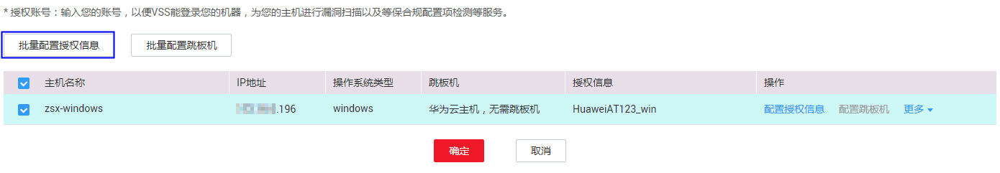
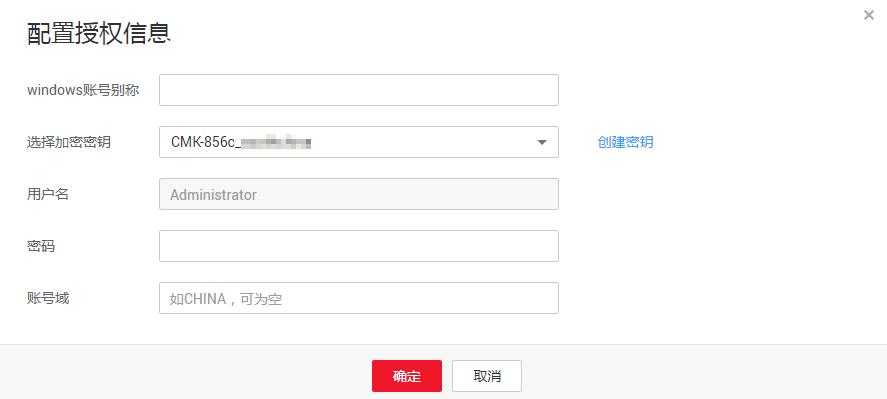

# Windows主机授权

## 操作场景

该任务指导用户通过漏洞扫描服务对已添加的华为云主机的Windows主机进行扫描授权。

## 前提条件

-   已获取管理控制台的登录帐号与密码。
-   登录用户只支持Administrator。
-   已添加华为云的Windows主机。

## 操作步骤

1.  登录管理控制台。
2.  单击页面上方的“服务列表“，选择“安全  \>  漏洞扫描服务“，在左侧导航树中，单击“资产列表“，进入“资产列表“界面。
3.  在“资产列表“页面，选择“主机“页签，勾选需要授权的Windows主机，在“批量操作“的下拉框中，单击“编辑“，如[图1](#fig1227015374407)所示。

    > **说明：**   
    >用户也可以单台主机授权，在目标主机所在行的“操作“列，单击“编辑“。  

    **图 1**  Windows主机授权  
    

4.  在主机授权页面，批量选择需要授权的主机，单击“批量配置授权信息“，如[图2](#fig37091438195719)所示。

    > **说明：**   
    >-   用户也可以单台主机授权，在目标主机所在行的“操作“列，单击“配置授权信息“。  
    >-   如果需要修改主机名称，单击，在弹出的对话框中，进行修改。  

    **图 2**  批量授权  
    

5.  在弹出的对话框中，选择已有Windows账号，或者单击“创建Windows账号“创建Windows账号，如[图3](#fig1851741671217)所示。

    **图 3**  配置授权信息  
    

    > **说明：**   
    >-   如果需要修改已有Windows账号，单击“编辑“，进行修改。  
    >-   如果需要删除已有Windows账号，单击“删除“，删除账号。  

    如果没有Windows账号，单击“创建Windows账号“创建账号，如[图4](#fig98124191127)所示，参数说明如[表1](#table1947303131)。

    **图 4**  创建Windows账号  
    

    **表 1**  参数说明

    
    <table><thead align="left"><tr id="row184230161317"><th class="cellrowborder" valign="top" width="40.21%" id="mcps1.2.3.1.1">
参数名称

    </th>
    <th class="cellrowborder" valign="top" width="59.79%" id="mcps1.2.3.1.2">
参数说明

    </th>
    </tr>
    </thead>
    <tbody><tr id="row5453018135"><td class="cellrowborder" valign="top" width="40.21%" headers="mcps1.2.3.1.1 ">
windows账号别称

    </td>
    <td class="cellrowborder" valign="top" width="59.79%" headers="mcps1.2.3.1.2 ">
自定义Windows账号名称。

    </td>
    </tr>
    <tr id="row84203016138"><td class="cellrowborder" valign="top" width="40.21%" headers="mcps1.2.3.1.1 ">
选择加密密钥

    </td>
    <td class="cellrowborder" valign="top" width="59.79%" headers="mcps1.2.3.1.2 ">
选择已有的加密密钥，或者单击“创建密钥”，创建新的密钥，具体方法请参考<a href="https://support.huaweicloud.com/usermanual-dew/zh-cn_topic_0034324884.html" target="_blank" rel="noopener noreferrer">创建密钥</a>。

    </td>
    </tr>
    <tr id="row241230111310"><td class="cellrowborder" valign="top" width="40.21%" headers="mcps1.2.3.1.1 ">
用户名

    </td>
    <td class="cellrowborder" valign="top" width="59.79%" headers="mcps1.2.3.1.2 ">
默认为Administrator。

    </td>
    </tr>
    <tr id="row981737121518"><td class="cellrowborder" valign="top" width="40.21%" headers="mcps1.2.3.1.1 ">
密码

    </td>
    <td class="cellrowborder" valign="top" width="59.79%" headers="mcps1.2.3.1.2 ">
Windows系统登录密码。

    </td>
    </tr>
    <tr id="row10729144117152"><td class="cellrowborder" valign="top" width="40.21%" headers="mcps1.2.3.1.1 ">
账号域

    </td>
    <td class="cellrowborder" valign="top" width="59.79%" headers="mcps1.2.3.1.2 ">
查看该Windows系统的账号域并填写到此处，该参数也可以为空，不填写。

    </td>
    </tr>
    </tbody>
    </table>

6.  单击“确定“，完成Windows主机授权。

