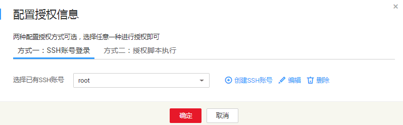
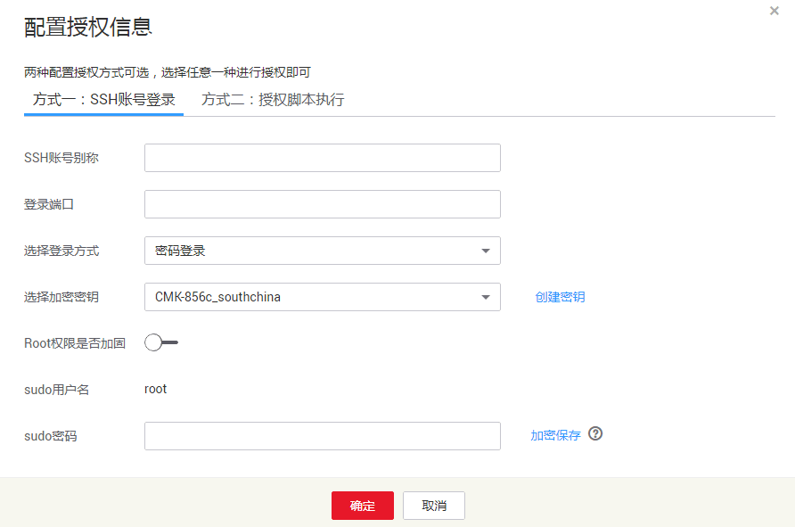

# Linux主机授权

## 操作场景

该任务指导用户通过漏洞扫描服务对已添加的Linux主机进行扫描授权。

## 前提条件

-   已获取管理控制台的登录帐号与密码。
-   已添加Linux主机。

## 操作步骤

1.  登录管理控制台。
2.  单击页面上方的“服务列表“，选择“安全  \>  漏洞扫描服务“，在左侧导航树中，单击“资产列表“，进入“资产列表“界面。
3.  在“资产列表“页面，选择“主机“页签，勾选需要授权的Linux主机，在“批量操作“的下拉框中，单击“编辑“，如[图1](#fig6288185203910)所示。

    > **说明：**   
    >用户也可以单台主机授权，在目标主机所在行的“操作“列，单击“编辑“。  

    **图 1**  主机授权  
    

4.  在主机授权页面，批量选择需要授权的主机，单击“批量配置授权信息“，如[图2](#fig37091438195719)所示。

    > **说明：**   
    >-   用户也可以单台主机授权，在目标主机所在行的“操作“列，单击“配置授权信息“。  
    >-   如果需要修改主机名称，单击，在弹出的对话框中，进行修改。  

    **图 2**  批量授权  
    

5.  选择授权方式进行主机授权。
    -   方式一：SSH账号登录。

        **图 3**  SSH账号登录  
        

        > **说明：**   
        >-   如果需要修改已有SSH帐号，单击“编辑“，进行修改。  
        >-   如果需要删除已有SSH帐号，单击“删除“，删除账号。  

        选择已有SSH账号，或者单击“创建SSH账号“创建SSH账号，如[图4](#fig9399138205616)所示，参数说明如[表1](#table3401158105617)所示。

        **图 4**  创建SSH账号  
        

        **表 1**  参数说明

        
        <table><thead align="left"><tr id="row16399178105616"><th class="cellrowborder" valign="top" width="38.07%" id="mcps1.2.3.1.1">
参数名称

        </th>
        <th class="cellrowborder" valign="top" width="61.92999999999999%" id="mcps1.2.3.1.2">
参数说明

        </th>
        </tr>
        </thead>
        <tbody><tr id="row1139920865618"><td class="cellrowborder" valign="top" width="38.07%" headers="mcps1.2.3.1.1 ">
SSH账号别称

        </td>
        <td class="cellrowborder" valign="top" width="61.92999999999999%" headers="mcps1.2.3.1.2 ">
自定义SSH账号名称。

        </td>
        </tr>
        <tr id="row1439913814562"><td class="cellrowborder" valign="top" width="38.07%" headers="mcps1.2.3.1.1 ">
登录端口

        </td>
        <td class="cellrowborder" valign="top" width="61.92999999999999%" headers="mcps1.2.3.1.2 ">
SSH账号登录的端口号。

        </td>
        </tr>
        <tr id="row1740017885620"><td class="cellrowborder" valign="top" width="38.07%" headers="mcps1.2.3.1.1 ">
选择登录方式

        </td>
        <td class="cellrowborder" valign="top" width="61.92999999999999%" headers="mcps1.2.3.1.2 "><ul id="ul104009865610"><li>“密码登录”</li><li>“密钥登录”
选择“密钥登录”时，需要“创建私钥”。

        </li></ul>
        </td>
        </tr>
        <tr id="row24002825619"><td class="cellrowborder" valign="top" width="38.07%" headers="mcps1.2.3.1.1 ">
选择加密密钥

        </td>
        <td class="cellrowborder" valign="top" width="61.92999999999999%" headers="mcps1.2.3.1.2 ">
选择已有的加密密钥，或者单击“创建密钥”，创建新的密钥，具体方法请参考<a href="https://support.huaweicloud.com/usermanual-dew/zh-cn_topic_0034324884.html" target="_blank" rel="noopener noreferrer">创建密钥</a>。

        </td>
        </tr>
        <tr id="row114013815617"><td class="cellrowborder" valign="top" width="38.07%" headers="mcps1.2.3.1.1 ">
Root权限是否加固

        </td>
        <td class="cellrowborder" valign="top" width="61.92999999999999%" headers="mcps1.2.3.1.2 ">
打开该权限后，不可以用root账号直接登录，而只能通过普通用户登录，然后才能切换到root用户。

        </td>
        </tr>
        <tr id="row1840112835616"><td class="cellrowborder" valign="top" width="38.07%" headers="mcps1.2.3.1.1 ">
sudo用户名

        </td>
        <td class="cellrowborder" valign="top" width="61.92999999999999%" headers="mcps1.2.3.1.2 ">
默认为root。

        </td>
        </tr>
        <tr id="row640119865619"><td class="cellrowborder" valign="top" width="38.07%" headers="mcps1.2.3.1.1 ">
sudo密码

        </td>
        <td class="cellrowborder" valign="top" width="61.92999999999999%" headers="mcps1.2.3.1.2 ">
设置sudo用户对应的密码，单击“加密保存”，对密码进行加密保存。

        </td>
        </tr>
        </tbody>
        </table>

    -   方式二：授权脚本执行。

        > **说明：**   
        >-   如果您选择“授权脚本执行“进行主机授权，由于该方式无法将是否已授权的信息传回到VSS，所以虽然主机已完成授权，但“授权信息“状态仍然为“暂未授权“。  
        >-   用户也可以在“主机“页面，单击“扫描授权“，通过授权脚本执行完成主机授权。  

        **图 5**  授权脚本执行  
        

        1.  单击界面上的“复制“，复制开通授权的命令。
        2.  使用远程管理工具（例如：“Xshell“、“SecureCRT“、“PuTTY“），通过弹性IP地址登录到待开通授权的弹性云服务器。

            > **说明：**   
            >也可使用弹性云服务器的“远程登录“功能，登录服务器。  

        3.  执行复制的命令（这里用“SecureCRT“工具登录），结果如[图6](#fig12402128115615)所示，即执行成功。

            **图 6**  执行结果  
            

6.  单击“确定“，完成Linux主机授权。

