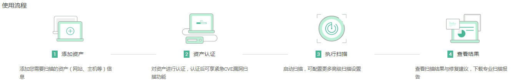
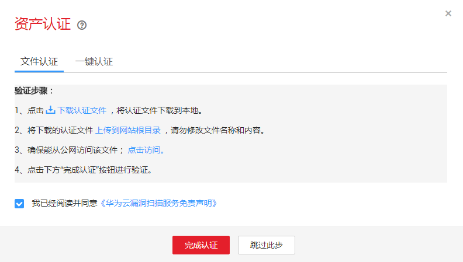
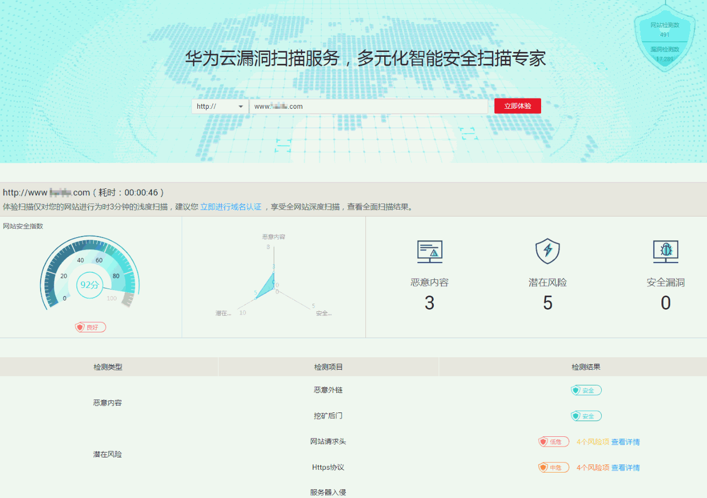
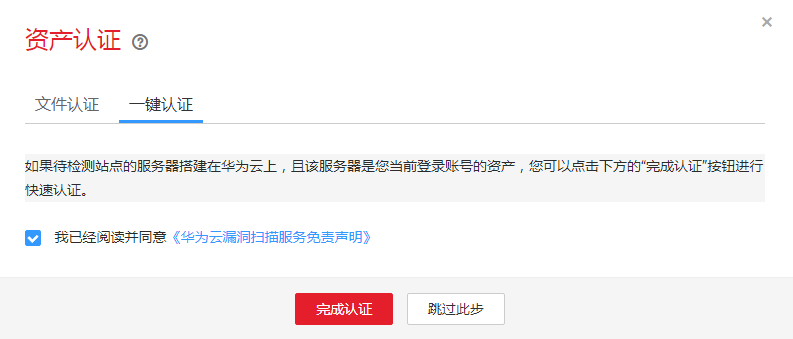

# 一键扫描

## 操作场景

该任务指导新用户免费体验漏洞扫描服务。

## 前提条件

已获取管理控制台的登录帐号与密码。

## 查看业务流程

1.  登录管理控制台。
2.  单击管理控制台左上角的，选择区域或项目。
3.  单击页面上方的“服务列表“，选择“安全\>漏洞扫描服务“，进入新用户体验界面。
4.  查看业务流程，如[图1](#fig437373710459)所示。

    **图 1**  业务流程  
    

    1.  添加资产：

        添加您需要扫描的资产（网站、主机）信息，支持添加网站域名地址、网站IP地址、主机IP地址。添加资产操作请参见[添加域名](添加域名.md)和[添加主机](添加主机.md)。

    2.  资产认证：

        对资产进行认证，具体参见[域名认证](域名认证.md)章节，仅认证成功的资产可启动扫描，并可在紧急漏洞爆发时针对单个漏洞进行快速检测。

    3.  执行扫描：

        按照默认配置或自定义配置，启动单次扫描，或设置周期监控扫描。

    4.  扫描结果：

        可在线实时查看扫描进度，扫描完毕后第一时间发送短信与邮件通知，输出专业扫描报告。

## 新用户体验

1.  登录管理控制台。
2.  单击管理控制台左上角的，选择区域或项目。
3.  单击页面上方的“服务列表“，选择“安全\>漏洞扫描服务“，进入新用户体验界面。
4.  输入想要扫描的域名/IP地址，如[图2](#fig3326113112185)所示，单击“立即体验“，弹出“资产认证“的弹框，如[图3](#fig159958345506)所示。

    **图 2**  新用户体验界面  
    

    **图 3**  资产认证  
    

    -   如果您不想进行域名认证，执行以下操作：
        1.  请单击界面上的“跳过此步“按钮，如[图3](#fig159958345506)所示，享受体验式扫描服务，你可以在线实时查看扫描进度，如[图4](#fig8793181720376)所示。

            **图 4**  正在扫描  
            

        2.  查看扫描结果，如[图5](#fig279314170377)所示，各栏目说明如[表1](#table779351714379)所示。

            **图 5**  扫描详情  
            

            **表 1**  扫描结果说明

            
            <table><thead align="left"><tr id="row1879361720371"><th class="cellrowborder" valign="top" width="15%" id="mcps1.2.4.1.1">
栏目

            </th>
            <th class="cellrowborder" valign="top" width="30%" id="mcps1.2.4.1.2">
说明

            </th>
            <th class="cellrowborder" valign="top" width="55.00000000000001%" id="mcps1.2.4.1.3">
操作

            </th>
            </tr>
            </thead>
            <tbody><tr id="row2793017143711"><td class="cellrowborder" valign="top" width="15%" headers="mcps1.2.4.1.1 ">
检测类型

            </td>
            <td class="cellrowborder" valign="top" width="30%" headers="mcps1.2.4.1.2 ">
对扫描结果进行分类显示。

            </td>
            <td class="cellrowborder" valign="top" width="55.00000000000001%" headers="mcps1.2.4.1.3 ">
-

            </td>
            </tr>
            <tr id="row9793121793710"><td class="cellrowborder" valign="top" width="15%" headers="mcps1.2.4.1.1 ">
检测项目

            </td>
            <td class="cellrowborder" valign="top" width="30%" headers="mcps1.2.4.1.2 ">
显示扫描的项目，属于检测类型的子类。

            </td>
            <td class="cellrowborder" valign="top" width="55.00000000000001%" headers="mcps1.2.4.1.3 ">
-

            </td>
            </tr>
            <tr id="row779341713710"><td class="cellrowborder" valign="top" width="15%" headers="mcps1.2.4.1.1 ">
检测结果

            </td>
            <td class="cellrowborder" valign="top" width="30%" headers="mcps1.2.4.1.2 ">
显示漏洞扫描的结果

            </td>
            <td class="cellrowborder" valign="top" width="55.00000000000001%" headers="mcps1.2.4.1.3 "><ul id="ul13793161713374"><li>结果为安全显示。</li><li>有风险会显示相应的风险级别，单击“查看详情”查看具体的漏洞信息，如。</li></ul>
            </td>
            </tr>
            </tbody>
            </table>

    -   如果您选择立即进行域名认证，请执行以下操作：
        1.  认证域名有两种方式，“文件认证“和“一键认证“。
        2.  方法一：选择“文件认证“，如[图6](#fig5907173173812)所示。

            **图 6**  文件认证  
            

            > **说明：**   
            >按照界面的“验证步骤“进行文件认证，完成认证后，该域名的状态为“已认证“。  

        3.  方法二：选择“一键认证“，如[图7](#fig83635214717)所示。

            如果待检测站点的服务器搭建在华为云上，且该服务器是您当前登录账号的资产，可以选择“一键认证“的方式。

            **图 7**  一键认证  
            

        4.  勾选“我已阅读并同意《华为云漏洞扫描服务免责声明》“，单击“完成认证“，享受正式的扫描服务。

