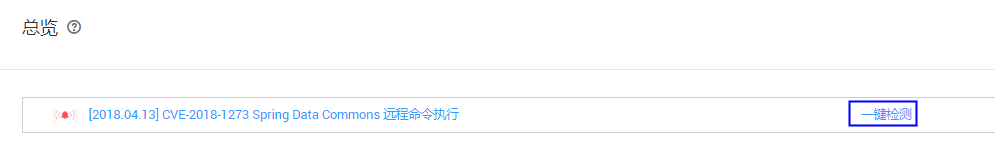
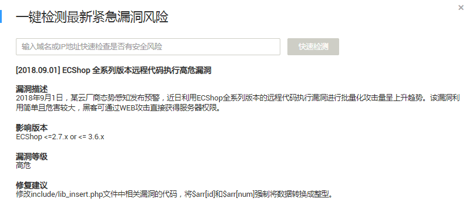
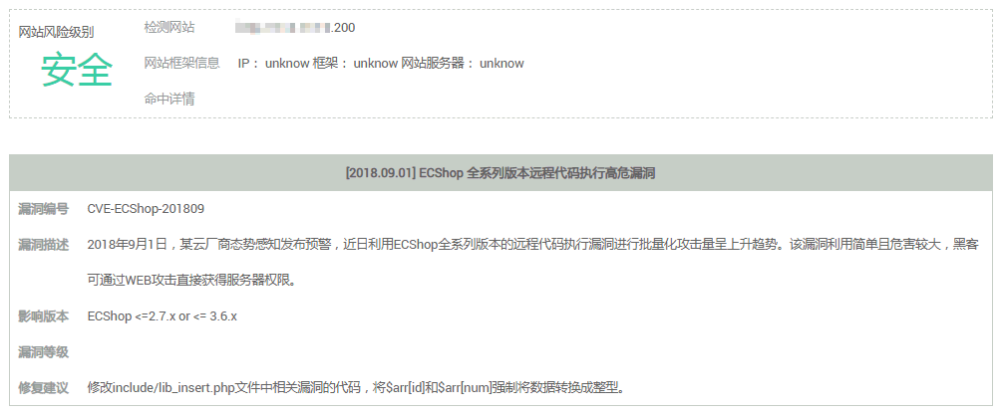

# 一键检测

## 操作场景

当业界有新漏洞爆发时，用户可以使用“一键检测“功能快速检测您的网站是否存在界面提示的高危漏洞。

## 前提条件

已获取管理控制台的登录帐号与密码。

## 操作步骤

1.  登录管理控制台。
2.  单击页面上方的“服务列表“，选择“安全\>漏洞扫描服务“，进入总览界面，如[图1](#fig437373710459)所示。

    **图 1**  总览页面  
    

3.  单击“一键检测“，在弹出的窗口中，输入需要检测的URL地址后，单击“快速检测“，如[图2](#fig1576988135517)所示。

    > **说明：**   
    >只支持检测已认证的域名对应的URL地址。  

    **图 2**  一键检测  
    

4.  查看检测结果，如果该网站存在危险漏洞，请根据修复建议进行修复，如升级对应补丁等。

    **图 3**  查看检测结果  
    

