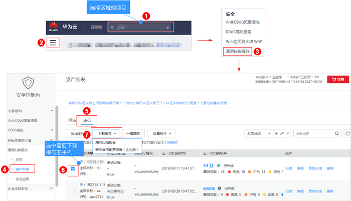
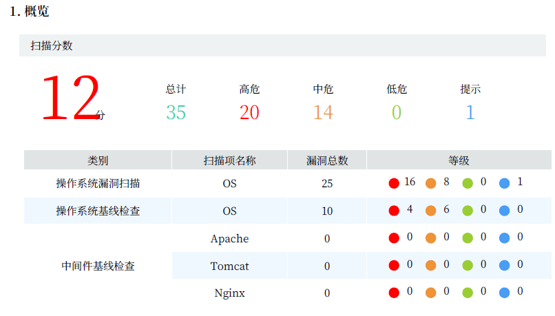
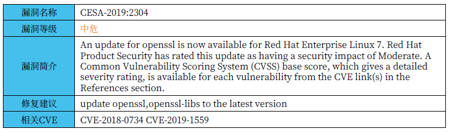
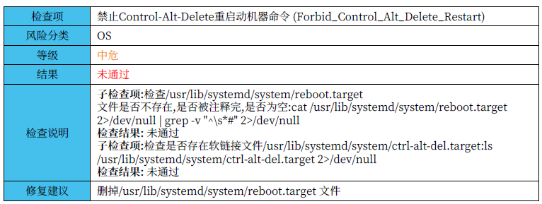
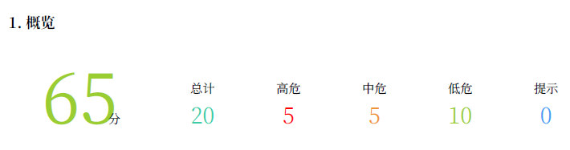
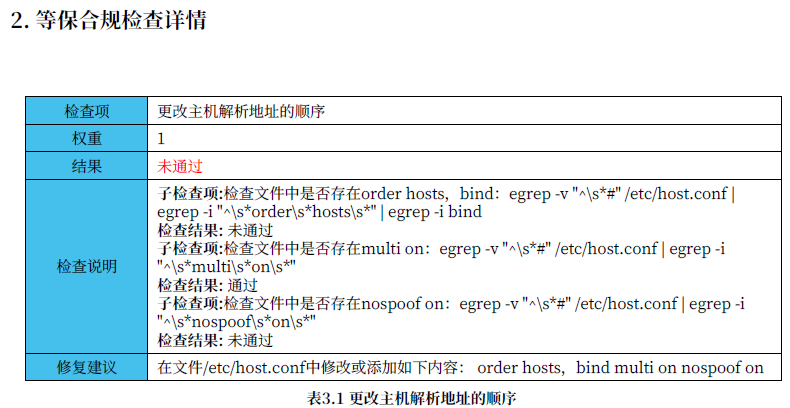

# 下载主机扫描报告

## 操作场景

当主机扫描任务成功完成后，您可以下载漏洞扫描报告和等保合规配置报告，报告目前只支持PDF格式。

> **须知：**   
>VSS目前仅企业版用户支持等保合规检测，如果您需要下载等保合规配置报告，请购买企业版。  

## 前提条件

已成功完成主机扫描任务，即目标主机的“上一次扫描结果“状态为“已完成“。

## 操作步骤

1.  [登录管理控制台](https://console.huaweicloud.com/)。
2.  进入下载主机扫描报告入口，如[图1](#fig1578442912552)所示。

    **图 1**  进入下载主机扫描报告入口  
    

3.  选择“漏洞扫描报告“或“等保合规配置报告（企业版）“，将目标主机的扫描报告下载到本地。

## 主机漏洞扫描报告模板说明

下载扫描报告后，您可以根据扫描结果，对漏洞进行修复，报告模板说明如下：

-   概览

    查看目标主机的扫描总览信息。

    **图 2**  查看扫描概览信息  
    

-   系统漏洞扫描详情

    您可以根据修复建议修复系统漏洞。

    **图 3**  查看漏洞详情以及修复建议  
    

-   基线检查详情

    您可以根据修复建议修复基线漏洞。

    **图 4**  查看基线检查结果以及修复建议  
    

## 等保合规配置报告模板说明

下载扫描报告后，您可以根据扫描结果，对漏洞进行修复，报告模板说明如下：

-   概览

    查看等保合规配置报告的概览信息。

    **图 5**  查看等保合规概览信息  
    

-   等保合规检查详情

    您可以根据修复建议修复等保合规漏洞。

    **图 6**  查看等保合规检查详情  
    

