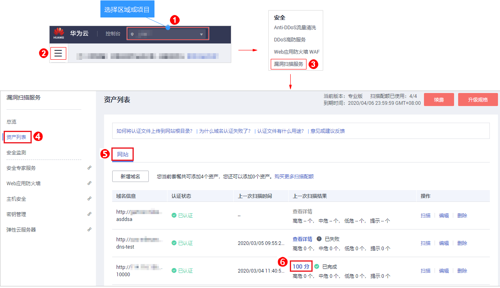
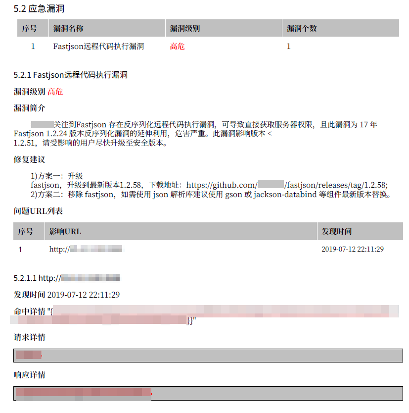

# 下载网站扫描报告

## 操作场景

当网站扫描任务成功完成后，您可以下载任务报告，报告目前只支持PDF格式。

## 前提条件

已成功完成网站扫描任务，即目标域名的“上一次扫描结果“状态为“已完成“。

## 操作步骤

1.  [登录管理控制台](https://console.huaweicloud.com/)。
2.  进入下载网站扫描报告入口，如[图1](#zh-cn_topic_0115901713_fig1450112312152)所示。

    **图 1**  进入下载网站扫描报告入口  
    

3.  单击右上角的，将网站扫描报告下载到本地，如[图2](#fig861714920181)所示。

    **图 2**  下载扫描报告  
    

## 网站漏洞扫描报告模板说明

下载扫描报告后，您可以根据扫描结果，对漏洞进行修复，报告模板主要内容说明如下：

-   概览

    查看目标网站的扫描漏洞数。

    **图 3**  查看任务概览信息  
    

-   漏洞分析概览

    统计漏洞类型及分布情况。

    **图 4**  漏洞类型分析  
    

-   服务端口列表

    查看目标网站的所有端口信息。

    **图 5**  端口列表  
    

-   漏洞根因及详情

    您可以根据修复建议修复漏洞。

    **图 6**  漏洞根因及详情  
    

