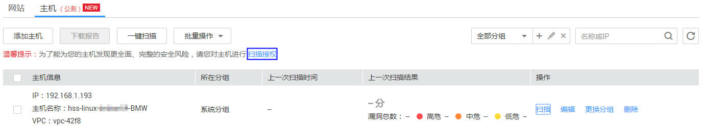
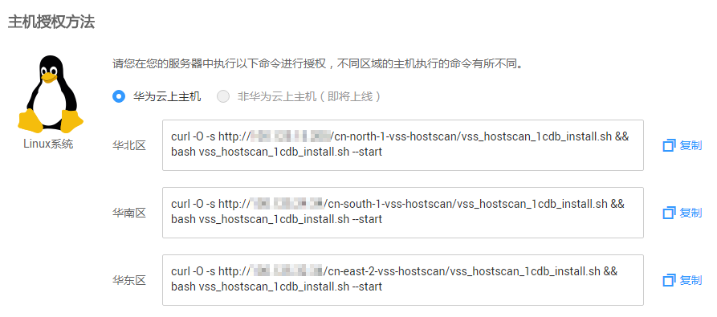
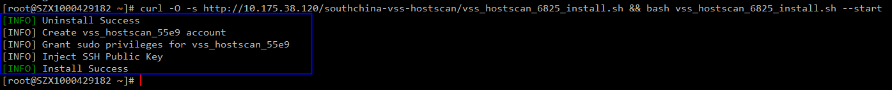

# 主机授权

## 操作场景

该任务指导用户通过漏洞扫描服务对已添加的华为云主机进行扫描授权。

扫描授权后，漏洞扫描服务能为用户的主机发现更全面、完整的安全风险。

> **说明：**   
>如果用户已经设置了SSH账号，就不需要进行主机授权。  

## 前提条件

-   已获取管理控制台的登录帐号与密码。
-   已添加主机。

## 操作步骤

1.  登录管理控制台。
2.  单击页面上方的“服务列表“，选择“安全  \>  漏洞扫描服务  \>  资产列表“，进入“资产列表“界面，选中“主机“页签，如[图1](#fig8223123454)所示。

    **图 1**  主机授权  
    

3.  单击“扫描授权“，进入“主机授权“界面，如[图2](#fig1038115404436)所示。

    **图 2**  主机授权方法  
    

4.  单击界面上的“复制“，复制开通授权的命令。
5.  使用远程管理工具（例如：“Xshell“、“SecureCRT“、“PuTTY“），通过弹性IP地址登录到待开通授权的弹性云服务器。

    > **说明：**   
    >也可使用弹性云服务器的“远程登录“功能，登录服务器。  

6.  执行复制的命令（这里用“SecureCRT“工具登录），结果如[图3](#fig7381440114316)所示，即执行成功。

    **图 3**  执行结果  
    

