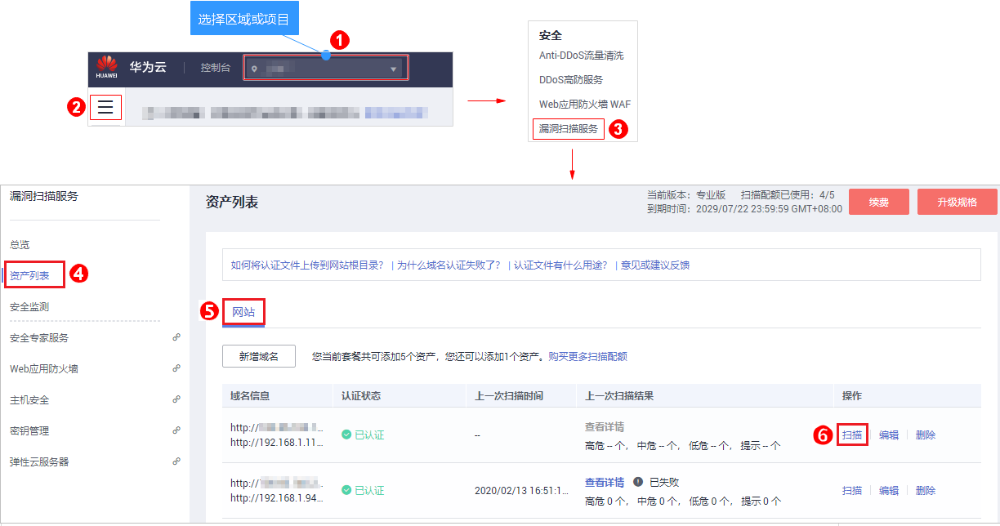

# 创建扫描任务

## 操作场景

该任务指导用户通过漏洞扫描服务创建扫描任务。

## 前提条件

-   已获取管理控制台的登录帐号与密码。
-   域名的“认证状态“为“已认证“。
-   如果您的网站设置了防火墙或其他安全策略，将导致VSS的扫描IP被当成恶意攻击者而误拦截。因此，在使用VSS前，请您将以下VSS的扫描IP添加至网站访问的白名单中：

    49.4.90.25，49.4.31.144，49.4.52.215，49.4.14.120，117.78.41.60，117.78.50.125，119.3.232.114，119.3.237.223，124.70.102.147，121.36.13.144，124.70.109.117，139.9.114.20，119.3.176.1

## 操作步骤

1.  [登录管理控制台](https://console.huaweicloud.com/?locale=zh-cn)。
2.  进入创建扫描任务入口，如[图1](#fig4989100164918)所示。

    **图 1**  进入创建扫描任务入口  
    

3.  在“创建任务“界面，请根据[表1](#table6685635142213)进行扫描设置，设置后如[图2](#fig17685113516224)所示。

    **图 2**  创建扫描任务  
    

    **表 1**  扫描设置参数说明

    
    <table><thead align="left"><tr id="row6685103582212"><th class="cellrowborder" valign="top" width="25.840000000000003%" id="mcps1.2.3.1.1">
参数

    </th>
    <th class="cellrowborder" valign="top" width="74.16%" id="mcps1.2.3.1.2">
参数说明

    </th>
    </tr>
    </thead>
    <tbody><tr id="row96853351221"><td class="cellrowborder" valign="top" width="25.840000000000003%" headers="mcps1.2.3.1.1 ">
任务名称

    </td>
    <td class="cellrowborder" valign="top" width="74.16%" headers="mcps1.2.3.1.2 ">
用户自定义。

    </td>
    </tr>
    <tr id="row1768593502210"><td class="cellrowborder" valign="top" width="25.840000000000003%" headers="mcps1.2.3.1.1 ">
目标网址

    </td>
    <td class="cellrowborder" valign="top" width="74.16%" headers="mcps1.2.3.1.2 ">
待扫描的网站地址或IP地址。

    
通过下拉框选择已认证通过的域名。

    
 须知： 

VSS是通过公网访问域名/IP地址进行扫描的，请确保该目标域名/IP地址能通过公网正常访问。

    

    </td>
    </tr>
    <tr id="row1239144922819"><td class="cellrowborder" valign="top" width="25.840000000000003%" headers="mcps1.2.3.1.1 ">
开始时间

    </td>
    <td class="cellrowborder" valign="top" width="74.16%" headers="mcps1.2.3.1.2 ">
可选参数，设置开始扫描的时间，不设置默认立即扫描。

    </td>
    </tr>
    <tr id="row16978346192814"><td class="cellrowborder" valign="top" width="25.840000000000003%" headers="mcps1.2.3.1.1 ">
扫描模式

    </td>
    <td class="cellrowborder" valign="top" width="74.16%" headers="mcps1.2.3.1.2 ">
三种扫描模式：

    <ul id="ul166301250203018"><li>快速扫描：扫描耗时最少，能检测到的漏洞相对较少。</li><li>标准扫描：扫描耗时适中，能检测到的漏洞相对较多。</li><li>深度扫描：扫描耗时最长，能检测到最深处的漏洞。</li></ul>
    
有些接口只能在登录后才能访问，建议用户配置对应接口的用户名和密码，VSS才能进行深度扫描。

    
 说明： 
<ul id="ul105281511945"><li>“快速扫描”：扫描的网站URL数量有限且VSS会开启耗时较短的扫描插件进行扫描。</li><li>“深度扫描”：扫描的网站URL数量不限且VSS会开启所有的扫描插件进行耗时较长的遍历扫描。</li><li>“标准扫描”：扫描的网站URL数量和耗时都介于“快速扫描”和“深度扫描”两者之间。</li></ul>
    

    </td>
    </tr>
    <tr id="row11685193520221"><td class="cellrowborder" valign="top" width="25.840000000000003%" headers="mcps1.2.3.1.1 ">
是否将本次扫描升级为专业版规格

    </td>
    <td class="cellrowborder" valign="top" width="74.16%" headers="mcps1.2.3.1.2 ">
基础版用户开启此功能后，扫描过程中会按需扣费：

    <ul id="ul176851835172211"><li>鼠标移动至了解升级后影响。</li><li>打开此功能时，扫描时会自动升级为专业版按需扣费，关闭该功能时，扫描时不会升级。</li></ul>
    </td>
    </tr>
    <tr id="row552974610328"><td class="cellrowborder" valign="top" width="25.840000000000003%" headers="mcps1.2.3.1.1 ">
扫描项设置

    </td>
    <td class="cellrowborder" valign="top" width="74.16%" headers="mcps1.2.3.1.2 ">
VSS支持的扫描功能参照<a href="#table832472816452">表2</a>。

    <ul id="ul14553014513"><li>：开启。</li><li>：关闭。</li></ul>
    </td>
    </tr>
    </tbody>
    </table>

    **表 2**  扫描项设置

    
    <table><thead align="left"><tr id="row163261428164510"><th class="cellrowborder" valign="top" width="30.9%" id="mcps1.2.3.1.1">
扫描项名称

    </th>
    <th class="cellrowborder" valign="top" width="69.1%" id="mcps1.2.3.1.2">
说明

    </th>
    </tr>
    </thead>
    <tbody><tr id="row10326102814457"><td class="cellrowborder" valign="top" width="30.9%" headers="mcps1.2.3.1.1 ">
Web常规漏洞扫描（包括XSS、SQL注入等30多种常见漏洞）

    </td>
    <td class="cellrowborder" valign="top" width="69.1%" headers="mcps1.2.3.1.2 ">
提供了常规的30多种常见漏洞的扫描，如XSS、SQL等漏洞的扫描。默认为开启状态，不支持关闭。

    </td>
    </tr>
    <tr id="row43261028164520"><td class="cellrowborder" valign="top" width="30.9%" headers="mcps1.2.3.1.1 ">
端口扫描

    </td>
    <td class="cellrowborder" valign="top" width="69.1%" headers="mcps1.2.3.1.2 ">
检测主机打开的所有端口。

    </td>
    </tr>
    <tr id="row17326428134515"><td class="cellrowborder" valign="top" width="30.9%" headers="mcps1.2.3.1.1 ">
弱密码扫描

    </td>
    <td class="cellrowborder" valign="top" width="69.1%" headers="mcps1.2.3.1.2 ">
对网站的弱密码进行扫描检测。

    </td>
    </tr>
    <tr id="row16326122844510"><td class="cellrowborder" valign="top" width="30.9%" headers="mcps1.2.3.1.1 ">
CVE漏洞扫描

    </td>
    <td class="cellrowborder" valign="top" width="69.1%" headers="mcps1.2.3.1.2 ">
CVE，即公共暴露漏洞库。VSS可以快速更新漏洞规则，扫描最新漏洞。

    </td>
    </tr>
    <tr id="row63261128104515"><td class="cellrowborder" valign="top" width="30.9%" headers="mcps1.2.3.1.1 ">
网页内容合规检测（文字）

    </td>
    <td class="cellrowborder" valign="top" width="69.1%" headers="mcps1.2.3.1.2 ">
对网站文字的合规性进行检测。

    </td>
    </tr>
    <tr id="row73261228194515"><td class="cellrowborder" valign="top" width="30.9%" headers="mcps1.2.3.1.1 ">
网页内容合规检测（图片）

    </td>
    <td class="cellrowborder" valign="top" width="69.1%" headers="mcps1.2.3.1.2 ">
对网站图片的合规性进行检测。

    </td>
    </tr>
    <tr id="row528481235011"><td class="cellrowborder" valign="top" width="30.9%" headers="mcps1.2.3.1.1 ">
网站挂马检测

    </td>
    <td class="cellrowborder" valign="top" width="69.1%" headers="mcps1.2.3.1.2 ">
挂马：上传木马到网站上，使得网站在运行的时候执行木马程序，被黑客控制，遭受损失。VSS可以检测网站是否存在挂马。

    </td>
    </tr>
    <tr id="row652215224509"><td class="cellrowborder" valign="top" width="30.9%" headers="mcps1.2.3.1.1 ">
链接健康检测（死链、暗链、恶意外链）

    </td>
    <td class="cellrowborder" valign="top" width="69.1%" headers="mcps1.2.3.1.2 ">
对网站的链接地址进行健康性检测，避免您的网站出现死链、暗链、恶意链接。

    </td>
    </tr>
    </tbody>
    </table>

    > **说明：** 
    >-   如果您当前的服务版本已经为专业版，不会提示升级。
    >-   基础版支持常见漏洞检测、端口扫描，每日扫描任务上限5个，单个扫描任务时长限制2小时。
    >-   专业版支持常见漏洞检测、端口扫描、弱密码扫描、短信通知，每日扫描任务上限多达60次。
    >-   高级版支持常见漏洞检测、端口扫描、弱密码扫描、短信通知，每日扫描任务上限多达60次。
    >-   企业版支持常见网站漏洞扫描、基线合规检测、弱密码、端口检测、紧急漏洞扫描、周期性检测，每日扫描任务上限多达60次。

4.  设置完成后，单击“开始扫描“。

    > **说明：** 
    >如果没有设置开始扫描时间，且此时服务器没有被占用，则创建的任务可立即开始扫描，任务状态为“进行中“；否则进入等待队列中等待，任务状态为“等待中“。

## 后续处理

扫描任务完成，您可以查看网站详情并下载网站扫描报告，详细操作请参见[查看网站扫描详情](查看网站扫描详情.md)、[下载网站扫描报告](下载网站扫描报告.md)。

## 相关操作

如果您在创建扫描任务过程中遇到问题，请参考以下方法解决：

-   [如何快速发现网站漏洞？](https://support.huaweicloud.com/vss_faq/vss_01_0045.html)
-   [为什么扫描任务自动登录失败了？](https://support.huaweicloud.com/vss_faq/vss_01_0043.html)
-   [为什么任务扫描中途就自动取消了？](https://support.huaweicloud.com/vss_faq/vss_01_0035.html)
-   [创建任务时为什么总是提示域名格式错误？](https://support.huaweicloud.com/vss_faq/vss_01_0040.html)
-   [网站漏洞扫描一次需要多久？](https://support.huaweicloud.com/vss_faq/vss_01_0026.html)
-   [如何解决网站扫描失败报连接超时的问题？](https://support.huaweicloud.com/vss_faq/vss_01_0097.html)
-   [创建网站扫描任务或重启任务不成功时如何处理？](https://support.huaweicloud.com/vss_faq/vss_01_0025.html)

