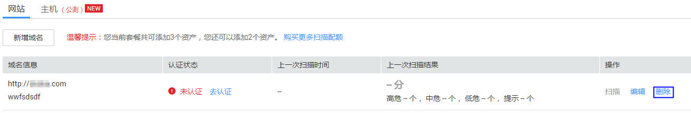
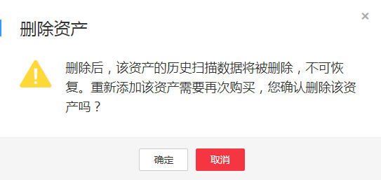

# 删除域名

## 操作场景

该任务指导用户通过漏洞扫描服务删除域名。

> **注意：**   
>域名删除后，该资产的历史扫描数据将被删除，不可恢复，故请谨慎操作。  

## 前提条件

-   已获取管理控制台的登录帐号与密码。
-   已添加域名。
-   任何状态的基础版域名。
-   专业版域名的状态为“未认证“。

## 操作步骤

1.  登录管理控制台。
2.  单击页面上方的“服务列表“，选择“安全  \>  漏洞扫描服务“，在左侧导航树中，选择“资产列表“，进入“资产列表“界面，如[图1](#fig18656134516104)所示。

    **图 1** “资产列表“界面  
    

3.  在目标域名的“操作“列中，单击“删除“，在弹出的对话框中，认真阅读提示内容，以未认证的专业版域名为例，如[图2](#fig1359133631511)所示。

    **图 2**  删除资产  
    

4.  单击“确定“，在页面右上角弹出“域名删除成功“，则说明域名删除成功。

    > **说明：**   
    >-   漏洞扫描服务只支持删除基础版域名和未认证的专业版域名。  
    >-   基础版域名和未认证的专业版域名删除后，不影响其已拥有的域名使用配额。  
    >-   如果您确定要删除专业版已认证的域名资产，请您发送申请邮件至：cloudvss@huawei.com，工作人员会第一时间进行回复与操作。  

