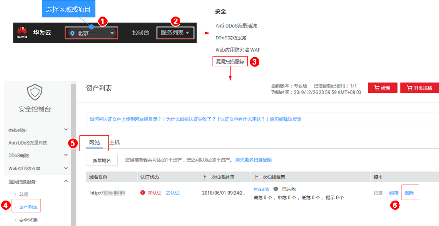

# 删除域名

## 操作场景

该任务指导用户通过漏洞扫描服务删除域名。

> **须知：**   
>域名删除后，该资产的历史扫描数据将被删除，不可恢复。  

## 前提条件

-   已获取管理控制台的登录账号与密码。
-   已添加域名。

## 操作步骤

1.  [登录管理控制台](https://console.huaweicloud.com/)。
2.  进入删除域名入口，如[图1](#fig4989100164918)所示。

    **图 1**  进入删除域名入口  
    

3.  在弹出的对话框中，单击“确定“，在页面右上角弹出“域名删除成功“，则说明域名删除成功。

## 相关操作

有关添加域名的详细操作，请参见[添加域名](添加域名.md)。

