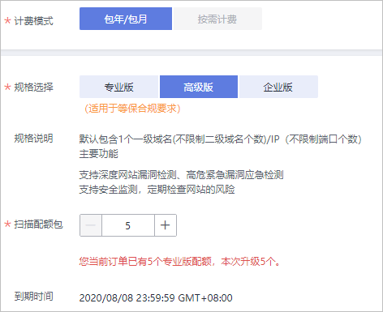

# 升级为高级版

当您是专业版用户时，如果需要将专业版扫描配额包中的二级域名配额全部升级为一级域名配额，可以直接将专业版升级为高级版。

该任务指导专业版用户将漏洞扫描服务升级为高级版。

## 前提条件

-   已获取管理控制台的登录账号（拥有VSS Administrator与BSS Administrator权限）和密码。
-   已购买专业版的漏洞扫描服务。

## 升级为高级版

1.  [登录管理控制台](https://console.huaweicloud.com/)。
2.  在页面上方选择区域或项目后，单击，选择“安全  \>  漏洞扫描服务“，进入漏洞扫描服务管理界面。
3.  单击“升级规格“，进入升级规格界面。
4.  在升级规格界面，单击“高级版“，设置配额，如[图1](#fig6160457319)所示。

    **图 1**  升级为高级版配额  
    

    在“扫描配额包“栏，单击增加域名扫描配额包数量。

    > **说明：**   
    >-   “扫描配额包“即配置的域名/IP地址个数，目前支持的范围为1-100。  
    >-   “扫描配额包“栏的数量默认为专业版配额的数量。  
    >-   “扫描配额包“可以选择大于或等于当前拥有的专业版配额，VSS仅支持专业版配额全部升级，不支持专业版配额部分升级。  
    >-   每个扫描配额包包含一个一级域名或公网IP。  

5.  确认订单详情无误并阅读《华为云漏洞扫描服务声明》后，勾选“我已阅读并同意《华为云漏洞扫描服务声明》“，单击“去支付“。

    如果订单填写有误，用户可以单击“上一页“，回到服务选型页面修改配置信息后再继续购买。

6.  在“付款“页面，选择付款方式进行付款。

