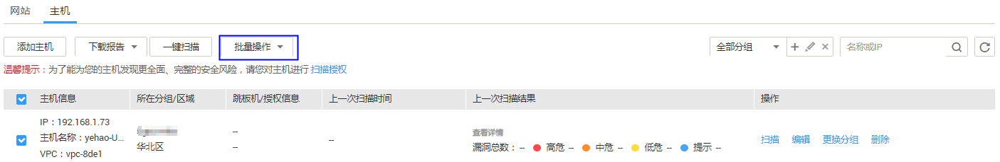
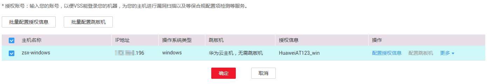

# 取消主机授权

## 操作场景

该任务指导用户通过漏洞扫描服务取消主机授权。

取消主机授权后，将不能完全扫描出主机的安全风险，请谨慎操作。

## 前提条件

-   已获取管理控制台的登录帐号与密码。
-   已添加主机。
-   已开通预置账号。
-   已在创建任务时授权华为云通过网络连接到对应的主机，即已进行主机授权。

## 操作步骤

1.  登录管理控制台。
2.  单击页面上方的“服务列表“，选择“安全  \>  漏洞扫描服务“，在左侧导航树中，单击“资产列表“，进入“资产列表“界面。
3.  在“资产列表“页面，选择“主机“页签，勾选需要解除授权的主机，在“批量操作“的下拉框中，单击“编辑“，如[图1](#zh-cn_topic_0115832330_fig8223123454)所示。

    **图 1**  主机授权  
    

4.  在目标主机的“操作“列，单击“更多“，在下拉框中，单击“解除授权“，如[图2](#fig1098202810557)所示。

    解除授权后，“授权信息“的状态为“暂未配置“。

    **图 2**  解除授权  
    

