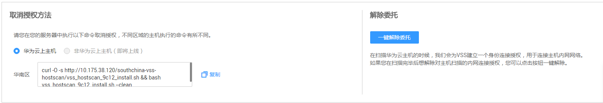

# 取消主机授权

## 操作场景

该任务指导用户通过漏洞扫描服务取消主机授权。

取消主机授权后，将不能完全扫描出主机的安全风险，请谨慎操作。

## 前提条件

-   已获取管理控制台的登录帐号与密码。
-   已添加主机。
-   已开通预置账号。
-   已在创建任务时授权华为云通过网络连接到对应的主机，即已进行主机授权。

## 操作步骤

1.  登录管理控制台。
2.  单击页面上方的“服务列表“，选择“安全  \>  漏洞扫描服务  \>  资产列表“，进入“资产列表“界面，选中“主机“页签，如[图1](#zh-cn_topic_0115832330_fig8223123454)所示。

    **图 1**  主机授权  
    

3.  单击“主机授权“，进入“主机授权“界面，选择主机类型，如[图2](#fig28591627165717)所示。

    **图 2**  取消授权  
    

4.  单击界面上的“复制“，复制取消授权的命令。
5.  使用远程管理工具（例如：“Xshell“、“SecureCRT“、“PuTTY“），通过弹性IP地址登录到待取消授权的弹性云服务器。

    > **说明：**   
    >也可使用弹性云服务器的“远程登录“功能，登录服务器。  

6.  执行复制的命令，取消授权。
7.  单击“一键解除连接授权“，如[图2](#fig28591627165717)所示，解除创建任务时授予的委托权限。

