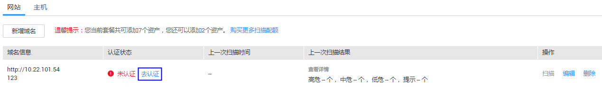
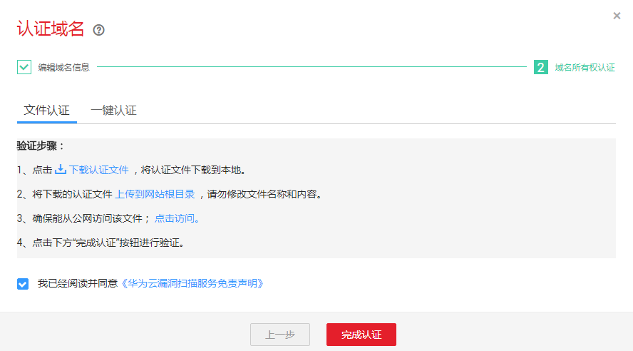
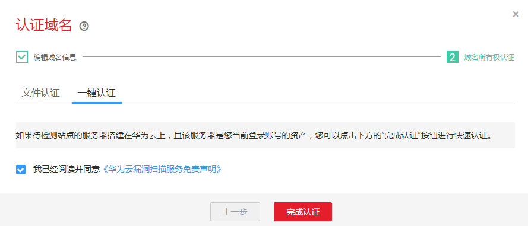

# 域名认证

该任务指导用户通过漏洞扫描服务完成域名认证。

## 前提条件

-   已获取管理控制台的登录帐号与密码。
-   域名的“认证状态“为“未认证“。

## 操作步骤

1.  登录管理控制台。
2.  单击页面上方的“服务列表“，选择“安全  \>  漏洞扫描服务“，在左侧导航树中，选择“资产列表“，进入“资产列表“界面。

    **图 1**  认证  
    

3.  在需要认证的域名所在行的“认证状态“列中，单击“去认证“，弹出的“认证域名“对话框，选择域名认证方式完成域名认证。

    > **说明：**   
    >如果待检测站点的服务器搭建在华为云上，且该服务器是您当前登录帐号的资产，才可以选择“一键认证“的方式进行快速认证，否则只能选择“文件认证“的方式进行认证。  

    -   文件认证，参照[图2](#fig118606072511)中的验证步骤完成域名认证。

        **图 2**  文件认证方式  
        

    -   一键认证，如[图3](#fig188601905252)所示。

        **图 3**  一键认证方式  
        

    勾选“我已阅读并同意《华为云漏洞扫描服务免责声明》“，单击“完成认证“，进行域名认证，执行完成后，该域名的状态为“已认证“。

