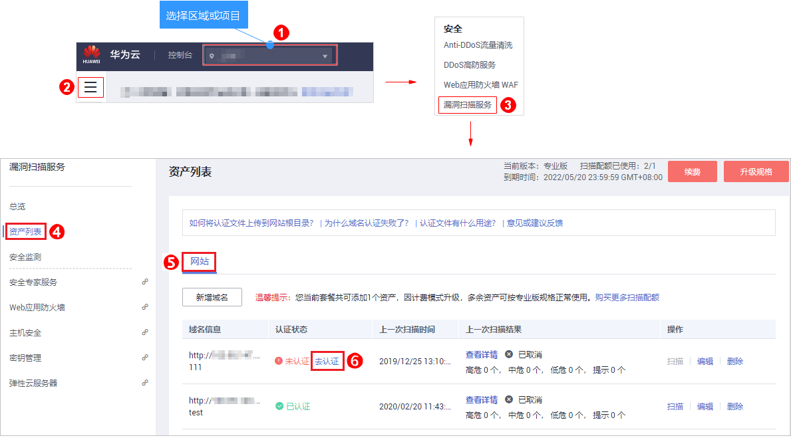

# 域名认证<a name="vss_01_0054"></a>

该任务指导用户通过漏洞扫描服务完成域名认证。

## 前提条件<a name="section362011861503"></a>

-   已获取管理控制台的登录账号与密码。
-   域名的“认证状态“为“未认证“。

## 操作步骤<a name="section23756719165737"></a>

1.  [登录管理控制台](https://console.huaweicloud.com/)。
2.  进入域名认证入口，如[图1](#fig4989100164918)所示。

    **图 1**  进入域名认证入口<a name="fig4989100164918"></a>  
    

3.  在弹出的“认证域名“对话框中，选择域名认证方式完成域名认证。
    -   文件认证，参照[图2](#fig9587920208)中的验证步骤完成域名认证。

        **图 2**  文件认证方式<a name="fig9587920208"></a>  
        

    -   一键认证，如[图3](#fig8587142013011)所示。

        **图 3**  一键认证方式<a name="fig8587142013011"></a>  
        

        > **须知：**   
        >如果您选择“一键认证“方式进行域名认证，请确保待检测站点的服务器搭建在华为云的以下区域，且该服务器是您当前登录账号的资产：  
        >-   华北-北京一  
        >-   华北-北京四  
        >-   华东-上海一  
        >-   华东-上海二  
        >-   华南-广州  
        >-   华南-深圳  
        >-   东北-大连  
        >-   西南-贵阳一  


4.  阅读《华为云漏洞扫描服务声明》后，勾选“我已阅读并同意《华为云漏洞扫描服务声明》“，单击“完成认证“，进行域名认证。

    执行完成后，该域名的状态为“已认证“。


## 认证文件上传网站根目录的配置示例<a name="section6188115084710"></a>

域名认证时，需要将下载的认证文件上传到网站根目录（即网站首页index文件的同级目录下），然后进行认证。用户使用的服务器不同，文件上传的位置有所不同，请参照以下示例场景完成认证文件的上传。以下示例场景不能覆盖所有的场景，如果遇到其他的场景，需要自行处理。

**场景一**：**网站部署在Tomcat、Apache、IIS服务器**

如果网站所使用的服务器是Tomcat、Apache、IIS服务器，请执行以下操作步骤。

1.  登录网站所使用的服务器。

    如果是非root用户，登录后，执行**su -root**命令切换到root用户。

2.  <a name="zh-cn_topic_0113516465_li16156578174417"></a>找到网站所使用的服务器的根目录，即“index“文件的同级目录。常见服务器的根目录如[表1](#zh-cn_topic_0113516465_table2433164122219)所示。

    **表 1**  常见服务器的根目录

    <a name="zh-cn_topic_0113516465_table2433164122219"></a>
    <table><thead align="left"><tr id="zh-cn_topic_0113516465_row12432144114224"><th class="cellrowborder" valign="top" width="30.04%" id="mcps1.2.3.1.1"><p id="zh-cn_topic_0113516465_p243284113227"><a name="zh-cn_topic_0113516465_p243284113227"></a><a name="zh-cn_topic_0113516465_p243284113227"></a>网站所使用的服务器</p>
    </th>
    <th class="cellrowborder" valign="top" width="69.96%" id="mcps1.2.3.1.2"><p id="zh-cn_topic_0113516465_p1643224162213"><a name="zh-cn_topic_0113516465_p1643224162213"></a><a name="zh-cn_topic_0113516465_p1643224162213"></a>根目录</p>
    </th>
    </tr>
    </thead>
    <tbody><tr id="zh-cn_topic_0113516465_row6432174162214"><td class="cellrowborder" valign="top" width="30.04%" headers="mcps1.2.3.1.1 "><p id="zh-cn_topic_0113516465_p643214117223"><a name="zh-cn_topic_0113516465_p643214117223"></a><a name="zh-cn_topic_0113516465_p643214117223"></a>tomcat</p>
    </td>
    <td class="cellrowborder" valign="top" width="69.96%" headers="mcps1.2.3.1.2 "><p id="zh-cn_topic_0113516465_p04322041122216"><a name="zh-cn_topic_0113516465_p04322041122216"></a><a name="zh-cn_topic_0113516465_p04322041122216"></a><i><span class="varname" id="zh-cn_topic_0113516465_varname0432114118220"><a name="zh-cn_topic_0113516465_varname0432114118220"></a><a name="zh-cn_topic_0113516465_varname0432114118220"></a>tomcat的部署地址</span></i>/webapps/ROOT/</p>
    </td>
    </tr>
    <tr id="zh-cn_topic_0113516465_row1843354118223"><td class="cellrowborder" valign="top" width="30.04%" headers="mcps1.2.3.1.1 "><p id="zh-cn_topic_0113516465_p9432941122216"><a name="zh-cn_topic_0113516465_p9432941122216"></a><a name="zh-cn_topic_0113516465_p9432941122216"></a>apache</p>
    </td>
    <td class="cellrowborder" valign="top" width="69.96%" headers="mcps1.2.3.1.2 "><p id="zh-cn_topic_0113516465_p3433541142217"><a name="zh-cn_topic_0113516465_p3433541142217"></a><a name="zh-cn_topic_0113516465_p3433541142217"></a>默认为<span class="filepath" id="zh-cn_topic_0113516465_filepath24331241162212"><a name="zh-cn_topic_0113516465_filepath24331241162212"></a><a name="zh-cn_topic_0113516465_filepath24331241162212"></a>“/var/www/html”</span>，请以实际情况为准</p>
    </td>
    </tr>
    <tr id="zh-cn_topic_0113516465_row24334411224"><td class="cellrowborder" valign="top" width="30.04%" headers="mcps1.2.3.1.1 "><p id="zh-cn_topic_0113516465_p13433184162217"><a name="zh-cn_topic_0113516465_p13433184162217"></a><a name="zh-cn_topic_0113516465_p13433184162217"></a>IIS</p>
    </td>
    <td class="cellrowborder" valign="top" width="69.96%" headers="mcps1.2.3.1.2 "><p id="zh-cn_topic_0113516465_p2433144110225"><a name="zh-cn_topic_0113516465_p2433144110225"></a><a name="zh-cn_topic_0113516465_p2433144110225"></a>默认为<span class="filepath" id="zh-cn_topic_0113516465_filepath3433841162214"><a name="zh-cn_topic_0113516465_filepath3433841162214"></a><a name="zh-cn_topic_0113516465_filepath3433841162214"></a>“C:\inetpub\wwwroot”</span>，请以实际情况为准</p>
    </td>
    </tr>
    </tbody>
    </table>

3.  将认证文件保存在[2](#zh-cn_topic_0113516465_li16156578174417)中找到的目录下。

    > **说明：**   
    >以下的操作仅为示例，请以实际情况为准，总之，将认证文件放到“index“文件的同级目录即可。  

    示例：

    1.  进入网站所使用的服务器的根目录：**cd**  根目录
    2.  新建一个同域名认证文件同名的文件：**vi**  hwwebscan\_verify.html
    3.  进入编辑模式：**i**

        将准备好的认证文件内容粘贴到此处。

    4.  保存并退出编辑模式：按“Esc“退出编辑，输入**:wq**保存并退出。
    5.  查看认证文件是否上传成功：**ll**

        **图 4**  示例<a name="zh-cn_topic_0113516465_fig44924411061"></a>  
        

4.  在浏览器中输入“_目标网址_/hwwebscan\_verify.html”，验证认证文件是否上传成功，如果能成功访问，则表示上传成功。

**场景二**：**网站部署在Nginx服务器**

如果网站所使用的服务器是Nginx，可以通过配置nginx.conf文件， 将hwwebscan\_verify.html的访问重定向到本地的某个文件， 具体操作请执行以下步骤。

1.  登录Nginx服务器。

    如果是非root用户，登录后，执行**su -root**命令切换到root用户。

2.  将认证文件上传到任意目录下（Nginx进程对此目录有只读权限）。以下以“/opt/mock“目录为例。

    示例：

    1.  打开任意目录：**cd**   /opt/mock
    2.  新建一个同域名认证文件同名的文件：**vi**  hwwebscan\_verify.html
    3.  进入编辑模式：**i**

        将准备好的认证文件内容粘贴到此处。

    4.  保存并退出编辑模式：按Esc退出编辑，输入**:wq**保存并退出。

3.  打开nginx.conf文件，配置Nginx的http模块的location信息，配置成功后，可以从“/opt/mock“目录下读取认证文件。
    1.  找到并打开nginx.con文件：**vi**  nginx.conf
    2.  根据具体场景，把以下的内容修改后替换nginx.conf的原http模块，如[图5](#zh-cn_topic_0113516465_fig2054691419416)所示。

        ```
        http {
        default_type "application/json;charset=utf-8";
        server {
        listen ${your website port};#根据具体场景替换
        location /hwwebscan_verify.html {
        ${user}  /opt/mock;
        }
        }
        }
        ```

        **图 5**  配置location信息<a name="zh-cn_topic_0113516465_fig2054691419416"></a>  
        

4.  完成配置后执行命令**nginx -s reload**刷新配置。
5.  在浏览器中输入“_目标网址_/hwwebscan\_verify.html”，验证认证文件是否上传成功，如果能成功访问，则表示上传成功。

