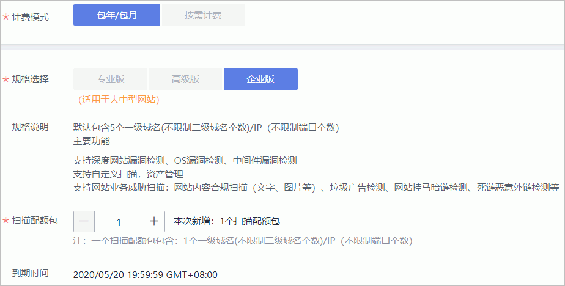

# 域名配额扩容

## 操作场景

该任务指导已购买专业版或者企业版的用户增加扫描的域名配额。

> **须知：**   
>-   若用户以前使用过基础版（免费体验版）进行扫描，在升级为专业版时，基础版所有的已有域名会占用专业版配额。  
>-   当前不支持从专业版直接升级至企业版，若您是专业版用户，并想要使用企业版，请直接购买企业版，为保证您的权益，请您购买企业版后，提工单退订专业版，如需帮助，请您联系您的客户经理或将您的联系方式发送至邮箱cloudvss@huawei.com，客户经理会第一时间与您联系，给您带来不便敬请谅解。  

## 前提条件

-   已获取管理控制台的登录账号（拥有VSS Administrator与BSS Administrator权限）和密码。
-   已购买专业版或者企业版的漏洞扫描服务。

## 扩容专业版配额

1.  [登录管理控制台](https://console.huaweicloud.com/)。
2.  进入升级专业版规格入口，如[图1](#fig4989100164918)所示。

    **图 1**  进入升级规格入口  
    

3.  在升级规格界面设置配额，如[图2](#fig9639151111292)所示。

    **图 2**  专业版配额扩容  
    

    在“扫描包数量“栏，单击增加域名扫描包数量。

    > **说明：**   
    >-   “扫描包数量“即配置的域名/IP地址个数，目前支持的范围为1-100。  
    >-   选择的“扫描包数量“必须大于当前拥有的域名配额。  
    >-   每个扫描包包含一个二级域名和每月60次的主机扫描配额（月末清零），您可以根据您的主机扫描需求，合理分配主机扫描配额。  

1.  在页面右下角，单击“立即购买“。

    > **说明：**   
    >如果您对价格有疑问，可以单击“了解计费详情“了解产品价格。  

1.  确认订单详情无误并阅读《华为云漏洞扫描服务声明》后，勾选“我已阅读并同意《华为云漏洞扫描服务声明》“，单击“去支付“。

    如果订单填写有误，用户可以单击“上一页“，回到服务选型页面修改配置信息后再继续购买。

1.  在“付款“页面，选择付款方式进行付款。

## 扩容企业版配额

1.  [登录管理控制台](https://console.huaweicloud.com/)。
2.  进入升级企业版规格入口，如[图3](#fig3648838886)所示。

    **图 3**  进入升级规格入口  
    

3.  在升级规格界面设置配额，如[图4](#zh-cn_topic_0124201198_fig199109632918)所示。

    **图 4**  企业版配额扩容  
    

    在“域名扩展包“栏，单击增加域名扩展包 。

    > **说明：**   
    >-   “域名扩展包“即配置的域名/IP地址个数，目前支持的范围为1～100。  
    >-   每个域名扩展包为一个一级域名扫描配额。  

1.  在页面右下角，单击“立即购买“。

    > **说明：**   
    >如果您对价格有疑问，可以单击“了解计费详情“了解产品价格。  

1.  确认订单详情无误并阅读《华为云漏洞扫描服务声明》后，勾选“我已阅读并同意《华为云漏洞扫描服务声明》“，单击“去支付“。

    如果订单填写有误，用户可以单击“上一页“，回到服务选型页面修改配置信息后再继续购买。

1.  在“付款“页面，选择付款方式进行付款。

