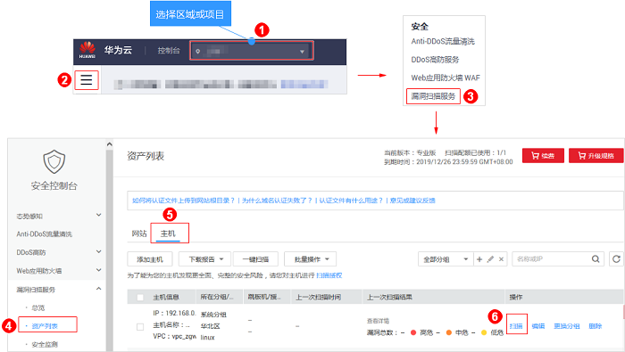
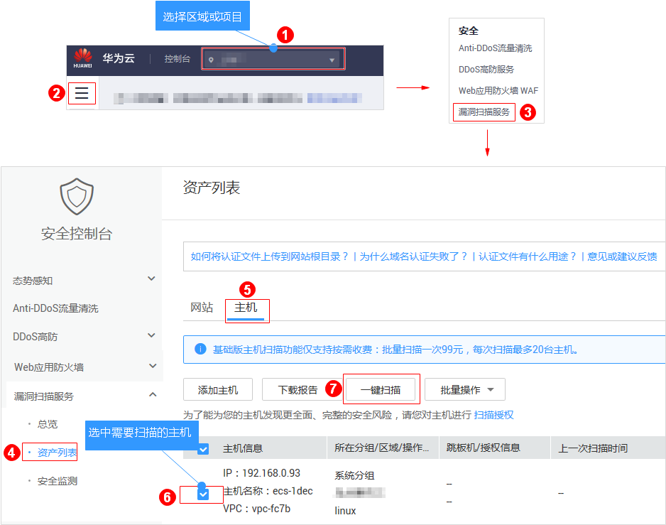

# 开启主机扫描

## 操作场景

该任务指导用户通过漏洞扫描服务开启主机扫描。

开启主机扫描后，漏洞扫描服务将对主机进行漏洞扫描与基线检测，Windows系统主机暂不支持基线检查功能。

> **须知：**   
>-   漏洞扫描服务的基础版不支持主机扫描功能，如果您是基础版用户，请通过以下方式使用主机扫描功能：  
>    -   购买专业版或企业版  
>    -   按次购买主机扫描功能  
>    -   按次一次性扣费，每次最多可以扫描20台主机。  

## 前提条件

-   已获取管理控制台的登录账号和密码。
-   已添加主机。

> **说明：**   
>为了确保扫描成功，在开启主机扫描前，请先完成以下操作。  
>1.  参照[配置Linux主机授权](配置Linux主机授权.md)和[配置Windows主机授权](配置Windows主机授权.md)完成主机授权。  
>2.  如果主机所在的安全组设置了访问限制，请参见[如何解决主机不能访问](https://support.huaweicloud.com/vss_faq/vss_01_0086.html)添加策略允许VSS的IP网段访问您的主机。  
>3.  如果用户同时使用了**主机安全服务**，参见[配置SSH登录IP白名单](https://support.huaweicloud.com/usermanual-hss/hss_01_0051.html)将您的主机IP配置为白名单。否则，主机IP会被当成不信任IP被**主机安全服务**拦截，造成扫描任务失败。  

## 开启主机扫描（专业版/企业版）

1.  [登录管理控制台](https://console.huaweicloud.com/)。
2.  进入主机扫描入口，如[图1](#fig4989100164918)所示。

    **图 1**  进入主机扫描入口  
    

    > **说明：**   
    >您可以选中需要扫描的主机，在主机列表上方单击“一键扫描“，对选中的多台主机批量进行扫描。  

3.  在弹出的对话框中，单击“确定“。

## 开启主机扫描（基础版）

漏洞扫描服务的基础版不支持主机扫描功能，如果您是基础版用户，请通过以下方式使用主机扫描功能：

-   购买专业版或企业版
-   按次购买主机扫描功能
-   按次一次性扣费，每次最多可以扫描20台主机。

请参照以下操作步骤，按需购买主机扫描功能。

1.  [登录管理控制台](https://console.huaweicloud.com/)。
2.  进入主机扫描入口，如[图2](#fig84591748125518)所示。

    **图 2**  进入主机扫描入口-基础版  
    

3.  在弹出的对话框中，选中“我已了解并同意支付该笔费用“，单击“确定“。

    **图 3** “开启主机扫描“对话框  
    

    当账户余额充足时，系统在自动扣费后，将执行主机扫描任务。

    > **须知：**   
    >-   当主机扫描任务成功时，请查看主机扫描详情，详细操作请参见[查看主机扫描详情](查看主机扫描详情.md)。  
    >-   当主机扫描任务失败时，请在扫描详情页面单击“重新扫描（免费）“，系统将重新执行扫描任务。  

## 相关操作

如果主机授权后仍扫描失败，请参照以下方法处理：

-   [如何解决Linux主机脚本授权后仍扫描失败？](https://support.huaweicloud.com/vss_faq/vss_01_0103.html)
-   [如何解决Windows主机授权后仍扫描失败？](https://support.huaweicloud.com/vss_faq/vss_01_0108.html)
-   [如何解决主机不能访问？](https://support.huaweicloud.com/vss_faq/vss_01_0086.html)
-   [主机扫描为什么会扫描失败？](https://support.huaweicloud.com/vss_faq/vss_01_0087.html)
-   [为什么在扫描时会提示授权委托失败？](https://support.huaweicloud.com/vss_faq/vss_01_0085.html)

