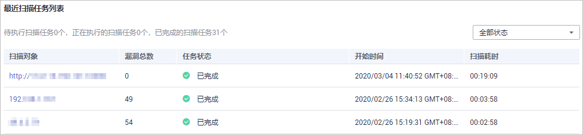

# 总览

## 操作场景

该任务指导用户通过“总览“查看扫描概况，主要展示资产信息、最近一次扫描情况、最近扫描任务列表和一键检测的提示信息。

## 前提条件

-   已获取管理控制台的登录账号与密码。
-   已添加网站或主机。

## 查看扫描概况

1.  [登录管理控制台](https://console.huaweicloud.com/)。
2.  单击页面上方的“服务列表“，选择“安全  \>  漏洞扫描服务“，进入“总览“界面。
3.  查看扫描概况。

    单击“一键检测“，进入“一键检测最新紧急漏洞风险“页面查看最新爆发的紧急漏洞详情。

    -   查看资产信息，如[图1](#fig235885183315)所示，资产信息参数说明如[表1](#table10359115133313)所示。

        **图 1**  资产信息  
        

        **表 1**  资产信息参数说明

        
        <table><thead align="left"><tr id="row2359175112339"><th class="cellrowborder" valign="top" width="18%" id="mcps1.2.4.1.1">
参数

        </th>
        <th class="cellrowborder" valign="top" width="48%" id="mcps1.2.4.1.2">
说明

        </th>
        <th class="cellrowborder" valign="top" width="34%" id="mcps1.2.4.1.3">
操作

        </th>
        </tr>
        </thead>
        <tbody><tr id="row193591551173312"><td class="cellrowborder" valign="top" width="18%" headers="mcps1.2.4.1.1 ">
网站/主机数量

        </td>
        <td class="cellrowborder" valign="top" width="48%" headers="mcps1.2.4.1.2 ">
显示网站/主机、已认证、未认证的网站/主机个数。

        
 说明： 

当网站/主机的个数为0时，单击“添加资产”，进入到资产列表界面添加网站/主机。

        

        </td>
        <td class="cellrowborder" valign="top" width="34%" headers="mcps1.2.4.1.3 "><ul id="ul1635910518330"><li>单击个数可以进入到相应的资产列表。</li><li>显示已认证和未认证的网站/主机个数。</li></ul>
        </td>
        </tr>
        <tr id="row235919515334"><td class="cellrowborder" valign="top" width="18%" headers="mcps1.2.4.1.1 ">
最危险网站/主机

        </td>
        <td class="cellrowborder" valign="top" width="48%" headers="mcps1.2.4.1.2 "><ul id="ul93591251143318"><li>得分最低的网站为最危险的网站，如果得分一样，则比较高危漏洞个数、中危漏洞个数......依次类推。</li><li>如果用户添加了网站且所有网站的扫描得分是100分，则没有最危险网站，展示“--”。</li><li>显示网站/主机不同等级的风险个数。</li></ul>
        </td>
        <td class="cellrowborder" valign="top" width="34%" headers="mcps1.2.4.1.3 "><ul id="ul19359205110332"><li>单击最危险网站/主机，可以进入到该网站/主机的最近一次扫描任务详情。</li><li>风险等级有：高危、中危、低危和提示。</li></ul>
        </td>
        </tr>
        <tr id="row63593511336"><td class="cellrowborder" valign="top" width="18%" headers="mcps1.2.4.1.1 ">
网站/主机风险统计

        </td>
        <td class="cellrowborder" valign="top" width="48%" headers="mcps1.2.4.1.2 ">
统计所有网站/主机的风险详情。

        </td>
        <td class="cellrowborder" valign="top" width="34%" headers="mcps1.2.4.1.3 ">
--

        </td>
        </tr>
        </tbody>
        </table>

    -   最近一次扫描情况，如[图2](#fig0360195110336)所示，参数说明如[表2](#table8363115111336)说明。

        **图 2**  最近一次扫描情况  
        

        > **说明：**   
        >-   单击切换最近1次的网站与主机的扫描情况。  
        >-   当扫描未完成的时候，不展示分数，而是展示扫描状态，未完成的扫描状态有“等待中“、“进行中“。  
        >-   如果扫描任务是失败的，则展示上一次扫描成功的任务详情。  

        **表 2**  扫描情况参数说明

        
        <table><thead align="left"><tr id="row4362125113339"><th class="cellrowborder" valign="top" width="20%" id="mcps1.2.4.1.1">
参数

        </th>
        <th class="cellrowborder" valign="top" width="40%" id="mcps1.2.4.1.2">
说明

        </th>
        <th class="cellrowborder" valign="top" width="40%" id="mcps1.2.4.1.3">
操作

        </th>
        </tr>
        </thead>
        <tbody><tr id="row153621551133311"><td class="cellrowborder" valign="top" width="20%" headers="mcps1.2.4.1.1 ">
扫描对象

        </td>
        <td class="cellrowborder" valign="top" width="40%" headers="mcps1.2.4.1.2 ">
扫描的网站/主机。

        </td>
        <td class="cellrowborder" valign="top" width="40%" headers="mcps1.2.4.1.3 ">
单击网站/主机可进入本次任务的扫描详情。

        </td>
        </tr>
        <tr id="row6362195116334"><td class="cellrowborder" valign="top" width="20%" headers="mcps1.2.4.1.1 ">
开始时间

        </td>
        <td class="cellrowborder" valign="top" width="40%" headers="mcps1.2.4.1.2 ">
开始扫描的时间。

        </td>
        <td class="cellrowborder" valign="top" width="40%" headers="mcps1.2.4.1.3 ">
--

        </td>
        </tr>
        <tr id="row636265113332"><td class="cellrowborder" valign="top" width="20%" headers="mcps1.2.4.1.1 ">
扫描耗时

        </td>
        <td class="cellrowborder" valign="top" width="40%" headers="mcps1.2.4.1.2 ">
扫描全过程所耗的时间。

        </td>
        <td class="cellrowborder" valign="top" width="40%" headers="mcps1.2.4.1.3 ">
--

        </td>
        </tr>
        <tr id="row1727071918320"><td class="cellrowborder" valign="top" width="20%" headers="mcps1.2.4.1.1 ">
任务状态

        </td>
        <td class="cellrowborder" valign="top" width="40%" headers="mcps1.2.4.1.2 "><ul id="ul19513105443212"><li>已完成</li><li>进行中</li><li>等待中</li></ul>
        </td>
        <td class="cellrowborder" valign="top" width="40%" headers="mcps1.2.4.1.3 ">
--

        </td>
        </tr>
        <tr id="row43631951153318"><td class="cellrowborder" valign="top" width="20%" headers="mcps1.2.4.1.1 ">
漏洞总数

        </td>
        <td class="cellrowborder" valign="top" width="40%" headers="mcps1.2.4.1.2 ">
显示网站/主机不同等级的风险个数。

        </td>
        <td class="cellrowborder" valign="top" width="40%" headers="mcps1.2.4.1.3 ">
风险等级有：高危、中危、低危、和提示。

        </td>
        </tr>
        <tr id="row12363351193314"><td class="cellrowborder" valign="top" width="20%" headers="mcps1.2.4.1.1 ">
TOP风险

        </td>
        <td class="cellrowborder" valign="top" width="40%" headers="mcps1.2.4.1.2 ">
根据扫描项的漏洞数量排序而来。

        </td>
        <td class="cellrowborder" valign="top" width="40%" headers="mcps1.2.4.1.3 ">
--

        </td>
        </tr>
        </tbody>
        </table>

    -   最近扫描任务列表，如[图3](#fig93631651183310)所示，参数说明如[表3](#table1036765113310)说明。

        **图 3**  最近扫描任务列表  
        

        **表 3**  任务列表参数说明

        
        <table><thead align="left"><tr id="row1936325114337"><th class="cellrowborder" valign="top" width="15%" id="mcps1.2.4.1.1">
参数

        </th>
        <th class="cellrowborder" valign="top" width="40%" id="mcps1.2.4.1.2">
说明

        </th>
        <th class="cellrowborder" valign="top" width="45%" id="mcps1.2.4.1.3">
操作

        </th>
        </tr>
        </thead>
        <tbody><tr id="row1836314519331"><td class="cellrowborder" valign="top" width="15%" headers="mcps1.2.4.1.1 ">
扫描对象

        </td>
        <td class="cellrowborder" valign="top" width="40%" headers="mcps1.2.4.1.2 ">
扫描的网站/主机。

        </td>
        <td class="cellrowborder" valign="top" width="45%" headers="mcps1.2.4.1.3 ">
单击网站/主机可进入本次任务的扫描详情。

        </td>
        </tr>
        <tr id="row93641351153313"><td class="cellrowborder" valign="top" width="15%" headers="mcps1.2.4.1.1 ">
漏洞总数

        </td>
        <td class="cellrowborder" valign="top" width="40%" headers="mcps1.2.4.1.2 ">
显示网站/主机的风险漏洞总数。

        </td>
        <td class="cellrowborder" valign="top" width="45%" headers="mcps1.2.4.1.3 ">
--

        </td>
        </tr>
        <tr id="row1636419513337"><td class="cellrowborder" valign="top" width="15%" headers="mcps1.2.4.1.1 ">
任务状态

        </td>
        <td class="cellrowborder" valign="top" width="40%" headers="mcps1.2.4.1.2 ">
三个状态：“等待中”、“进行中”、“已完成”。

        </td>
        <td class="cellrowborder" valign="top" width="45%" headers="mcps1.2.4.1.3 ">
--

        </td>
        </tr>
        <tr id="row936475113333"><td class="cellrowborder" valign="top" width="15%" headers="mcps1.2.4.1.1 ">
开始时间

        </td>
        <td class="cellrowborder" valign="top" width="40%" headers="mcps1.2.4.1.2 ">
开始扫描的时间。

        </td>
        <td class="cellrowborder" valign="top" width="45%" headers="mcps1.2.4.1.3 ">
--

        </td>
        </tr>
        <tr id="row12366145118332"><td class="cellrowborder" valign="top" width="15%" headers="mcps1.2.4.1.1 ">
扫描耗时

        </td>
        <td class="cellrowborder" valign="top" width="40%" headers="mcps1.2.4.1.2 ">
扫描全过程所耗的时间。

        </td>
        <td class="cellrowborder" valign="top" width="45%" headers="mcps1.2.4.1.3 ">
--

        </td>
        </tr>
        </tbody>
        </table>

