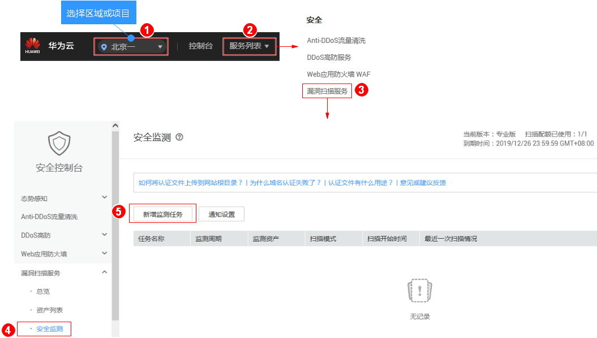
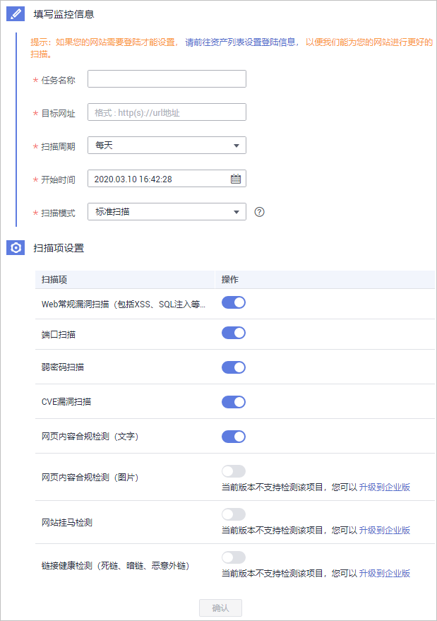

# 新增监测任务

## 操作场景

漏洞扫描服务支持网站、服务器扫描，网站与服务器都是您的“资产“，您可以在“安全监测“界面对您的资产进行安全扫描与编辑操作。

该任务指导用户通过漏洞扫描服务新增监测任务，监测任务新增成功后，自动开启监测。

> **须知：**   
>漏洞扫描服务的基础版不支持安全监测功能，如果您是基础版用户，请您通过购买专业版或企业版使用该功能。  

## 前提条件

-   已获取管理控制台的登录账号与密码。
-   域名的“认证状态“为“已认证“。

## 操作步骤

1.  [登录管理控制台](https://console.huaweicloud.com/)。
2.  进入新增监测任务入口，如[图1](#fig1578442912552)所示。

    **图 1**  进入新增监测任务入口  
    

3.  在“新增监测任务“界面，请根据[表1](#table13105205413919)进行扫描设置，设置后如[图2](#fig5927172481519)所示。

    **图 2**  监测任务的扫描设置  
    

    **表 1**  扫描设置参数说明

    
    <table><thead align="left"><tr id="row1610517541494"><th class="cellrowborder" valign="top" width="25.840000000000003%" id="mcps1.2.3.1.1">
参数

    </th>
    <th class="cellrowborder" valign="top" width="74.16%" id="mcps1.2.3.1.2">
参数说明

    </th>
    </tr>
    </thead>
    <tbody><tr id="row51054541898"><td class="cellrowborder" valign="top" width="25.840000000000003%" headers="mcps1.2.3.1.1 ">
任务名称

    </td>
    <td class="cellrowborder" valign="top" width="74.16%" headers="mcps1.2.3.1.2 ">
用户自定义。

    </td>
    </tr>
    <tr id="row1110517542911"><td class="cellrowborder" valign="top" width="25.840000000000003%" headers="mcps1.2.3.1.1 ">
目标网址

    </td>
    <td class="cellrowborder" valign="top" width="74.16%" headers="mcps1.2.3.1.2 ">
待扫描的网站地址或IP地址。

    
通过下拉框选择已认证通过的域名。

    </td>
    </tr>
    <tr id="row51055543919"><td class="cellrowborder" valign="top" width="25.840000000000003%" headers="mcps1.2.3.1.1 ">
扫描周期

    </td>
    <td class="cellrowborder" valign="top" width="74.16%" headers="mcps1.2.3.1.2 ">
单击下拉框选择任务扫描周期。

    <ul id="ul1421563810517"><li>每天</li><li>每三天</li><li>每周</li><li>每月</li></ul>
    </td>
    </tr>
    <tr id="row1310515548919"><td class="cellrowborder" valign="top" width="25.840000000000003%" headers="mcps1.2.3.1.1 ">
开始时间

    </td>
    <td class="cellrowborder" valign="top" width="74.16%" headers="mcps1.2.3.1.2 ">
设置监测任务开始的时间。

    </td>
    </tr>
    <tr id="row19928103045314"><td class="cellrowborder" valign="top" width="25.840000000000003%" headers="mcps1.2.3.1.1 ">
扫描模式

    </td>
    <td class="cellrowborder" valign="top" width="74.16%" headers="mcps1.2.3.1.2 ">
三种扫描模式：

    <ul id="ul723114126541"><li>快速扫描：扫描耗时最少，能检测到的漏洞相对较少。</li><li>标准扫描：扫描耗时适中，能检测到的漏洞相对较多。</li><li>深度扫描：扫描耗时最长，能检测到最深处的漏洞。</li></ul>
    </td>
    </tr>
    <tr id="row101058544913"><td class="cellrowborder" valign="top" width="25.840000000000003%" headers="mcps1.2.3.1.1 ">
是否将每次扫描升级为专业版规格

    </td>
    <td class="cellrowborder" valign="top" width="74.16%" headers="mcps1.2.3.1.2 ">
基础版用户开启此功能后，扫描过程中会按需扣费：

    <ul id="ul1310575413919"><li>鼠标移动至了解升级后影响。</li><li>打开此功能时，扫描时会自动升级为专业版按需扣费，关闭该功能时，扫描时不会升级。</li></ul>
    </td>
    </tr>
    <tr id="row497202419558"><td class="cellrowborder" valign="top" width="25.840000000000003%" headers="mcps1.2.3.1.1 ">
扫描项设置

    </td>
    <td class="cellrowborder" valign="top" width="74.16%" headers="mcps1.2.3.1.2 ">
VSS支持的扫描项参照<a href="#table832472816452">表2</a>。

    <ul id="ul14553014513"><li>：开启。</li><li>：关闭。</li></ul>
    </td>
    </tr>
    </tbody>
    </table>

    **表 2**  扫描项设置

    
    <table><thead align="left"><tr id="vss_01_0067_row163261428164510"><th class="cellrowborder" valign="top" width="30.9%" id="mcps1.2.3.1.1">
扫描项名称

    </th>
    <th class="cellrowborder" valign="top" width="69.1%" id="mcps1.2.3.1.2">
说明

    </th>
    </tr>
    </thead>
    <tbody><tr id="vss_01_0067_row10326102814457"><td class="cellrowborder" valign="top" width="30.9%" headers="mcps1.2.3.1.1 ">
Web常规漏洞扫描（包括XSS、SQL注入等30多种常见漏洞）

    </td>
    <td class="cellrowborder" valign="top" width="69.1%" headers="mcps1.2.3.1.2 ">
提供了常规的30多种常见漏洞的扫描，如XSS、SQL等漏洞的扫描。默认为开启状态，不支持关闭。

    </td>
    </tr>
    <tr id="vss_01_0067_row43261028164520"><td class="cellrowborder" valign="top" width="30.9%" headers="mcps1.2.3.1.1 ">
端口扫描

    </td>
    <td class="cellrowborder" valign="top" width="69.1%" headers="mcps1.2.3.1.2 ">
检测主机打开的所有端口。

    </td>
    </tr>
    <tr id="vss_01_0067_row17326428134515"><td class="cellrowborder" valign="top" width="30.9%" headers="mcps1.2.3.1.1 ">
弱密码扫描

    </td>
    <td class="cellrowborder" valign="top" width="69.1%" headers="mcps1.2.3.1.2 ">
对网站的弱密码进行扫描检测。

    </td>
    </tr>
    <tr id="vss_01_0067_row16326122844510"><td class="cellrowborder" valign="top" width="30.9%" headers="mcps1.2.3.1.1 ">
CVE漏洞扫描

    </td>
    <td class="cellrowborder" valign="top" width="69.1%" headers="mcps1.2.3.1.2 ">
CVE，即公共暴露漏洞库。VSS可以快速更新漏洞规则，扫描最新漏洞。

    </td>
    </tr>
    <tr id="vss_01_0067_row63261128104515"><td class="cellrowborder" valign="top" width="30.9%" headers="mcps1.2.3.1.1 ">
网页内容合规检测（文字）

    </td>
    <td class="cellrowborder" valign="top" width="69.1%" headers="mcps1.2.3.1.2 ">
对网站文字的合规性进行检测。

    </td>
    </tr>
    <tr id="vss_01_0067_row73261228194515"><td class="cellrowborder" valign="top" width="30.9%" headers="mcps1.2.3.1.1 ">
网页内容合规检测（图片）

    </td>
    <td class="cellrowborder" valign="top" width="69.1%" headers="mcps1.2.3.1.2 ">
对网站图片的合规性进行检测。

    </td>
    </tr>
    <tr id="vss_01_0067_row528481235011"><td class="cellrowborder" valign="top" width="30.9%" headers="mcps1.2.3.1.1 ">
网站挂马检测

    </td>
    <td class="cellrowborder" valign="top" width="69.1%" headers="mcps1.2.3.1.2 ">
挂马：上传木马到网站上，使得网站在运行的时候执行木马程序，被黑客控制，遭受损失。VSS可以检测网站是否存在挂马。

    </td>
    </tr>
    <tr id="vss_01_0067_row652215224509"><td class="cellrowborder" valign="top" width="30.9%" headers="mcps1.2.3.1.1 ">
链接健康检测（死链、暗链、恶意外链）

    </td>
    <td class="cellrowborder" valign="top" width="69.1%" headers="mcps1.2.3.1.2 ">
对网站的链接地址进行健康性检测，避免您的网站出现死链、暗链、恶意链接。

    </td>
    </tr>
    </tbody>
    </table>

4.  设置完成后，单击“确认“。

    > **说明：**   
    >-   如果没有设置开始扫描时间，且此时服务器没有被占用，则创建的任务可立即开始扫描，任务状态为“进行中“；否则进入等待队列中等待，任务状态为“等待中“。  
    >-   在扫描过程中，当任务的扫描时长大于2小时且扫描进度大于20%时就会提示您超出部分已按需收费，请根据情况决定是否取消扫描任务。  

