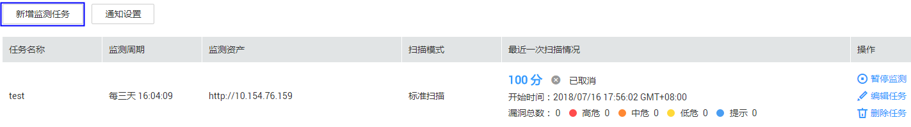
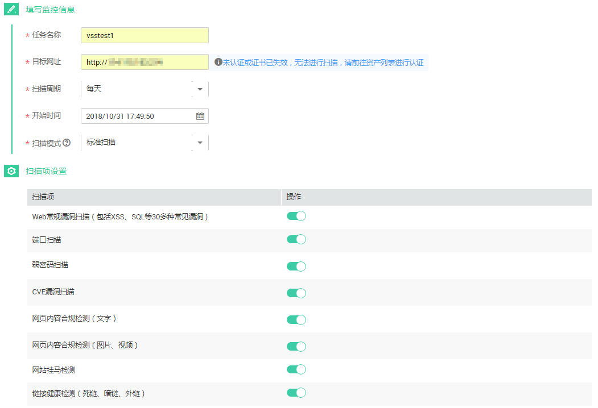

# 新增监测任务

## 操作场景

该任务指导用户通过漏洞扫描服务新增监测任务。

## 前提条件

-   已获取管理控制台的登录帐号与密码。
-   域名状态为“已认证“。

## 操作步骤

1.  登录管理控制台。
2.  单击页面上方的“服务列表“，选择“安全  \>  漏洞扫描服务\>安全监测“，进入“安全监测“界面。
3.  单击“新增监测任务“，进入“新增监测任务“界面，如[图1](#fig8716958152919)所示。

    **图 1**  新增监测任务  
    

4.  请根据[表1](#table13105205413919)进行扫描设置，设置后如[图2](#fig5927172481519)所示。

    **图 2**  新增监测的扫描设置  
    

    > **说明：**   
    >如果您的域名已经为专业版或者企业版，就不会提示升级。  

    **表 1**  扫描设置参数说明

    
    <table><thead align="left"><tr id="row1610517541494"><th class="cellrowborder" valign="top" width="25.840000000000003%" id="mcps1.2.3.1.1">
参数

    </th>
    <th class="cellrowborder" valign="top" width="74.16%" id="mcps1.2.3.1.2">
参数说明

    </th>
    </tr>
    </thead>
    <tbody><tr id="row51054541898"><td class="cellrowborder" valign="top" width="25.840000000000003%" headers="mcps1.2.3.1.1 ">
任务名称

    </td>
    <td class="cellrowborder" valign="top" width="74.16%" headers="mcps1.2.3.1.2 ">
用户自定义。

    </td>
    </tr>
    <tr id="row1110517542911"><td class="cellrowborder" valign="top" width="25.840000000000003%" headers="mcps1.2.3.1.1 ">
目标网址

    </td>
    <td class="cellrowborder" valign="top" width="74.16%" headers="mcps1.2.3.1.2 ">
待扫描的网站地址或IP地址。

    
通过下拉框选择已认证通过的域名。

    </td>
    </tr>
    <tr id="row51055543919"><td class="cellrowborder" valign="top" width="25.840000000000003%" headers="mcps1.2.3.1.1 ">
扫描周期

    </td>
    <td class="cellrowborder" valign="top" width="74.16%" headers="mcps1.2.3.1.2 ">
单击下拉框选择任务扫描周期。

    </td>
    </tr>
    <tr id="row1310515548919"><td class="cellrowborder" valign="top" width="25.840000000000003%" headers="mcps1.2.3.1.1 ">
开始时间

    </td>
    <td class="cellrowborder" valign="top" width="74.16%" headers="mcps1.2.3.1.2 ">
单击选择任务开始扫描的时间。

    
扫描任务会在你选择的时间开始执行。

    </td>
    </tr>
    <tr id="row19928103045314"><td class="cellrowborder" valign="top" width="25.840000000000003%" headers="mcps1.2.3.1.1 ">
扫描模式

    </td>
    <td class="cellrowborder" valign="top" width="74.16%" headers="mcps1.2.3.1.2 ">
三种扫描模式：

    <ul id="ul723114126541"><li>快速扫描：扫描耗时最少，能检测到的漏洞相对较少。</li><li>标准扫描：扫描耗时适中，能检测到的漏洞相对较多。</li><li>深度扫描：扫描耗时最长，能检测到最深处的漏洞。</li></ul>
    </td>
    </tr>
    <tr id="row101058544913"><td class="cellrowborder" valign="top" width="25.840000000000003%" headers="mcps1.2.3.1.1 ">
是否将每次扫描升级为专业版规格

    </td>
    <td class="cellrowborder" valign="top" width="74.16%" headers="mcps1.2.3.1.2 ">
基础版用户开启此功能后，扫描过程中会按需扣费：

    <ul id="ul1310575413919"><li>鼠标移动至了解升级后影响。也可参考界面右上角基础版扫描与专业版扫描有何区别？如<a href="#ZH-CN_TOPIC_0118746213__fig5927172481519">图2</a>所示。</li><li>单击开关关闭，扫描时不会升级。</li><li>单击开关打开，扫描时会自动升级为专业版按需扣费。</li></ul>
    </td>
    </tr>
    <tr id="row497202419558"><td class="cellrowborder" valign="top" width="25.840000000000003%" headers="mcps1.2.3.1.1 ">
扫描项设置

    </td>
    <td class="cellrowborder" valign="top" width="74.16%" headers="mcps1.2.3.1.2 ">
单击打开需要扫描的检测项。

    </td>
    </tr>
    </tbody>
    </table>

5.  设置完成后，单击“确认“立即执行任务。

    > **说明：**   
    >如果服务器还有空闲，则创建的任务可立即开始扫描，任务状态为“进行中“；否则进入等待队列中等待，任务状态为“等待中“。在扫描过程中取消扫描任务，若任务的扫描时长大于2小时且扫描进度大于20%时就会提示您超出部分已按需收费，请按情况决定是否取消扫描任务。  

