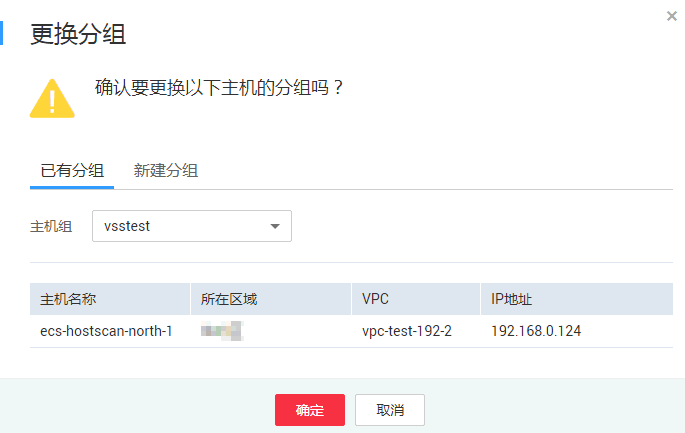
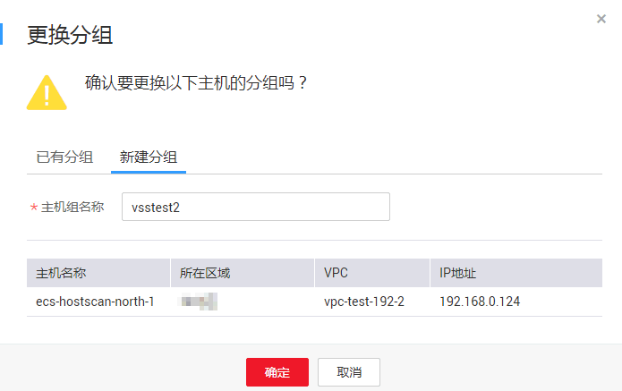

# 更换分组

## 操作场景

该任务指导用户通过漏洞扫描服务为已添加的主机更换分组。

## 前提条件

-   已获取管理控制台的登录账号和密码。
-   已添加主机。

## 操作步骤

1.  登录管理控制台。
2.  单击页面上方的“服务列表“，选择“安全  \>  漏洞扫描服务“。
3.  在左侧导航树中，选择“资产列表“，进入“资产列表“界面，选中“主机“页签，如[图1](#vss_01_0070_fig14176121734116)所示。

    **图 1**  主机列表  
    

4.  在目标主机的操作列，单击“更换分组“。
    -   在已有“主机组“下拉列表中，选择已有的主机组，如[图2](#fig318873619584)所示。

        **图 2**  更换分组  
        

    -   单击“新建分组“页签，输入“主机组名称“，创建新的主机组，如[图3](#fig956184615013)所示。

        **图 3**  新建分组  
        

5.  单击“确定“，主机更换分组成功。

