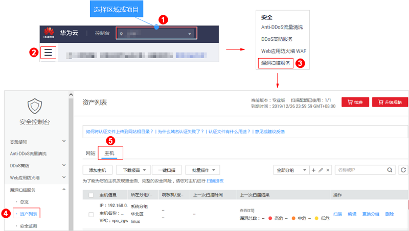
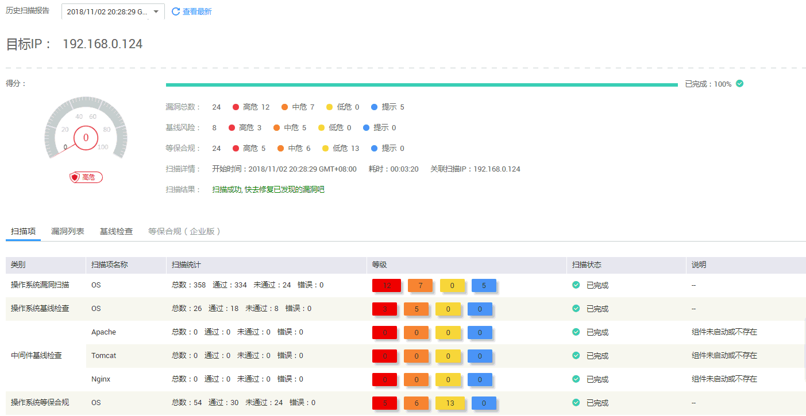
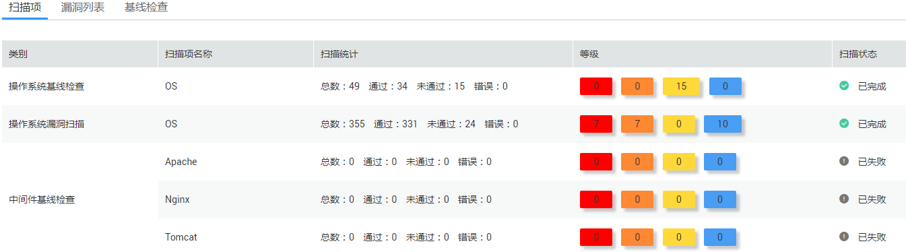
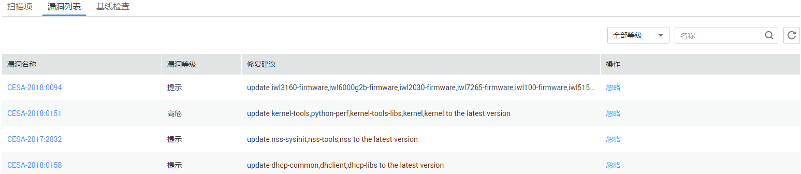
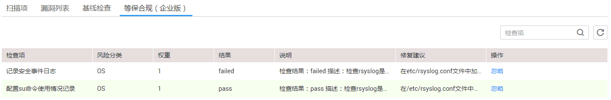

# 查看主机扫描详情

## 操作场景

该任务指导用户通过漏洞扫描服务查看主机扫描详情。

> **说明：**   
>-   Linux主机扫描支持主机漏洞扫描、基线检测、等保合规检测。  
>-   Windows主机扫描支持主机漏洞扫描、等保合规检测，暂不支持基线检测。  

## 前提条件

-   已获取管理控制台的登录账号和密码。
-   主机扫描任务已成功完成。

## 操作步骤

1.  [登录管理控制台](https://console.huaweicloud.com/)。
2.  进入主机列表入口，如[图1](#fig1643474422612)所示。

    **图 1**  进入主机列表入口  
    

3.  查看主机信息，相关参数说明如[表1](#zh-cn_topic_0115875447_table945023816226)所示。

    **表 1**  主机资产列表参数说明

    
    <table><thead align="left"><tr id="zh-cn_topic_0115875447_row1843515380227"><th class="cellrowborder" valign="top" width="18.44%" id="mcps1.2.3.1.1">
参数

    </th>
    <th class="cellrowborder" valign="top" width="81.56%" id="mcps1.2.3.1.2">
参数说明

    </th>
    </tr>
    </thead>
    <tbody><tr id="zh-cn_topic_0115875447_row184358389228"><td class="cellrowborder" valign="top" width="18.44%" headers="mcps1.2.3.1.1 ">
主机信息

    </td>
    <td class="cellrowborder" valign="top" width="81.56%" headers="mcps1.2.3.1.2 "><ul id="zh-cn_topic_0115875447_ul11435838202212"><li>IP</li><li>主机名称</li><li>VPC</li></ul>
    </td>
    </tr>
    <tr id="zh-cn_topic_0115875447_row7914113694420"><td class="cellrowborder" valign="top" width="18.44%" headers="mcps1.2.3.1.1 ">
所在分组/区域/操作系统

    </td>
    <td class="cellrowborder" valign="top" width="81.56%" headers="mcps1.2.3.1.2 ">
主机所在分组/区域/操作系统，可在目标主机的“操作”列，单击“更换分组”，更换主机组。

    </td>
    </tr>
    <tr id="zh-cn_topic_0115875447_row143551929113517"><td class="cellrowborder" valign="top" width="18.44%" headers="mcps1.2.3.1.1 ">
跳板机/授权信息

    </td>
    <td class="cellrowborder" valign="top" width="81.56%" headers="mcps1.2.3.1.2 "><ul id="zh-cn_topic_0115875447_ul1053314417363"><li>添加跳板机的具体操作请参见<a href="添加主机.md">添加主机</a>。</li><li>主机授权的具体操作请参见<a href="配置Linux主机授权.md">配置Linux主机授权</a>和<a href="配置Windows主机授权.md">配置Windows主机授权</a>。</li></ul>
    </td>
    </tr>
    <tr id="zh-cn_topic_0115875447_row1280410179456"><td class="cellrowborder" valign="top" width="18.44%" headers="mcps1.2.3.1.1 ">
上一次扫描时间

    </td>
    <td class="cellrowborder" valign="top" width="81.56%" headers="mcps1.2.3.1.2 ">
主机最近一次扫描任务扫描时间。

    </td>
    </tr>
    <tr id="zh-cn_topic_0115875447_row1243593812227"><td class="cellrowborder" valign="top" width="18.44%" headers="mcps1.2.3.1.1 ">
上一次扫描结果

    </td>
    <td class="cellrowborder" valign="top" width="81.56%" headers="mcps1.2.3.1.2 ">
主机最近一次扫描任务的信息，包括得分和各等级的漏洞数量。单击分数或者“查看详情”，进入“任务详情”界面查看扫描概况。

    </td>
    </tr>
    </tbody>
    </table>

4.  在目标主机所在行的“上一次扫描结果“列，单击分数或者“查看详情“，查看相应任务的“扫描项总览“，如[图2](#fig1539218190447)所示，各栏目说明如[表2](#table0392161914440)所示。

    > **须知：**   
    >基础版用户按次购买主机扫描功能后，如果扫描任务失败，请在扫描详情页面单击“重新扫描（免费）“，系统将重新执行扫描任务。  

    **图 2**  查看主机扫描详情  
    

    **表 2**  详情总览说明

    
    <table><thead align="left"><tr id="row43921019104414"><th class="cellrowborder" valign="top" width="22.439999999999998%" id="mcps1.2.3.1.1">
栏目

    </th>
    <th class="cellrowborder" valign="top" width="77.56%" id="mcps1.2.3.1.2">
说明

    </th>
    </tr>
    </thead>
    <tbody><tr id="row23921619114412"><td class="cellrowborder" valign="top" width="22.439999999999998%" headers="mcps1.2.3.1.1 ">
目标IP

    </td>
    <td class="cellrowborder" valign="top" width="77.56%" headers="mcps1.2.3.1.2 ">
主机IP。

    </td>
    </tr>
    <tr id="row14392101924413"><td class="cellrowborder" valign="top" width="22.439999999999998%" headers="mcps1.2.3.1.1 ">
任务信息

    </td>
    <td class="cellrowborder" valign="top" width="77.56%" headers="mcps1.2.3.1.2 ">
显示目标任务的基本信息，包括：

    <ul id="ul153921319144417"><li>得分：任务被创建后，初始得分是一百分，任务扫描完成后，根据扫描出的漏洞个数和漏洞级别会扣除相应的分数，无漏洞则不扣分。</li><li>漏洞总数：漏洞总数及各级别的漏洞个数。</li><li>基线风险：各级别的基线风险个数，windows扫描不支持此项检测。</li><li>等保合规：为您提供本地化、系统化、专业的等保测评服务，为您提供一站式安全产品及服务，帮助您测评整改，提升安全防护能力，快速满足国家实行的网络安全等级保护制度。
 须知： 

仅企业版可查看“等保合规”功能的检测结果。

    

    </li><li>扫描详情：开始时间及任务扫描耗时。</li><li>扫描结果；扫描任务的执行结果，有“扫描成功”和“扫描失败”两种结果。</li></ul>
    </td>
    </tr>
    <tr id="row639201914444"><td class="cellrowborder" valign="top" width="22.439999999999998%" headers="mcps1.2.3.1.1 ">
扫描项

    </td>
    <td class="cellrowborder" valign="top" width="77.56%" headers="mcps1.2.3.1.2 ">
显示扫描任务的类别、扫描项名称、扫描统计、等级和扫描状态。

    </td>
    </tr>
    </tbody>
    </table>

5.  选择“扫描项“页签，查看目标主机的扫描项信息，如[图3](#fig1725275904412)所示。

    **图 3**  扫描项  
    

6.  选择“漏洞列表“页签，查看目标主机的漏洞信息，如[图4](#fig20644132619453)所示。

    **图 4**  漏洞列表界面  
    

    > **说明：**   
    >-   如果您确认扫描出的漏洞不会对主机造成危害，您可以在目标漏洞所在行的“操作”列，单击“忽略”忽略该漏洞，相应的漏洞统计结果将发生变化，扫描报告中也不会出现该漏洞。  
    >-   单击漏洞名称，进入“漏洞详情“页面，根据修复建议修复漏洞。  

7.  选择“基线检查“页签，查看目标网站的基线检查信息，如[图5](#fig1113024674619)所示。

    **图 5**  基线检查  
    

    > **说明：**   
    >-   如果您确认扫描出的检查项不会对主机造成危害，您可以在目标检查项所在行的“操作”列，单击“忽略”忽略该检查项，相应的检查项统计结果将发生变化，扫描报告中也不会出现该检查项。  
    >-   Windows扫描暂不支持基线检测扫描。  

8.  单击“等保合规（企业版）“页签，进入“等保合规（企业版）“的详情列表界面，显示目标主机的等保合规检测信息，如[图6](#fig8588822125618)所示。

    **图 6**  等保合规  
    

    > **须知：**   
    >-   如果您确认扫描出的检查项不会对主机造成危害，您可以在目标检查项所在行的“操作”列，单击“忽略”忽略该检查项，相应的检查项统计结果将发生变化，扫描报告中也不会出现该检查项。  
    >-   VSS目前仅企业版用户支持等保合规检测，如果您需要对您的主机进行等保合规检测，请购买企业版。  

## 相关操作

-   有关主机扫描得分的计算方法，请参见[扫描任务的得分是如何计算的？](https://support.huaweicloud.com/vss_faq/vss_01_0049.html)。
-   有关修复主机漏洞的详细介绍，请参见[如何修复扫描出来的主机漏洞？](https://support.huaweicloud.com/vss_faq/vss_01_0101.html)。

