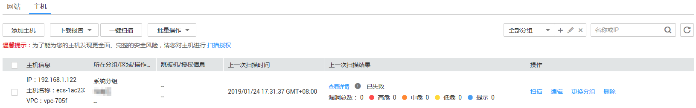

# 查看主机资产列表

## 操作场景

该任务指导用户通过漏洞扫描服务查看主机资产列表。

## 前提条件

-   已获取管理控制台的登录帐号与密码。
-   已有华为云或者非华为云主机。

## 操作步骤

1.  登录管理控制台。
2.  单击页面上方的“服务列表“，选择“安全  \>  漏洞扫描服务“。
3.  在左侧导航树中，选择“资产列表“，进入“资产列表“界面，选中“主机“页签，如[图1](#fig15435138132214)所示，相关参数说明如[表1](#table945023816226)所示。

    **图 1**  主机列表  
    

    **表 1**  主机资产列表参数说明

    
    <table><thead align="left"><tr id="row1843515380227"><th class="cellrowborder" valign="top" width="18.44%" id="mcps1.2.3.1.1">
参数

    </th>
    <th class="cellrowborder" valign="top" width="81.56%" id="mcps1.2.3.1.2">
参数说明

    </th>
    </tr>
    </thead>
    <tbody><tr id="row184358389228"><td class="cellrowborder" valign="top" width="18.44%" headers="mcps1.2.3.1.1 ">
主机信息

    </td>
    <td class="cellrowborder" valign="top" width="81.56%" headers="mcps1.2.3.1.2 "><ul id="ul11435838202212"><li>IP</li><li>主机名称</li><li>VPC</li></ul>
    </td>
    </tr>
    <tr id="row7914113694420"><td class="cellrowborder" valign="top" width="18.44%" headers="mcps1.2.3.1.1 ">
所在分组/区域/操作系统

    </td>
    <td class="cellrowborder" valign="top" width="81.56%" headers="mcps1.2.3.1.2 ">
主机所在分组/区域/操作系统，可在目标主机的“操作”列，单击“更换分组”，更换主机组。

    </td>
    </tr>
    <tr id="row143551929113517"><td class="cellrowborder" valign="top" width="18.44%" headers="mcps1.2.3.1.1 ">
跳板机/授权信息

    </td>
    <td class="cellrowborder" valign="top" width="81.56%" headers="mcps1.2.3.1.2 "><ul id="ul1053314417363"><li>添加跳板机的具体操作请参见<a href="添加主机.md">添加主机</a>。</li><li>主机授权的具体操作请参见<a href="Linux主机授权.md">Linux主机授权</a>和<a href="Windows主机授权.md">Windows主机授权</a>。</li></ul>
    </td>
    </tr>
    <tr id="row1280410179456"><td class="cellrowborder" valign="top" width="18.44%" headers="mcps1.2.3.1.1 ">
上一次扫描时间

    </td>
    <td class="cellrowborder" valign="top" width="81.56%" headers="mcps1.2.3.1.2 ">
主机最近一次扫描任务扫描时间。

    </td>
    </tr>
    <tr id="row1243593812227"><td class="cellrowborder" valign="top" width="18.44%" headers="mcps1.2.3.1.1 ">
上一次扫描结果

    </td>
    <td class="cellrowborder" valign="top" width="81.56%" headers="mcps1.2.3.1.2 ">
主机最近一次扫描任务的信息，包括得分和各等级的漏洞数量。单击<i>分数</i>或者“查看详情”，进入“任务详情”界面查看扫描概况。

    </td>
    </tr>
    </tbody>
    </table>

