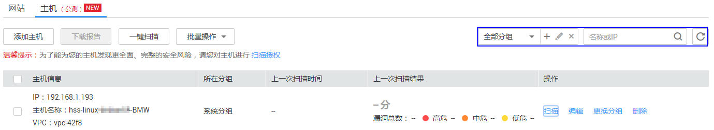

# 查看主机资产列表

## 操作场景

该任务指导用户通过漏洞扫描服务查看主机资产列表。

## 前提条件

-   已获取管理控制台的登录帐号与密码。
-   已有华为云主机。

## 操作步骤

1.  登录管理控制台。
2.  单击页面上方的“服务列表“，选择“安全  \>  漏洞扫描服务  \>  资产列表“，进入“资产列表“界面，选中“主机“页签，如[图1](#fig15435138132214)所示，相关参数说明如[表1](#table945023816226)所示。

    **图 1**  主机资产列表  
    

    **表 1**  主机资产列表参数说明

    
    <table><thead align="left"><tr id="row1843515380227"><th class="cellrowborder" valign="top" width="18.44%" id="mcps1.2.3.1.1">
参数

    </th>
    <th class="cellrowborder" valign="top" width="81.56%" id="mcps1.2.3.1.2">
参数说明

    </th>
    </tr>
    </thead>
    <tbody><tr id="row184358389228"><td class="cellrowborder" valign="top" width="18.44%" headers="mcps1.2.3.1.1 ">
主机信息

    </td>
    <td class="cellrowborder" valign="top" width="81.56%" headers="mcps1.2.3.1.2 "><ul id="ul11435838202212"><li>IP</li><li>主机名称</li><li>VPC</li><li>所在分组：单击界面右上角选择分组下拉框选择分组，也可单击添加分组，单击编辑分组名称。</li></ul>
    </td>
    </tr>
    <tr id="row7914113694420"><td class="cellrowborder" valign="top" width="18.44%" headers="mcps1.2.3.1.1 ">
所在分组

    </td>
    <td class="cellrowborder" valign="top" width="81.56%" headers="mcps1.2.3.1.2 ">
主机所在分组。

    </td>
    </tr>
    <tr id="row1280410179456"><td class="cellrowborder" valign="top" width="18.44%" headers="mcps1.2.3.1.1 ">
上一次扫描时间

    </td>
    <td class="cellrowborder" valign="top" width="81.56%" headers="mcps1.2.3.1.2 ">
主机最近一次扫描任务扫描时间。

    </td>
    </tr>
    <tr id="row1243593812227"><td class="cellrowborder" valign="top" width="18.44%" headers="mcps1.2.3.1.1 ">
上一次扫描结果

    </td>
    <td class="cellrowborder" valign="top" width="81.56%" headers="mcps1.2.3.1.2 ">
主机最近一次扫描任务的信息，包括得分、扫描时间和各等级的漏洞数量。单击<i>分数</i>，进入“任务详情”界面查看扫描概况。

    </td>
    </tr>
    <tr id="row74505382226"><td class="cellrowborder" valign="top" width="18.44%" headers="mcps1.2.3.1.1 ">
操作

    </td>
    <td class="cellrowborder" valign="top" width="81.56%" headers="mcps1.2.3.1.2 "><ul id="ul194501638192211"><li>单击“扫描”，创建扫描任务。
 说明： 

也可选择多个主机，单击列表左上角的“一键扫描”批量进行扫描。

    

    </li><li>单击“编辑”可对主机名称进行修改。</li><li>单击“更换分组”可更换主机的当前分组，可选择“已有分组”，单击下拉框选择已经存在额分组，也可选择“新建分组”，自己新建一个分组。
 说明： 

也可选择多个主机，单击列表左上角的“批量操作”下拉框选择“更换分组”批量更换主机的分组。

    

    </li><li>单击“删除”可删除名下没有正在扫描任务的主机。
 说明： 

也可选择多个主机，单击列表左上角的“批量操作”下拉框，选择“删除”批量删除主机。

    

    </li></ul>
    </td>
    </tr>
    </tbody>
    </table>

