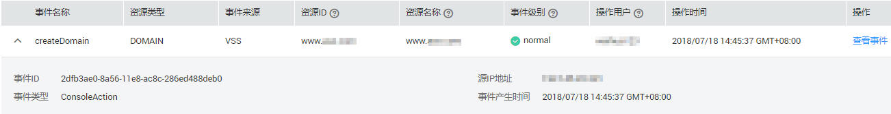
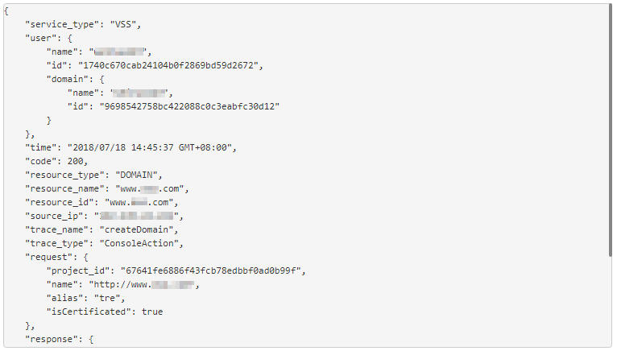

# 查看云审计日志

开启了云审计服务后，系统开始记录VSS资源的操作。云审计服务管理控制台保存最近7天的操作记录。

## 查看VSS的云审计日志

1.  登录管理控制台。
2.  在左侧导航树中，单击，选择“管理与部署  \>  云审计服务 CTS“，进入云审计服务信息页面。
3.  单击左侧导航树的“事件列表“，进入事件列表信息页面。
4.  单击事件列表上方的“Region“，设置对应的操作事件条件。

    当前事件列表支持四个维度的组合查询，详细信息如下：

    -   “事件类型“、“事件来源“、“资源类型“和“筛选类型“。
        -   在下拉框中选择查询条件。其中，“事件来源“选择“VSS“。
        -   筛选类型选择事件名称时，还需选择某个具体的事件名称。
        -   选择资源ID时，还需选择或者手动输入某个具体的资源ID。
        -   选择资源名称时，还需选择或手动输入某个具体的资源名称。

    -   “操作用户“：在下拉框中选择某一具体的操作用户，此操作用户指用户级别，而非租户级别。
    -   “事件级别“：可选项为“所有事件级别“、“normal“、“warning“、“incident“，只可选择其中一项。
    -   可在页面右上角选择查询最近1小时、最近1天、最近1周及自定义时间段的操作事件。

5.  单击“查询“，查看对应的操作事件。
6.  在需要查看的记录左侧，单击展开该记录的详细信息，展开记录如[图1](#fig17669149112013)所示。

    **图 1**  展开记录  
    

7.  在需要查看的记录右侧，单击“查看事件“，弹出一个窗口，如[图2](#fig9310171012116)所示，显示了该操作事件结构的详细信息。

    **图 2**  查看事件  
    

