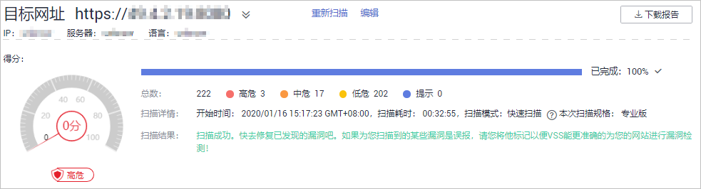
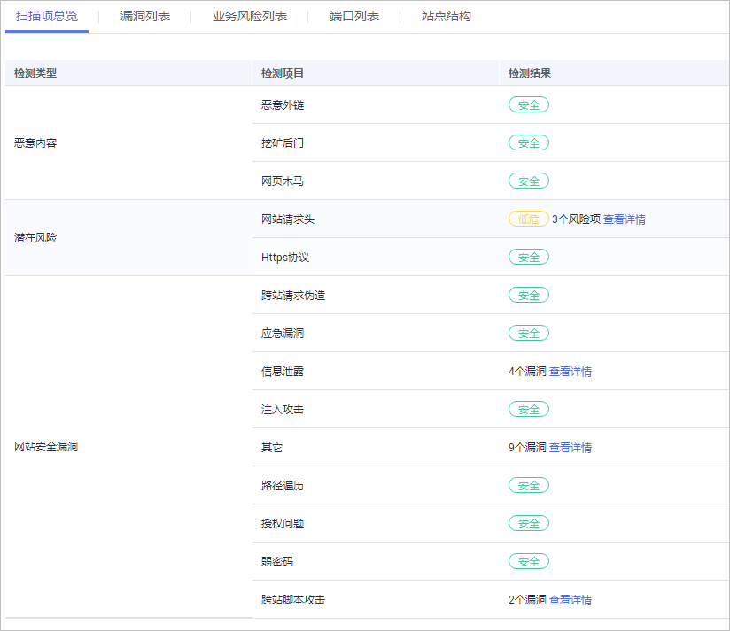
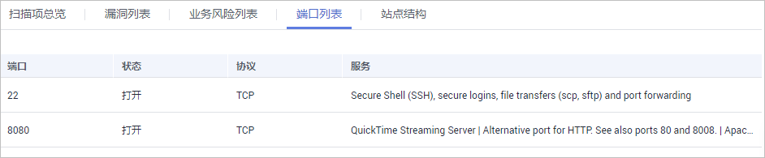
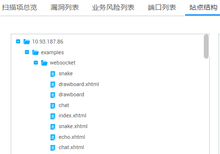

# 查看任务详情

## 操作场景

该任务指导用户通过漏洞扫描服务查看任务详情。

## 前提条件

已获取管理控制台的登录帐号与密码。

## 操作步骤

1.  登录管理控制台。
2.  单击管理控制台左上角的，选择区域或项目。
3.  单击页面上方的“服务列表“，选择“安全  \>  漏洞扫描服务“，在左侧导航树中，选择“安全检测“，进入“安全监测“界面，如[图1](#fig15318816618)所示。

    **图 1**  监测列表  
    

4.  在目标监测任务所在行的“最近一次扫描情况“列，单击_分数_或者“查看详情“，进入“任务详情“界面，可以查看相应任务的“扫描项总览“，如[图2](#fig13534816610)所示。

    > **说明：**   
    >-   “任务详情“界面默认显示最近一次的扫描情况，如果您需要查看其它时间的扫描情况，单击“历史扫描报告“下拉框，选择扫描时间点。  
    >-   单击“重新扫描“，可以重新执行扫描任务。  
    >-   如果需要修改扫描任务名称或者检测项，单击“编辑“，完成相关配置。  
    >-   扫描完成后，单击右上角的“下载报告“，可以下载任务报告，目前只支持HTML格式。  

    **图 2**  查看扫描详情  
    

5.  选中“扫描项总览“页签，进入“扫描项总览“界面，如[图3](#zh-cn_topic_0115901713_fig937111401197)所示。

    **图 3**  扫描项总览  
    

    > **说明：**   
    >“扫描项总览“显示的是扫描项的检测结果，如果检测结果存在漏洞或者危险，可单击“查看详情“了解漏洞或者危险的详细情况。  

6.  单击“漏洞列表“页签，进入“漏洞列表“界面，如[图4](#zh-cn_topic_0115901713_fig77611917175513)所示。

    **图 4**  漏洞列表  
    

    > **说明：**   
    >-   单击“查看更多“，可以查看详细的漏洞分析。  
    >-   单击漏洞名称可以查看相应漏洞的“漏洞详情“、“漏洞简介“、“修复建议“。  
    >-   如果确认该漏洞不存在风险，在目标漏洞所在行的“操作“列，单击“忽略“，忽略此漏洞。  
    >-   如果想对已忽略的漏洞恢复为风险类型，在目标漏洞所在行的“操作“列，单击“取消忽略“，恢复检测此漏洞。  

7.  单击“端口列表“页签，进入“端口列表“的详情列表界面，显示目标网站的端口信息，如[图5](#zh-cn_topic_0115901713_fig1676191745520)所示。

    **图 5**  端口列表  
    

8.  单击“站点结构“页签，进入“站点结构“的详情列表界面，如[图6](#zh-cn_topic_0115901713_fig129510337427)所示。

    > **说明：**   
    >站点结构显示的是目标任务的漏洞的具体站点位置，如果任务暂未扫描出漏洞，站点结构无数据显示。  
    >显示目标网站的基本信息，包括：  
    >-   IP地址：目标网站的IP地址。  
    >-   服务器：目标网站部署所使用的服务器名称（例如：Tomcat 、Apache httpd、 IIS等）。  
    >-   语言：目标网站所使用的开发语言（例如：PHP、JAVA、C\#等）。  

    **图 6**  站点结构  
    

