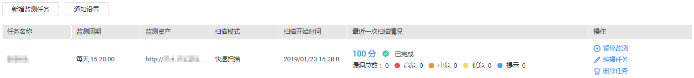

# 查看任务详情

## 操作场景

该任务指导用户通过漏洞扫描服务查看任务详情。

## 前提条件

已获取管理控制台的登录帐号与密码。

## 操作步骤

1.  登录管理控制台。
2.  选择“安全  \>  漏洞扫描服务\>安全监测“，进入“安全监测“界面，如[图1](#fig15318816618)所示。

    **图 1**  监测列表  
    

3.  单击“最近一次扫描情况“的“分数“，进入“任务详情“界面，可以查看相应任务的“扫描项总览“，如[图2](#fig13534816610)所示，各栏目说明如[表1](#table1053481261)所示。

    > **说明：**   
    >-   扫描完成后，单击右上角的可以下载任务报告，目前只支持HTML格式。  
    >-   “任务详情“界面默认显示最近一次的扫描任务，单击“历史扫描报告“下拉框选择您需要查看的任务详情。  

    **图 2**  查看任务扫描详情  
    

    **表 1**  详情总览说明

    
    <table><thead align="left"><tr id="zh-cn_topic_0115901713_row1476115178555"><th class="cellrowborder" valign="top" width="16.170000000000005%" id="mcps1.2.4.1.1">
栏目

    </th>
    <th class="cellrowborder" valign="top" width="55.89000000000001%" id="mcps1.2.4.1.2">
说明

    </th>
    <th class="cellrowborder" valign="top" width="27.940000000000005%" id="mcps1.2.4.1.3">
操作

    </th>
    </tr>
    </thead>
    <tbody><tr id="zh-cn_topic_0115901713_row1176101718557"><td class="cellrowborder" valign="top" width="16.170000000000005%" headers="mcps1.2.4.1.1 ">
扫描地址

    </td>
    <td class="cellrowborder" valign="top" width="55.89000000000001%" headers="mcps1.2.4.1.2 ">
从当前页面开始扫描。默认值是创建任务时填写的“目标网址”。

    </td>
    <td class="cellrowborder" valign="top" width="27.940000000000005%" headers="mcps1.2.4.1.3 "><ul id="zh-cn_topic_0115901713_ul3761201715519"><li>单击目标网址后面的图标可以查看网站的基本信息包括：<ul id="zh-cn_topic_0115901713_ul17611717155511"><li>IP</li><li>服务器</li><li>语言</li></ul>
    </li></ul>
    </td>
    </tr>
    <tr id="zh-cn_topic_0115901713_row77618172559"><td class="cellrowborder" valign="top" width="16.170000000000005%" headers="mcps1.2.4.1.1 ">
任务信息

    </td>
    <td class="cellrowborder" valign="top" width="55.89000000000001%" headers="mcps1.2.4.1.2 ">
显示目标任务的基本信息，包括：

    <ul id="zh-cn_topic_0115901713_ul17761517185513"><li>得分：任务被创建后，初始得分是一百分，任务扫描完成后，根据扫描出的漏洞个数和漏洞级别会扣除相应的分数，无漏洞则不扣分。</li><li>安全级别：根据扫描的结果分析网站的安全级别。如果无漏洞显示为安全，反之，有漏洞会按照漏洞的危险程度来显示中危、高危等。</li><li>总数：漏洞总数及各级别的漏洞个数。</li><li>开始时间：任务扫描的开始时间。</li><li>扫描耗时：任务扫描耗时。</li><li>扫描强度：创建扫描任务时选的对网站的扫描强度，一般扫描强度越深，扫描速度越慢。</li><li>扫描结果；扫描任务的执行结果，有“扫描成功”和“扫描失败”两种结果。</li></ul>
    </td>
    <td class="cellrowborder" valign="top" width="27.940000000000005%" headers="mcps1.2.4.1.3 "><ul id="zh-cn_topic_0115901713_ul187610173556"><li>单击“重新扫描”或“取消扫描”，可以重新扫描或取消扫描任务。</li><li>单击“更多”，可以执行以下操作：<ul id="zh-cn_topic_0115901713_ul17761191717551"><li>查看高级设置详情</li><li>编辑扫描任务</li></ul>
    </li></ul>
    </td>
    </tr>
    <tr id="zh-cn_topic_0115901713_row1761141775518"><td class="cellrowborder" valign="top" width="16.170000000000005%" headers="mcps1.2.4.1.1 ">
扫描项总览

    </td>
    <td class="cellrowborder" valign="top" width="55.89000000000001%" headers="mcps1.2.4.1.2 ">
显示扫描任务的扫描项和扫描的类型以及每个扫描项的扫描结果。

    </td>
    <td class="cellrowborder" valign="top" width="27.940000000000005%" headers="mcps1.2.4.1.3 ">
扫描结果：

    <ul id="zh-cn_topic_0115901713_ul20761917205517"><li>安全。</li><li>危险，单击“查看详情”。</li><li>未知。</li><li>未进行域名认证，无法扫描，单击“立即进行域名认证”完成认证。</li></ul>
    </td>
    </tr>
    </tbody>
    </table>

4.  “扫描项总览“显示扫描任务的扫描项和扫描的类型以及每个扫描项的扫描结果。扫描结果如果为安全且未认证可以单击“查看详情“了解详细情况。如果有危险（中危、高危等）请单击“查看详情“了解风险的内容，如[图3](#zh-cn_topic_0115901713_fig4761417135511)所示。

    **图 3**  扫描项总览  
    

5.  单击“漏洞列表“页签，进入“漏洞列表“的详情列表界面，如[图4](#zh-cn_topic_0115901713_fig77611917175513)所示。

    **图 4**  漏洞列表  
    

    > **说明：**   
    >显示目标任务最新发现的漏洞信息，单页最多显示5条，可以通过翻页进行查看。  
    >-   单击“查看更多“，可以查看漏洞列表。  
    >-   单击漏洞ID可以查看相应漏洞的“漏洞详情“。  

6.  单击“端口列表“页签，进入“端口列表“的详情列表界面，显示目标网站的端口信息，如[图5](#zh-cn_topic_0115901713_fig1676191745520)所示。

    **图 5**  端口列表  
    

7.  单击“站点结构“页签，进入“站点结构“的详情列表界面，如[图6](#zh-cn_topic_0115901713_fig129510337427)所示。

    > **说明：**   
    >站点结构显示的是目标任务的漏洞的具体站点位置，如果任务暂未扫描出漏洞，站点结构无数据显示。  
    >显示目标网站的基本信息，包括：  
    >-   IP地址：目标网站的IP地址。  
    >-   服务器：目标网站部署所使用的服务器名称（例如：Tomcat 、Apache httpd、 IIS等）。  
    >-   语言：目标网站所使用的开发语言（例如：PHP、JAVA、C\#等）。  

    **图 6**  站点结构  
    

