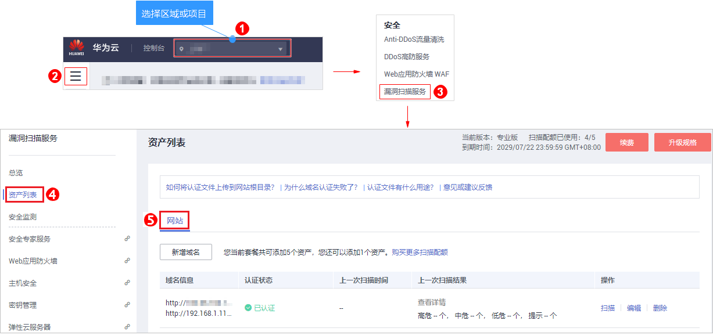
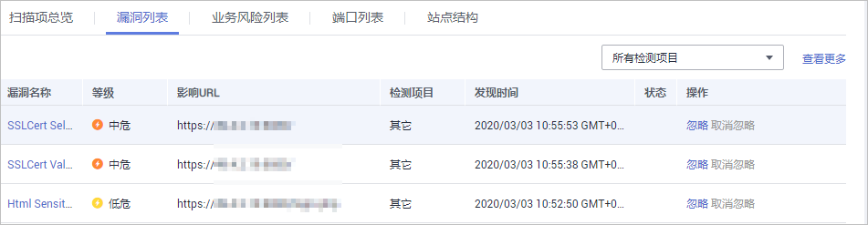

# 查看网站扫描详情

该任务指导用户通过漏洞扫描服务查看网站扫描结果，可以查看扫描项总览、业务风险列表、漏洞列表、端口列表、站点结构。

VSS暂不支持web\_CMS漏洞扫描功能。

## 前提条件

-   已获取管理控制台的登录账号与密码。
-   已添加域名并已完成域名认证。
-   已执行扫描任务。

## 操作步骤

1.  [登录管理控制台](https://console.huaweicloud.com/)。
2.  进入网站列表入口，如[图1](#fig1450112312152)所示。

    **图 1**  进入网站列表入口  
    

3.  查看网站资产列表，相关参数说明如[表1](#table11938700161133)所示。

    **表 1**  网站资产列表参数说明

    
    <table><thead align="left"><tr id="row41637521161133"><th class="cellrowborder" valign="top" width="18.44%" id="mcps1.2.3.1.1">
参数

    </th>
    <th class="cellrowborder" valign="top" width="81.56%" id="mcps1.2.3.1.2">
参数说明

    </th>
    </tr>
    </thead>
    <tbody><tr id="row310980382146"><td class="cellrowborder" valign="top" width="18.44%" headers="mcps1.2.3.1.1 ">
域名信息

    </td>
    <td class="cellrowborder" valign="top" width="81.56%" headers="mcps1.2.3.1.2 "><ul id="ul11042195211350"><li>域名/IP地址</li><li>域名别称</li></ul>
    </td>
    </tr>
    <tr id="row613352015396"><td class="cellrowborder" valign="top" width="18.44%" headers="mcps1.2.3.1.1 ">
认证状态

    </td>
    <td class="cellrowborder" valign="top" width="81.56%" headers="mcps1.2.3.1.2 "><ul id="ul2638145924314"><li>“已认证”
目标域名已完成域名认证。

    </li></ul>
    <ul id="ul39646437212223"><li>“未认证”
目标域名未完成域名认证。单击“去认证”进行域名认证。

    </li><li>“证书失效”
如果证书失效，请重新下载证书文件并完成域名认证。

    </li></ul>
    </td>
    </tr>
    <tr id="row6697271721424"><td class="cellrowborder" valign="top" width="18.44%" headers="mcps1.2.3.1.1 ">
上次扫描时间

    </td>
    <td class="cellrowborder" valign="top" width="81.56%" headers="mcps1.2.3.1.2 ">
域名最近一次扫描任务的时间。

    </td>
    </tr>
    <tr id="row1072416455392"><td class="cellrowborder" valign="top" width="18.44%" headers="mcps1.2.3.1.1 ">
上一次扫描结果

    </td>
    <td class="cellrowborder" valign="top" width="81.56%" headers="mcps1.2.3.1.2 ">
域名最近一次扫描结果信息，包括得分和各等级的漏洞数量。单击得分或者“查看详情”，进入“扫描详情”界面查看扫描概况。

    </td>
    </tr>
    </tbody>
    </table>

4.  在目标域名所在行的“上一次扫描结果“列，单击分数或者“查看详情“，查看扫描任务详情，如[图2](#fig57613177553)所示。

    > **说明：**   
    >-   扫描任务详情界面默认显示最近一次的扫描情况，如果您需要查看其他时间的扫描情况，在“历史扫描报告“下拉框中，选择扫描时间点。  
    >-   单击“重新扫描“，可以重新执行扫描任务。  
    >-   如果需要修改扫描任务名称或者检测项，单击“编辑“，完成相关配置。  
    >-   当扫描任务成功完成后，单击右上角的，可以下载任务报告，目前只支持PDF格式。  

    **图 2**  查看扫描详情  
    

5.  选择“扫描项总览“页签，查看扫描项的检测结果，如[图3](#fig937111401197)所示。

    **图 3**  扫描项总览  
    

    > **说明：**   
    >如果检测结果存在漏洞或者风险，可在“检测结果“列，单击“查看详情“了解漏洞或者风险的详细情况。  

6.  选择“漏洞列表“页签，查看漏洞信息，如[图4](#fig77611917175513)所示。

    **图 4**  漏洞列表  
    

    > **说明：**   
    >-   单击“查看更多“，可以查看详细的漏洞分析。  
    >-   单击漏洞名称可以查看相应漏洞的“漏洞详情“、“漏洞简介“、“修复建议“。  
    >-   如果您确认扫描出的漏洞不会对网站造成危害，请在目标漏洞所在行的“操作“列，单击“忽略“，忽略该漏洞，后续执行扫描任务会扫描出该漏洞，但扫描结果将不会统计忽略的漏洞。例如，如果您对2个低危漏洞执行了“忽略“操作，则再次执行扫描任务，扫描结果显示的低危漏洞个数将减少2。  
    >-   如果想对已忽略的漏洞恢复为风险类型，在目标漏洞所在行的“操作“列，单击“取消忽略“，恢复检测此漏洞。  

7.  选择“业务风险列表“页签，查看业务风险信息，如[图5](#fig46892011205519)所示。

    **图 5**  风险列表  
    

8.  选择“端口列表“页签，查看目标网站的端口信息，如[图6](#fig1676191745520)所示。

    **图 6**  端口列表  
    

9.  选择“站点结构“页签，查看目标网站的站点结构信息，如[图7](#fig129510337427)所示。

    > **说明：**   
    >站点结构显示的是目标任务的漏洞的具体站点位置，如果任务暂未扫描出漏洞，站点结构无数据显示。  
    >显示目标网站的基本信息，包括：  
    >-   IP地址：目标网站的IP地址。  
    >-   服务器：目标网站部署所使用的服务器名称（例如：Tomcat 、Apache httpd、 IIS等）。  
    >-   语言：目标网站所使用的开发语言（例如：PHP、JAVA、C\#等）。  

    **图 7**  站点结构  
    

## 后续处理

当您修复网站漏洞后，在扫描详情界面右侧单击“重新扫描“，重新扫描网站后，请在网站扫描详情界面查看该漏洞是否已修复。

## 相关操作

-   有关网站扫描得分的计算方法，请参见[扫描任务的得分是如何计算的？](https://support.huaweicloud.com/vss_faq/vss_01_0049.html)。
-   有关修复漏洞的详细介绍，请参见[漏洞扫描服务能修复扫描出来的漏洞吗？](https://support.huaweicloud.com/vss_faq/vss_01_0100.html)。
-   [对扫描出的漏洞执行“忽略”操作有什么影响？](https://support.huaweicloud.com/vss_faq/vss_01_0142.html)

