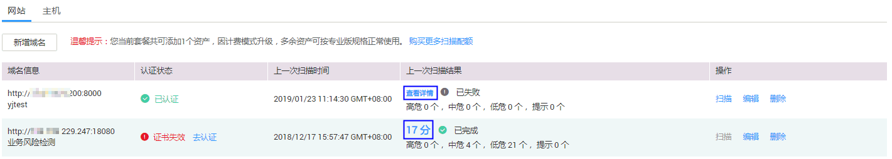

# 查看网站资产列表

## 操作场景

该任务指导用户通过漏洞扫描服务查看网站资产列表。

## 前提条件

-   已获取管理控制台的登录帐号与密码。
-   已添加域名。

## 操作步骤

1.  登录管理控制台。
2.  单击页面上方的“服务列表“，选择“安全  \>  漏洞扫描服务“。
3.  在左侧导航树中，选择“资产列表“，进入“资产列表“界面，选中“网站“页签，查看网站资产列表，如[图1](#fig644751891734)所示，相关参数说明如[表1](#table11938700161133)所示。

    **图 1**  网站资产列表  
    

    **表 1**  网站资产列表参数说明

    
    <table><thead align="left"><tr id="row41637521161133"><th class="cellrowborder" valign="top" width="18.44%" id="mcps1.2.3.1.1">
参数

    </th>
    <th class="cellrowborder" valign="top" width="81.56%" id="mcps1.2.3.1.2">
参数说明

    </th>
    </tr>
    </thead>
    <tbody><tr id="row310980382146"><td class="cellrowborder" valign="top" width="18.44%" headers="mcps1.2.3.1.1 ">
域名信息

    </td>
    <td class="cellrowborder" valign="top" width="81.56%" headers="mcps1.2.3.1.2 "><ul id="ul11042195211350"><li>域名/IP地址</li><li>域名名称</li></ul>
    </td>
    </tr>
    <tr id="row613352015396"><td class="cellrowborder" valign="top" width="18.44%" headers="mcps1.2.3.1.1 ">
认证状态

    </td>
    <td class="cellrowborder" valign="top" width="81.56%" headers="mcps1.2.3.1.2 "><ul id="ul2638145924314"><li>“已认证”
目标域名已完成域名认证。

    </li></ul>
    <ul id="ul39646437212223"><li>“未认证”
目标域名未完成域名认证。单击“去认证”进行域名认证，具体操作请参见<a href="域名认证.md">域名认证</a>章节。

    </li><li>“证书失效”
如果证书失效，请重新下载证书文件并完成域名认证，具体操作请参见<a href="域名认证.md">域名认证</a>章节。

    </li></ul>
    </td>
    </tr>
    <tr id="row6697271721424"><td class="cellrowborder" valign="top" width="18.44%" headers="mcps1.2.3.1.1 ">
上次扫描时间

    </td>
    <td class="cellrowborder" valign="top" width="81.56%" headers="mcps1.2.3.1.2 ">
域名最近一次扫描任务的时间。

    </td>
    </tr>
    <tr id="row1072416455392"><td class="cellrowborder" valign="top" width="18.44%" headers="mcps1.2.3.1.1 ">
上一次扫描结果

    </td>
    <td class="cellrowborder" valign="top" width="81.56%" headers="mcps1.2.3.1.2 ">
域名最近一次扫描结果信息，包括得分和各等级的漏洞数量。单击<i>分数</i>或者“查看详情”，进入“扫描详情”界面查看扫描概况。

    </td>
    </tr>
    </tbody>
    </table>

