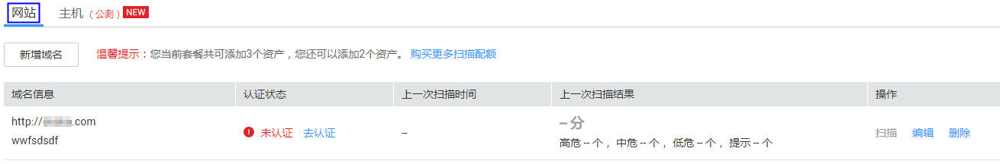

# 查看网站资产列表

## 操作场景

该任务指导用户通过漏洞扫描服务查看网站资产列表。

## 前提条件

已获取管理控制台的登录帐号与密码。

## 操作步骤

1.  登录管理控制台。
2.  单击页面上方的“服务列表“，选择“安全  \>  漏洞扫描服务  \>  资产列表“，进入“资产列表“界面，选中“网站“页签，如[图1](#fig644751891734)所示，相关参数说明如[表1](#table11938700161133)所示。

    > **注意：**   
    >用户可以单击操作列的“更多“，编辑、扫描或删除域名。  

    **图 1**  网站  
    

    **表 1**  网站资产列表参数说明

    
    <table><thead align="left"><tr id="row41637521161133"><th class="cellrowborder" valign="top" width="18.44%" id="mcps1.2.3.1.1">
参数

    </th>
    <th class="cellrowborder" valign="top" width="81.56%" id="mcps1.2.3.1.2">
参数说明

    </th>
    </tr>
    </thead>
    <tbody><tr id="row310980382146"><td class="cellrowborder" valign="top" width="18.44%" headers="mcps1.2.3.1.1 ">
域名信息

    </td>
    <td class="cellrowborder" valign="top" width="81.56%" headers="mcps1.2.3.1.2 "><ul id="ul11042195211350"><li>域名/IP地址和认证状态<ul id="ul39646437212223"><li>已认证
目标域名已完成域名认证。可以单击操作列的“立即扫描”创建扫描任务，具体操作请参见<a href="创建扫描任务.md">创建扫描任务</a>章节。

    </li><li>未认证
目标域名未完成域名认证。可以单击操作列的“前往认证”进行域名认证，具体操作请参见<a href="域名认证.md">域名认证</a>章节。

    </li><li>已过期
若专业版超过购买时长时，将会显示为“已过期”。单击“重新购买”可对该域名进行续费，具体操作请参见《漏洞扫描服务购买指南》。

    </li></ul>
    </li><li>任务名称</li><li>套餐版本：当前使用的漏洞扫描版本，“基础版”或“专业版”。</li><li>到期时间：<ul id="ul435304211930"><li>当用户使用“基础版”时，显示到期日期。</li><li>当用户使用“专业版”时，显示到期日期；若使用套餐已过期，可单击“重新购买”。</li></ul>
    </li></ul>
    </td>
    </tr>
    <tr id="row6697271721424"><td class="cellrowborder" valign="top" width="18.44%" headers="mcps1.2.3.1.1 ">
最新扫描情况

    </td>
    <td class="cellrowborder" valign="top" width="81.56%" headers="mcps1.2.3.1.2 ">
域名最近一次扫描任务的信息，包括得分、扫描时间和各等级的漏洞数量。单击<i>分数</i>进入“扫描详情”界面查看扫描概况。

    </td>
    </tr>
    <tr id="row428143103317"><td class="cellrowborder" valign="top" width="18.44%" headers="mcps1.2.3.1.1 ">
操作

    </td>
    <td class="cellrowborder" valign="top" width="81.56%" headers="mcps1.2.3.1.2 "><ul id="ul1473274383416"><li>单击“前往认证”可进行域名认证，完成认证后单击“马上扫描”创建扫描任务。</li><li>单击“更多”可对单个域名进行“编辑”、“扫描”、和“删除”的操作。<ul id="ul17857278370"><li>单击“编辑”可对未进行域名认证的信息进行修改。</li><li>单击“扫描”可对已认证的域名进行再次扫描。</li><li>单击“删除”可删除名下没有正在扫描任务的域名。</li></ul>
    </li></ul>
    </td>
    </tr>
    </tbody>
    </table>

