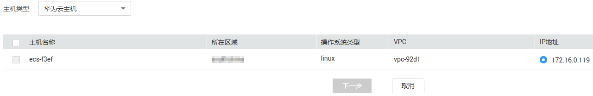
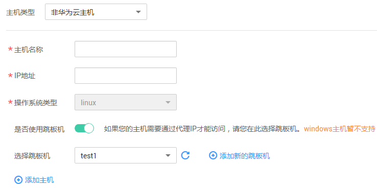

# 添加主机

> **说明：**   
>漏洞扫描服务的基础版将于5月30日起不再支持主机扫描功能，如果您目前是基础版用户且还想继续使用此功能，请在5月30日前购买漏洞扫描服务的专业版或者企业版套餐。  

## 操作场景

该任务指导用户通过漏洞扫描服务添加主机。

漏洞扫描服务支持添加华为云的Linux主机和Windows主机，非华为云主机仅支持linux主机。

> **说明：**   
>-   Linux主机扫描支持主机漏洞扫描、基线检测、等保合规检测。  
>-   Windows主机扫描支持主机漏洞扫描、等保合规检测，暂不支持基线检测。  
>-   Windows主机只支持2008、2012的操作系统。  

## 前提条件

-   已获取管理控制台的登录帐号与密码。
-   已有华为云或者非华为云主机。

## 操作步骤

1.  登录管理控制台。
2.  单击页面上方的“服务列表“，选择“安全  \>  漏洞扫描服务“。
3.  在左侧导航树中，选择“资产列表“，进入“资产列表“界面，选中“主机“页签，如[图1](#fig14176121734116)所示。

    **图 1**  主机列表  
    

4.  单击“添加主机“，进入“添加主机“页面，选择添加的主机类型。
    -   “主机类型“选择“华为云主机“时，选中需要添加的主机，单击“下一步“，如[图2](#fig12762205414131)所示。

        > **说明：**   
        >-   选择“华为云主机“时，支持Linux操作系统、Windows2008和Windows2012的操作系统。  
        >-   在目标主机所在行的“操作系统类型“列，单击，选择操作系统。  

        **图 2**  华为云主机  
        

    -   “主机类型“选择“非华为云主机“时，按界面提示添加主机，如[图3](#fig1130296103015)所示，参数说明如[表1](#table17138193812311)所示。

        **图 3**  添加非华为云主机  
        

        **表 1**  参数说明

        
        <table><thead align="left"><tr id="row11138163823113"><th class="cellrowborder" valign="top" width="34.77%" id="mcps1.2.3.1.1">
参数名称

        </th>
        <th class="cellrowborder" valign="top" width="65.23%" id="mcps1.2.3.1.2">
参数说明

        </th>
        </tr>
        </thead>
        <tbody><tr id="row91382382313"><td class="cellrowborder" valign="top" width="34.77%" headers="mcps1.2.3.1.1 ">
主机名称

        </td>
        <td class="cellrowborder" valign="top" width="65.23%" headers="mcps1.2.3.1.2 ">
用户需要添加的主机名称。

        </td>
        </tr>
        <tr id="row3138143893120"><td class="cellrowborder" valign="top" width="34.77%" headers="mcps1.2.3.1.1 ">
IP地址

        </td>
        <td class="cellrowborder" valign="top" width="65.23%" headers="mcps1.2.3.1.2 ">
添加的非华为云主机的IP地址。

        </td>
        </tr>
        <tr id="row14282121165012"><td class="cellrowborder" valign="top" width="34.77%" headers="mcps1.2.3.1.1 ">
操作系统类型

        </td>
        <td class="cellrowborder" valign="top" width="65.23%" headers="mcps1.2.3.1.2 ">
“主机类型”选择“非华为云主机”时，仅支持Linux操作系统。

        </td>
        </tr>
        <tr id="row1138103833119"><td class="cellrowborder" valign="top" width="34.77%" headers="mcps1.2.3.1.1 ">
是否使用跳板机

        </td>
        <td class="cellrowborder" valign="top" width="65.23%" headers="mcps1.2.3.1.2 ">
如果用户的主机需要通过代理IP才能访问，需要选择跳板机。

        </td>
        </tr>
        <tr id="row44251951173211"><td class="cellrowborder" valign="top" width="34.77%" headers="mcps1.2.3.1.1 ">
选择跳板机

        </td>
        <td class="cellrowborder" valign="top" width="65.23%" headers="mcps1.2.3.1.2 ">
可在下拉框中选择已有跳板机，或者单击“添加新的跳板机”，添加跳板机。

        </td>
        </tr>
        </tbody>
        </table>

        如果需要添加新的跳板机，请执行以下操作步骤。

        1.  单击“添加新的跳板机“。
        2.  在“添加跳板机“对话框中，设置配置参数，如[图4](#fig1494662310543)所示，配置说明如[表2](#table1827708551)所示。

            **图 4**  添加跳板机  
            

            **表 2**  配置说明

            
            <table><thead align="left"><tr id="row22719011559"><th class="cellrowborder" valign="top" width="30.28%" id="mcps1.2.3.1.1">
参数名称

            </th>
            <th class="cellrowborder" valign="top" width="69.72%" id="mcps1.2.3.1.2">
参数说明

            </th>
            </tr>
            </thead>
            <tbody><tr id="row9275025515"><td class="cellrowborder" valign="top" width="30.28%" headers="mcps1.2.3.1.1 ">
主机名称

            </td>
            <td class="cellrowborder" valign="top" width="69.72%" headers="mcps1.2.3.1.2 ">
添加的跳板机的主机名称。

            </td>
            </tr>
            <tr id="row202710011552"><td class="cellrowborder" valign="top" width="30.28%" headers="mcps1.2.3.1.1 ">
公网IP

            </td>
            <td class="cellrowborder" valign="top" width="69.72%" headers="mcps1.2.3.1.2 ">
添加的跳板机的公网IP。

            </td>
            </tr>
            <tr id="row6271304550"><td class="cellrowborder" valign="top" width="30.28%" headers="mcps1.2.3.1.1 ">
登录端口

            </td>
            <td class="cellrowborder" valign="top" width="69.72%" headers="mcps1.2.3.1.2 ">
添加的跳板机的登录端口。

            </td>
            </tr>
            <tr id="row4280035519"><td class="cellrowborder" valign="top" width="30.28%" headers="mcps1.2.3.1.1 ">
选择登录方式

            </td>
            <td class="cellrowborder" valign="top" width="69.72%" headers="mcps1.2.3.1.2 ">
“密码登录”和“密钥登录”。

            <ul id="ul6889638037"><li>选择密码登录时，需要添加跳板机的用户名和密码。</li><li>选择密钥登录时，需要添加跳板机的用户名、私钥和私钥密码。</li></ul>
            </td>
            </tr>
            <tr id="row192812015516"><td class="cellrowborder" valign="top" width="30.28%" headers="mcps1.2.3.1.1 ">
选择加密密钥

            </td>
            <td class="cellrowborder" valign="top" width="69.72%" headers="mcps1.2.3.1.2 ">
选择已有的加密密钥，或者单击“创建密钥”，创建新的密钥，具体方法请参考<a href="https://support.huaweicloud.com/usermanual-dew/zh-cn_topic_0034324884.html" target="_blank" rel="noopener noreferrer">创建密钥</a>。

            </td>
            </tr>
            </tbody>
            </table>

        3.  单击“确定“。

5.  添加主机已经完成，请参见[Linux主机授权](Linux主机授权.md)和[Windows主机授权](Windows主机授权.md)执行主机授权的操作。

