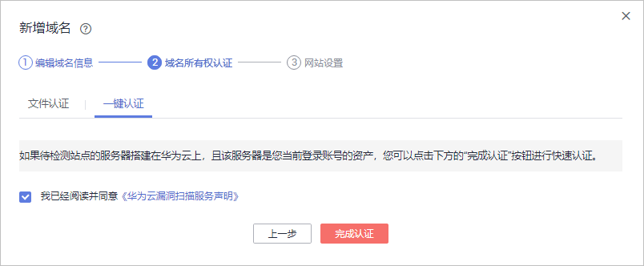
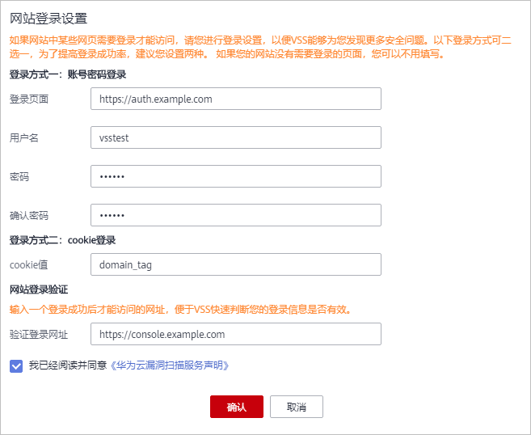

# 添加域名

开通漏洞扫描服务后，您首先需要将网站资产以IP或域名的形式添加到漏洞扫描服务中并完成域名认证，才能进行漏洞扫描。

如果您的网站中存在需要登录才能访问的网页，还需要配置网站登录信息（“账号密码登录“和“cookie登录“两种登录方式），VSS才能为您更好的检测网站安全问题。

## 前提条件

已获取管理控制台的登录帐号与密码。

## 操作步骤

1.  登录管理控制台。
2.  单击页面上方的“服务列表“，选择“安全  \>  漏洞扫描服务“，在左侧导航树中，选择“资产列表“，进入“资产列表“界面，如[图1](#fig1345410313159)所示。

    **图 1**  资产列表  
    

    > **说明：**   
    >在列表的左上角，可以查看可添加域名的个数。  

3.  在资产列表的左上角，单击“新增域名“，添加“域名/IP地址“，设置“域名别称“，如[图2](#fig3348135721835)所示。

    **图 2**  新增域名  
    

4.  单击“确认新增“，进入“域名所有权认证“页面。

    > **说明：**   
    >-   如果暂时不进行域名所有权认证，可单击“跳过此步“，体验风险预估扫描。后续参照[域名认证](域名认证.md)章节完成域名认证。  
    >-   如果待检测站点的服务器搭建在华为云上，且该服务器是您当前登录帐号的资产，才可以选择“一键认证“的方式进行快速认证，否则只能选择“文件认证“的方式进行认证。  

    -   文件认证，参照[图3](#fig1927191024815)中的验证步骤完成域名认证。

        **图 3**  文件认证方式  
        

    -   一键认证，如[图4](#fig927215106480)所示。

        **图 4**  一键认证方式  
        

    勾选“我已阅读并同意《华为云漏洞扫描服务免责声明》“，单击“完成认证“，进行域名认证，执行完成后，该域名的状态为“已认证“。

5.  如果域名认证成功，页面跳转到“网站设置“页面，参照[表1](#table13777610223)完成网站信息配置，如[图5](#fig1697493412471)所示。

    > **说明：**   
    >-   如果网站中存在需要登录才能访问的网页，进行登录设置后，VSS能够为您更好的检测网站安全问题，后续也可以参照[编辑域名](编辑域名.md)进行配置。  
    >-   VSS提供了“账号密码登录“和“cookie登录“两种登录方式，为了提高登录成功率，建议您配置两种登录方式。  

    **图 5**  网站登录设置  
    

    **表 1**  网站登录页面参数说明

    
    <table><thead align="left"><tr id="row16378261222"><th class="cellrowborder" valign="top" width="35.92%" id="mcps1.2.4.1.1">
参数名称

    </th>
    <th class="cellrowborder" valign="top" width="36.53%" id="mcps1.2.4.1.2">
参数说明

    </th>
    <th class="cellrowborder" valign="top" width="27.55%" id="mcps1.2.4.1.3">
样例

    </th>
    </tr>
    </thead>
    <tbody><tr id="row7378126132218"><td class="cellrowborder" colspan="3" valign="top" headers="mcps1.2.4.1.1 mcps1.2.4.1.2 mcps1.2.4.1.3 ">
<b>登录方式一：账号密码登录</b>

    </td>
    </tr>
    <tr id="row3378126152219"><td class="cellrowborder" valign="top" width="35.92%" headers="mcps1.2.4.1.1 ">
登录页面

    </td>
    <td class="cellrowborder" valign="top" width="36.53%" headers="mcps1.2.4.1.2 ">
网站登录页面的地址。

    </td>
    <td class="cellrowborder" valign="top" width="27.55%" headers="mcps1.2.4.1.3 ">
https://auth.huaweicloud.com/

    </td>
    </tr>
    <tr id="row1037813682219"><td class="cellrowborder" valign="top" width="35.92%" headers="mcps1.2.4.1.1 ">
用户名

    </td>
    <td class="cellrowborder" valign="top" width="36.53%" headers="mcps1.2.4.1.2 ">
登录网站的用户名。

    </td>
    <td class="cellrowborder" valign="top" width="27.55%" headers="mcps1.2.4.1.3 ">
vsstest

    </td>
    </tr>
    <tr id="row17378869229"><td class="cellrowborder" valign="top" width="35.92%" headers="mcps1.2.4.1.1 ">
密码

    </td>
    <td class="cellrowborder" valign="top" width="36.53%" headers="mcps1.2.4.1.2 ">
对应用户名的密码。

    </td>
    <td class="cellrowborder" valign="top" width="27.55%" headers="mcps1.2.4.1.3 ">
--

    </td>
    </tr>
    <tr id="row3305733112618"><td class="cellrowborder" valign="top" width="35.92%" headers="mcps1.2.4.1.1 ">
确认密码

    </td>
    <td class="cellrowborder" valign="top" width="36.53%" headers="mcps1.2.4.1.2 ">
再次输入用户名的密码。

    </td>
    <td class="cellrowborder" valign="top" width="27.55%" headers="mcps1.2.4.1.3 ">
--

    </td>
    </tr>
    <tr id="row43061133152619"><td class="cellrowborder" colspan="3" valign="top" headers="mcps1.2.4.1.1 mcps1.2.4.1.2 mcps1.2.4.1.3 ">
<b>方式二：cookie登录</b>

    
如果网站登录需要动态验证码才能登录成功，此时必须配置“cookie登录”方式。

    </td>
    </tr>
    <tr id="row930773315262"><td class="cellrowborder" valign="top" width="35.92%" headers="mcps1.2.4.1.1 ">
cookie值

    </td>
    <td class="cellrowborder" valign="top" width="36.53%" headers="mcps1.2.4.1.2 ">
输入登录网站的cookie值。

    </td>
    <td class="cellrowborder" valign="top" width="27.55%" headers="mcps1.2.4.1.3 ">
domain_tag

    </td>
    </tr>
    <tr id="row4230144172614"><td class="cellrowborder" colspan="3" valign="top" headers="mcps1.2.4.1.1 mcps1.2.4.1.2 mcps1.2.4.1.3 ">
<b>网站登录验证</b>

    </td>
    </tr>
    <tr id="row823094422614"><td class="cellrowborder" valign="top" width="35.92%" headers="mcps1.2.4.1.1 ">
验证登录网址

    </td>
    <td class="cellrowborder" valign="top" width="36.53%" headers="mcps1.2.4.1.2 ">
登录成功后才能访问的网址，便于VSS快速判断您的登录信息是否有效。

    </td>
    <td class="cellrowborder" valign="top" width="27.55%" headers="mcps1.2.4.1.3 ">
https://console.huaweicloud.com/

    </td>
    </tr>
    </tbody>
    </table>

6.  单击“确定“。

