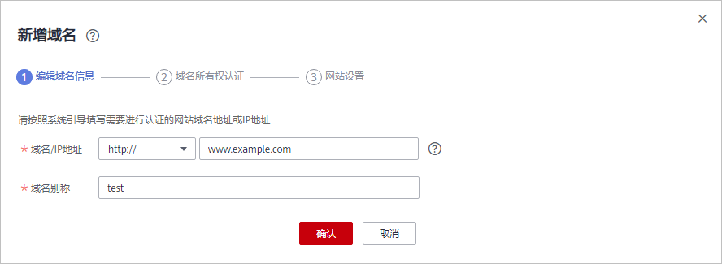

# 添加域名

## 操作场景

该任务指导用户通过漏洞扫描服务添加域名。

## 前提条件

已获取管理控制台的登录帐号与密码。

## 操作步骤

1.  登录管理控制台。
2.  单击管理控制台左上角的，选择区域或项目。
3.  单击页面上方的“服务列表“，选择“安全  \>  漏洞扫描服务“，在左侧导航树中，选择“资产列表“，进入“资产列表“界面，如[图1](#fig1345410313159)所示。

    **图 1**  资产列表  
    

    > **说明：**   
    >在列表的左上角，可以查看可添加域名的个数。  

4.  在资产列表的左上角，单击“新增域名“，设置“域名名称“，添加“域名/IP地址“，如[图2](#fig3348135721835)所示。

    **图 2**  新增域名  
    

5.  单击“确认新增“，进入“域名所有权认证“页面。

    > **说明：**   
    >如果暂时不进行域名所有权认证，可单击“跳过此步“，后续参照[域名认证](域名认证.md)章节完成域名认证，未完成域名认证，只能进行风险预估扫描。  

    方法一：选择“文件认证“，如[图3](#fig1927191024815)所示。

    **图 3**  文件认证方式  
    

    1.  单击“下载认证文件“。
    2.  将下载的认证文件上传到网站根目录，保证能成功访问链接“_目标网址_/hwwebscan\_verify.html”。
    3.  勾选“我已阅读并同意《华为云漏洞扫描服务免责声明》“。
    4.  单击“完成认证“，进行域名认证。

    方法二：选择“一键认证“，如[图4](#fig927215106480)所示。

    **图 4**  一键认证方式  
    

    勾选“我已阅读并同意《华为云漏洞扫描服务免责声明》“，单击“完成认证“，进行域名认证，执行完成后，该域名的状态为“已认证“。

6.  域名认证成功后，单击“完成认证“，进入“网站设置“页面，配置网站信息。
7.  单击“确定“，完成网站配置。

