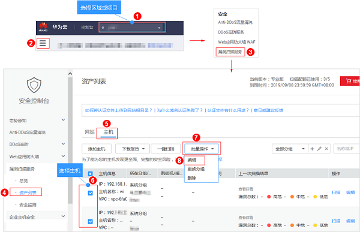
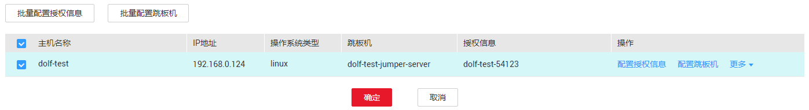
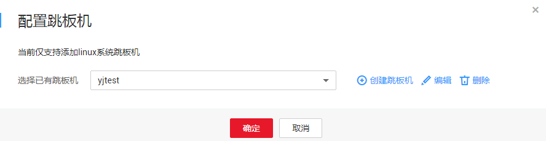
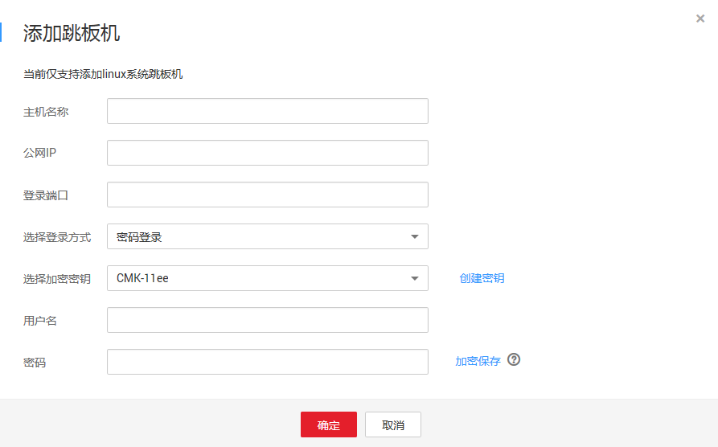

# 添加跳板机

## 操作场景

该任务指导用户通过漏洞扫描服务为Linux系统的主机配置跳板机。

> **说明：**   
>当前仅支持添加Linux系统跳板机。  

## 前提条件

-   已获取管理控制台的登录账号和密码。
-   已添加Linux系统的主机。

## 操作步骤

1.  [登录管理控制台](https://console.huaweicloud.com/)。
2.  进入批量授权入口，如[图1](#vss_01_0072_fig1441123313521)所示。

    **图 1**  进入批量授权入口  
    

    > **说明：**   
    >用户也可以单台主机授权，在目标主机所在行的“操作“列，单击“编辑“。  

3.  在主机授权页面，批量选择需要添加跳板机的主机，单击“批量配置跳板机“，如[图2](#fig37091438195719)所示。

    > **说明：**   
    >-   用户也可以单台主机添加跳板机，在目标主机所在行的“操作“列，单击“配置跳板机“。  
    >-   如果需要修改主机名称和操作系统类型，单击，在弹出的对话框中，进行修改。  

    **图 2**  批量配置跳板机  
    

4.  在“配置跳板机“对话框中，选择已有跳板机，或者单击“添加新的跳板机“，添加跳板机，如[图3](#fig175437599368)所示。

    **图 3**  配置跳板机  
    

    > **说明：**   
    >-   如果需要修改已有跳板机，单击“编辑“，进行修改。  
    >-   如果需要删除已有跳板机，单击“删除“，删除跳板机。  

    如果需要添加新的跳板机，请执行以下操作步骤。

    1.  单击“新增跳板机“。
    2.  在“添加跳板机“对话框中，设置配置参数，如[图4](#vss_01_0070_fig1494662310543)所示，配置说明如[表1](#vss_01_0070_table1827708551)所示。

        **图 4**  添加跳板机  
        

        **表 1**  跳板机配置参数说明

        
        <table><thead align="left"><tr id="vss_01_0070_row22719011559"><th class="cellrowborder" valign="top" width="30.28%" id="mcps1.2.3.1.1">
参数名称

        </th>
        <th class="cellrowborder" valign="top" width="69.72%" id="mcps1.2.3.1.2">
参数说明

        </th>
        </tr>
        </thead>
        <tbody><tr id="vss_01_0070_row9275025515"><td class="cellrowborder" valign="top" width="30.28%" headers="mcps1.2.3.1.1 ">
主机名称

        </td>
        <td class="cellrowborder" valign="top" width="69.72%" headers="mcps1.2.3.1.2 ">
添加的跳板机的主机名称。

        </td>
        </tr>
        <tr id="vss_01_0070_row202710011552"><td class="cellrowborder" valign="top" width="30.28%" headers="mcps1.2.3.1.1 ">
公网IP

        </td>
        <td class="cellrowborder" valign="top" width="69.72%" headers="mcps1.2.3.1.2 ">
添加的跳板机的公网IP。

        </td>
        </tr>
        <tr id="vss_01_0070_row6271304550"><td class="cellrowborder" valign="top" width="30.28%" headers="mcps1.2.3.1.1 ">
登录端口

        </td>
        <td class="cellrowborder" valign="top" width="69.72%" headers="mcps1.2.3.1.2 ">
添加的跳板机的登录端口。

        </td>
        </tr>
        <tr id="vss_01_0070_row4280035519"><td class="cellrowborder" valign="top" width="30.28%" headers="mcps1.2.3.1.1 ">
选择登录方式

        </td>
        <td class="cellrowborder" valign="top" width="69.72%" headers="mcps1.2.3.1.2 ">
“密码登录”和“密钥登录”。

        <ul id="vss_01_0070_ul6889638037"><li>选择密码登录时，需要添加跳板机的用户名和密码。</li><li>选择密钥登录时，需要添加跳板机的用户名、私钥和私钥密码。</li></ul>
        </td>
        </tr>
        <tr id="vss_01_0070_row192812015516"><td class="cellrowborder" valign="top" width="30.28%" headers="mcps1.2.3.1.1 ">
选择加密密钥

        </td>
        <td class="cellrowborder" valign="top" width="69.72%" headers="mcps1.2.3.1.2 ">
为了保护主机登录密码或密钥安全，请您必须使用加密密钥，以避免登录密码或密钥明文存储和泄露风险。

        
如果没有可选的加密密钥，请单击“创建密钥”，创建VSS专用的默认主密钥。

        </td>
        </tr>
        </tbody>
        </table>

    3.  阅读《华为云漏洞扫描服务声明》后，勾选“我已阅读并同意《华为云漏洞扫描服务声明》“，单击“确定“。

5.  单击“确定“，跳板机配置成功。

    如果需要解除绑定主机的跳板机，在目标主机的“操作“列，单击“更多  \>  解除跳板机“，解除跳板机。

