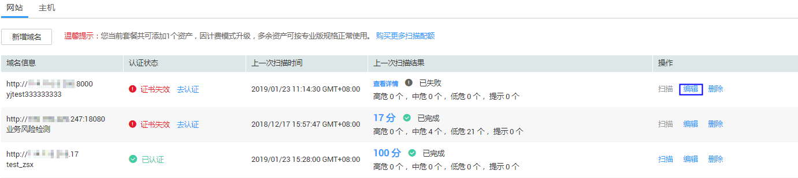

# 编辑域名

## 操作场景

该任务指导用户通过漏洞扫描服务编辑域名。

## 前提条件

-   已获取管理控制台的登录帐号与密码。
-   专业版域名的“认证状态“为“未认证“。

## 操作步骤

1.  登录管理控制台。
2.  单击管理控制台左上角的，选择区域或项目。
3.  单击页面上方的“服务列表“，选择“安全  \>  漏洞扫描服务“，在左侧导航树中，选择“资产列表“，进入“资产列表“界面，如[图1](#fig18656134516104)所示。

    **图 1**  资产列表界面  
    

4.  在目标域名的“操作“列，单击“编辑“，进入域名编辑页面，根据需要修改“域名名称“及“网站登录设置“，如[图2](#fig6546120152716)所示。

    **图 2**  编辑页面  
    

    > **说明：**   
    >已认证的专业版域名不能随意修改，如果您有修改需求，请您发送邮件“华为云用户名+需要修改的域名+修改后的域名“到邮箱cloudvss@huawei.com，系统将第一时间为您处理，感谢您的理解。  

5.  单击“确定“，完成域名信息修改。

