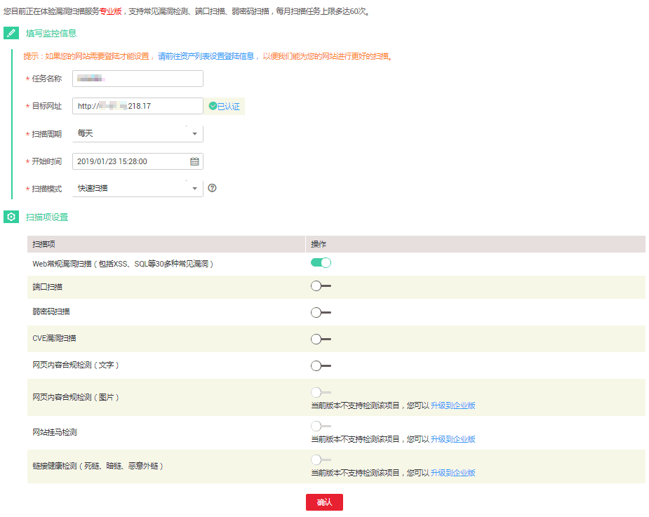

# 编辑监测任务

## 操作场景

该任务指导用户通过漏洞扫描服务编辑资产的监测任务。

## 前提条件

-   已获取管理控制台的登录帐号与密码。
-   已创建监测任务。

## 操作步骤

1.  登录管理控制台。
2.  单击管理控制台左上角的，选择区域或项目。
3.  单击页面上方的“服务列表“，选择“安全  \>  漏洞扫描服务“，在左侧导航树中，选择“安全检测“，进入“安全监测“界面，如[图1](#zh-cn_topic_0118982375_fig15318816618)所示。

    **图 1**  监测列表  
    

4.  在目标监测任务所在行的“操作“列中，单击“编辑任务“，如[图2](#fig196487293911)所示。

    **图 2**  编辑任务  
    

5.  根据需求，重新配置监控信息和扫描项设置。

