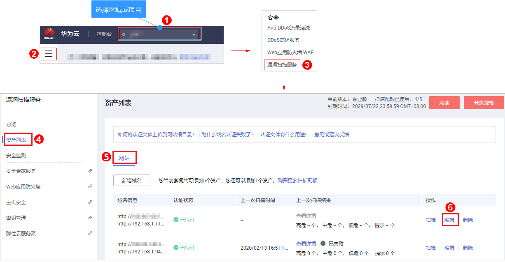

# 网站登录设置

## 操作场景

该任务指导用户通过漏洞扫描服务进行网站登录设置，修改网站信息。

如果您的网站页面需要登录才能访问，必须进行网站登录设置，以便VSS能为您发现更多安全问题。VSS提供了两种登录方式，请您根据您的网站访问限制条件选择登录方式：

-   方式一：账号密码登录。

    如果您的网站仅需要账号密码就可以登录访问，设置方式一即可。

-   方式二：cookie登录。

    如果您的网站除了需要账号密码登录，还有其他的访问限制，如需要输入“动态验证码“，必须选择方式二，设置cookie登录。

    > **须知：** 
    >-   若没有cookie，请在“高级配置“中，通过添加自定义Header的方式进行登录扫描。
    >-   若没有cookie，也没有自定义Header，则VSS不支持扫描该网站。

以上登录方式根据网站访问情况可二选一，但是为了提高登录成功率，建议您设置两种。

## 前提条件

-   已获取管理控制台的登录帐号与密码。
-   已添加域名。

## 操作步骤

1.  [登录管理控制台](https://console.huaweicloud.com/?locale=zh-cn)。
2.  进入网站登录设置入口，如[图1](#fig4989100164918)所示。

    **图 1**  进入网站登录设置入口  
    

3.  在域名编辑页面，根据需要修改“网站信息“和“网站登录设置“，如[图2](#fig54103515315)所示，参数说明如[表1](#table1015272220137)所示。

    **图 2**  编辑页面  
    

    **表 1**  参数说明

    
    <table><thead align="left"><tr id="row21531222161319"><th class="cellrowborder" valign="top" width="29.020000000000003%" id="mcps1.2.3.1.1">
参数名称

    </th>
    <th class="cellrowborder" valign="top" width="70.98%" id="mcps1.2.3.1.2">
参数说明

    </th>
    </tr>
    </thead>
    <tbody><tr id="row587082851517"><td class="cellrowborder" colspan="2" valign="top" headers="mcps1.2.3.1.1 mcps1.2.3.1.2 ">
<b>网站信息修改</b>

    </td>
    </tr>
    <tr id="row1172520176346"><td class="cellrowborder" valign="top" width="29.020000000000003%" headers="mcps1.2.3.1.1 ">
域名/IP地址

    </td>
    <td class="cellrowborder" valign="top" width="70.98%" headers="mcps1.2.3.1.2 ">
未认证的域名可修改。

    
 说明： 

VSS不支持修改已认证域名的“域名/IP地址”，如需修改，请删除域名后，重新创建新的域名。

    

    </td>
    </tr>
    <tr id="row102711826111516"><td class="cellrowborder" valign="top" width="29.020000000000003%" headers="mcps1.2.3.1.1 ">
域名别称

    </td>
    <td class="cellrowborder" valign="top" width="70.98%" headers="mcps1.2.3.1.2 ">
自定义的域名名称，可修改。

    </td>
    </tr>
    <tr id="row1515372212135"><td class="cellrowborder" colspan="2" valign="top" headers="mcps1.2.3.1.1 mcps1.2.3.1.2 ">
<b>网站登录设置</b>

    
如果您的网站页面需要登录才能访问，请您进行登录设置，以便VSS能为您发现更多安全问题。

    <ul id="ul0348145813553"><li>如果您的网站仅需要账号密码就可以登录访问，设置方式一即可。</li><li>如果您的网站除了需要账号密码登录，还有其他的访问限制，如需要输入动态验证码，必须设置方式二。</li></ul>
    
以下登录方式可二选一，为了提高登录成功率，建议您设置两种。

    </td>
    </tr>
    <tr id="row3153112220132"><td class="cellrowborder" colspan="2" valign="top" headers="mcps1.2.3.1.1 mcps1.2.3.1.2 ">
“登录方式一：账号密码登录”

    </td>
    </tr>
    <tr id="row13153102220136"><td class="cellrowborder" valign="top" width="29.020000000000003%" headers="mcps1.2.3.1.1 ">
登录页面

    </td>
    <td class="cellrowborder" valign="top" width="70.98%" headers="mcps1.2.3.1.2 ">
网站登录页面的地址。

    </td>
    </tr>
    <tr id="row365533614202"><td class="cellrowborder" valign="top" width="29.020000000000003%" headers="mcps1.2.3.1.1 ">
用户名

    </td>
    <td class="cellrowborder" valign="top" width="70.98%" headers="mcps1.2.3.1.2 ">
登录网站的用户名。

    </td>
    </tr>
    <tr id="row393318443204"><td class="cellrowborder" valign="top" width="29.020000000000003%" headers="mcps1.2.3.1.1 ">
密码

    </td>
    <td class="cellrowborder" valign="top" width="70.98%" headers="mcps1.2.3.1.2 ">
用户名的密码。

    </td>
    </tr>
    <tr id="row39333448203"><td class="cellrowborder" valign="top" width="29.020000000000003%" headers="mcps1.2.3.1.1 ">
确认密码

    </td>
    <td class="cellrowborder" valign="top" width="70.98%" headers="mcps1.2.3.1.2 ">
再次输入用户名的密码。

    </td>
    </tr>
    <tr id="row12328195515205"><td class="cellrowborder" colspan="2" valign="top" headers="mcps1.2.3.1.1 mcps1.2.3.1.2 ">
“登录方式二：cookie登录”

    </td>
    </tr>
    <tr id="row732925572018"><td class="cellrowborder" valign="top" width="29.020000000000003%" headers="mcps1.2.3.1.1 ">
cookie值

    </td>
    <td class="cellrowborder" valign="top" width="70.98%" headers="mcps1.2.3.1.2 ">
输入登录网站的cookie值。

    
有关获取登录网站的cookie值的详细操作，请参见<a href="https://support.huaweicloud.com/vss_faq/vss_01_0146.html" target="_blank" rel="noopener noreferrer">如何获取网站cookie值？</a>

    
 说明： 
<ul id="ul1789214315310"><li>若使用cookie登录时，没有获取到cookie值，您可以在“高级配置”中通过添加自定义Header的方式进行登录。</li><li>添加自定义Header时，请获取会话相关的HTTP请求头。常见的如：带有Token或Session字样的HTTP请求头。</li></ul>
    

    </td>
    </tr>
    <tr id="row103291355142019"><td class="cellrowborder" colspan="2" valign="top" headers="mcps1.2.3.1.1 mcps1.2.3.1.2 ">
“网站登录验证”

    </td>
    </tr>
    <tr id="row15329135552016"><td class="cellrowborder" valign="top" width="29.020000000000003%" headers="mcps1.2.3.1.1 ">
验证登录网址

    </td>
    <td class="cellrowborder" valign="top" width="70.98%" headers="mcps1.2.3.1.2 ">
登录成功后才能访问的网址，便于VSS快速判断您的登录信息是否有效。

    </td>
    </tr>
    <tr id="row1257824513186"><td class="cellrowborder" colspan="2" valign="top" headers="mcps1.2.3.1.1 mcps1.2.3.1.2 ">
“高级配置”

    </td>
    </tr>
    <tr id="row58561110104317"><td class="cellrowborder" valign="top" width="29.020000000000003%" headers="mcps1.2.3.1.1 ">
自定义Header

    </td>
    <td class="cellrowborder" valign="top" width="70.98%" headers="mcps1.2.3.1.2 ">
配置HTTP请求头部。最多可添加5个自定义HTTP请求头。

    
当待扫描的网站需要请求中附带特殊的HTTP请求头时，可以通过自定义Header进行设置。

    </td>
    </tr>
    </tbody>
    </table>

4.  阅读《华为云漏洞扫描服务声明》后，勾选“我已阅读并同意《华为云漏洞扫描服务声明》“，单击“确定“。

