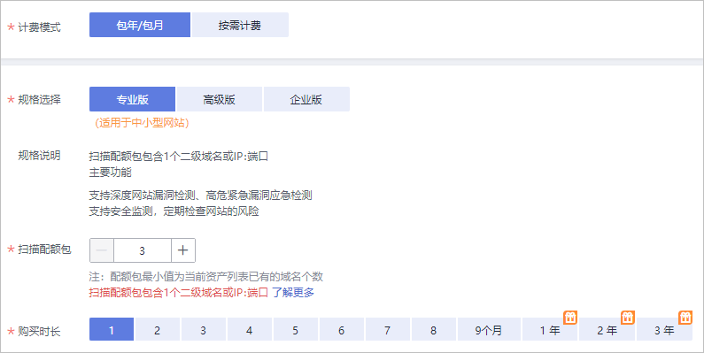
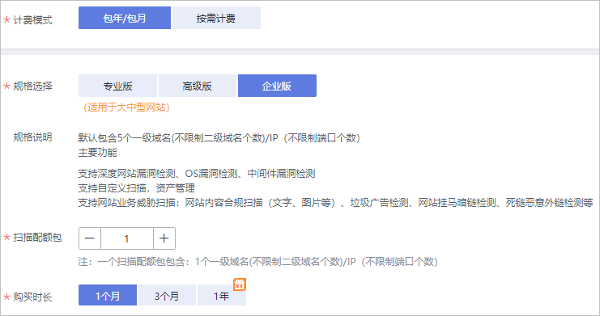

# 购买漏洞扫描服务

## 操作场景

该任务指导用户首次使用VSS时，如何购买漏洞扫描服务的专业版和企业版扫描功能。

> **须知：**   
>当前不支持从专业版直接升级至企业版，当您是专业版用户时，如果需要使用企业版，请直接购买企业版。为保证您的权益，请您购买企业版后，提工单退订专业版，如需帮助，请您联系您的客户经理或将您的联系方式发送至邮箱cloudvss@huawei.com，客户经理会第一时间与您联系，给您带来不便敬请谅解。  

## 前提条件

已获取管理控制台的登录账号（拥有VSS Administrator与BSS Administrator权限）与密码。

## 购买步骤

1.  [登录管理控制台](https://console.huaweicloud.com/)。
2.  单击左上角的，选择区域或项目。
3.  在左侧导航树中，单击，选择“安全  \>  漏洞扫描服务“，进入漏洞扫描服务管理界面。

    > **说明：**   
    >-   首次使用VSS，您可以在页面左侧，单击“立即购买“，进入VSS购买页面。  
    >-   如果您已经体验了VSS基础版，请在页面的右上角，单击“升级规格“，进入VSS购买页面。  

4.  购买在购买漏洞扫描服务界面，进行服务选型配置。
    -   “计费模式“选择“包年/包月“，如[图1](#zh-cn_topic_0112897556_fig1441133184811)和[图2](#fig2182651183415)所示，参数说明如[表1](#zh-cn_topic_0112897556_table1481533144812)所示，参数配置完成后，请执行[5](#zh-cn_topic_0112897556_lf9018f70cc3641d28938b2d0d69770ba)。

        > **说明：**   
        >-   使用基础版的用户，可以继续使用基础版的功能，每个用户可添加的域名个数不超过5个。  
        >-   漏洞扫描服务不支持基础版，专业版同时存在。如果是老客户，已购买的版本下存在基础版和专业版，基础版全部免费升级为专业版，版本到期时间以订单到期时间最长的为准。  
        >-   当用户在使用中需要升级专业版购买配额，购买的数量不能小于已购买的数量，到期时间不变。  

        **图 1**  计费模式-包年/包月（专业版）  
        

        **图 2**  计费模式-包年/包月（企业版）  
        

        **表 1**  服务选型参数说明

        
        <table><thead align="left"><tr id="zh-cn_topic_0112897556_row10473319484"><th class="cellrowborder" valign="top" width="18.029999999999998%" id="mcps1.2.3.1.1">
参数

        </th>
        <th class="cellrowborder" valign="top" width="81.97%" id="mcps1.2.3.1.2">
参数说明

        </th>
        </tr>
        </thead>
        <tbody><tr id="zh-cn_topic_0112897556_row47153312489"><td class="cellrowborder" valign="top" width="18.029999999999998%" headers="mcps1.2.3.1.1 ">
规格选择

        </td>
        <td class="cellrowborder" valign="top" width="81.97%" headers="mcps1.2.3.1.2 ">
漏洞扫描服务提供了基础版、专业版和企业版三种服务版本。其中，基础版配额内的服务免费，部分功能按需计费；专业版和企业版需要收费。

        </td>
        </tr>
        <tr id="zh-cn_topic_0112897556_row797217328199"><td class="cellrowborder" valign="top" width="18.029999999999998%" headers="mcps1.2.3.1.1 ">
规格说明

        </td>
        <td class="cellrowborder" valign="top" width="81.97%" headers="mcps1.2.3.1.2 ">
对应版本支持的功能介绍。

        </td>
        </tr>
        <tr id="zh-cn_topic_0112897556_row2719332483"><td class="cellrowborder" valign="top" width="18.029999999999998%" headers="mcps1.2.3.1.1 ">
购买时长

        </td>
        <td class="cellrowborder" valign="top" width="81.97%" headers="mcps1.2.3.1.2 "><ul id="zh-cn_topic_0112897556_ul1764184918198"><li>专业版
可以选择1个月～3年的时长。

        </li><li>企业版
支持“1个月”、“3个月”、“1年”的购买时长。

        </li></ul>
        </td>
        </tr>
        <tr id="zh-cn_topic_0112897556_row158173311486"><td class="cellrowborder" valign="top" width="18.029999999999998%" headers="mcps1.2.3.1.1 ">
扫描包数量

        </td>
        <td class="cellrowborder" valign="top" width="81.97%" headers="mcps1.2.3.1.2 ">
选择“专业版”时，需要配置购买的域名扫描包数量。

        
每个扫描包包含一个二级域名和每月60次的主机扫描配额（月末清零），购买的“扫描包数量”不能少于资产列表的网站数量。

        
 须知： 

如果您在购买专业版之前使用过免费体验版（即基础版）进行扫描，在购买专业版时，“扫描包数量”的选择必须等于或者大于当前资产列表已添加的网站个数。

        <ul id="zh-cn_topic_0112897556_ul1921162791810"><li>如果当前资产列表的某个基础版域名，您不想升级为专业版为其付费，请您在购买专业版之前对其进行删除。</li><li>如果您只需要将当前基础版域名全部升级为专业版规格，“扫描包数量”的选择等于当前资产列表已添加的网站个数。</li><li>如果您需要增加域名配额，即增加扫描的网站个数，“扫描包数量”的选择大于当前资产列表已添加的网站个数，且“扫描包数量”的选择值为您期望的域名配额值。</li></ul>
        
购买专业版成功后，当前资产列表所有基础版域名默认升级为专业版，享受专业版规格。

        

        </td>
        </tr>
        <tr id="zh-cn_topic_0112897556_row055834314151"><td class="cellrowborder" valign="top" width="18.029999999999998%" headers="mcps1.2.3.1.1 ">
域名扩展包

        </td>
        <td class="cellrowborder" valign="top" width="81.97%" headers="mcps1.2.3.1.2 ">
选择“企业版”时，需要配置域名扩展包数量，一个域名扩展包包含5个一级域名或公网IP，每个一级域名包含的二级域名个数不限，每个IP支持的端口号不限，故不需要再配置域名数量。

        </td>
        </tr>
        </tbody>
        </table>

    -   计费模式选择“按需计费“，如[图3](#fig123471433114615)所示。

        -   创建任务时，保持升级开关关闭，开始扫描后默认享受单次基础版扫描服务。
        -   创建任务时，开启升级开关，开始扫描后享受单次专业版扫描服务。扫描开始后进行一次性扣费，请保障您的账户余额充足。

        **图 3**  计费模式-按需计费  
        

        请参照以下操作步骤完成一次扫描任务：

        1.  单击“立即体验“回到“资产列表“界面。

            > **说明：**   
            >如果没有域名，请先添加域名并完成域名认证，再在创建任务界面进行单次按需购买。  

        2.  单击“扫描“，进入“创建任务“界面，相关设置如[图4](#fig2349833114612)所示。

            **图 4**  扫描设置  
            

            您可以打开“是否将本次扫描升级为专业版规格“开关，将本次扫描升级为专业版。

            设置完成后，用户可以根据需要选择定时扫描或者立即扫描，在弹出的“付费提醒“界面，单击“同意并扫描“。

            > **说明：**   
            >-   在您开始扫描后，该费用将从您的账户余额中扣取，在页面右上角，单击“费用“，进入费用中心，查看余额变动，漏洞扫描服务默认每隔1小时统计一次按需扫描的次数，进行费用扣取。  
            >-   用户选择“按需计费“的方式，在进行扫描时，如果扫描任务失败，直接单击“重新扫描“就可以免费再次按专业版规格进行扫描。  

5.  参数设置完毕后，在页面右下角，单击“立即购买“。

    > **说明：**   
    >如果您对价格有疑问，可以单击“了解计费详情“了解产品价格。  

6.  确认订单详情无误并阅读《华为云漏洞扫描服务声明》后，勾选“我已阅读并同意《华为云漏洞扫描服务声明》“，单击“去支付“。

    如果订单填写有误，用户可以单击“上一页“，回到服务选型页面修改配置信息后再继续购买。

7.  在“付款“页面，选择付款方式进行付款。

