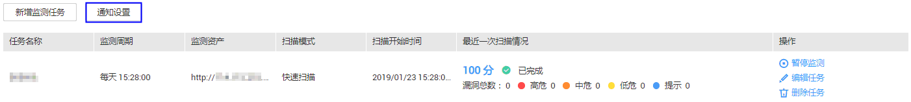
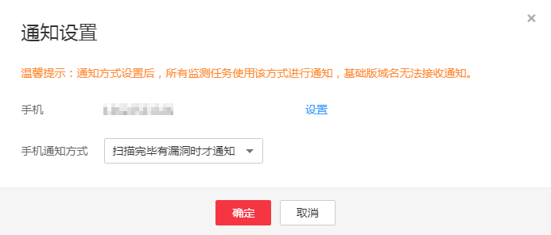

# 通知设置

## 操作场景

该任务指导用户在扫描任务完成后设置通过短信的方式通知用户。

## 前提条件

-   已获取管理控制台的登录帐号与密码。
-   域名必须是“专业版域名“。

## 操作步骤

1.  登录管理控制台。
2.  单击管理控制台左上角的，选择区域或项目。
3.  单击页面上方的“服务列表“，选择“安全  \>  漏洞扫描服务“，在左侧导航树中，选择“安全检测“，进入“安全监测“界面，如[图1](#fig8716958152919)所示。

    **图 1**  安全监测  
    

4.  在安全监测列表左上角，单击“通知设置“，进入“通知设置“界面，如[图2](#fig81479327442)所示，参数说明如[表1](#table645215173564)。

    **图 2** “通知设置“对话框  
    

    **表 1**  参数说明

    
    <table><thead align="left"><tr id="row7453141735614"><th class="cellrowborder" valign="top" width="30.9%" id="mcps1.2.3.1.1">
参数名称

    </th>
    <th class="cellrowborder" valign="top" width="69.1%" id="mcps1.2.3.1.2">
参数说明

    </th>
    </tr>
    </thead>
    <tbody><tr id="row34531417165611"><td class="cellrowborder" valign="top" width="30.9%" headers="mcps1.2.3.1.1 ">
手机

    </td>
    <td class="cellrowborder" valign="top" width="69.1%" headers="mcps1.2.3.1.2 ">
默认为实名认证时填写的手机号码，如果想发送通知到其他手机，单击“设置”，在弹出的对话框中重新输入新的手机号码，并完成验证码验证。

    </td>
    </tr>
    <tr id="row6453101718561"><td class="cellrowborder" valign="top" width="30.9%" headers="mcps1.2.3.1.1 ">
手机通知方式

    </td>
    <td class="cellrowborder" valign="top" width="69.1%" headers="mcps1.2.3.1.2 ">
可选择的通知方式如下：

    <ul id="ul138971352125817"><li>扫描完毕立即通知</li><li>扫描完毕有漏洞时才通知</li><li>不接受任何通知</li></ul>
    </td>
    </tr>
    </tbody>
    </table>

5.  单击“确定“，完成设置。

