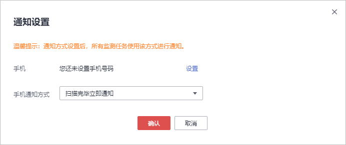

# 通知设置

## 操作场景

该任务指导用户在扫描任务完成后设置通过短信的方式通知用户。

## 前提条件

-   已获取管理控制台的登录帐号与密码。
-   域名必须是“专业版域名“。

## 操作步骤

1.  登录管理控制台。
2.  单击页面上方的“服务列表“，选择“安全  \>  漏洞扫描服务\>安全监测“，进入“安全监测“界面。
3.  在安全监测列表左上角，单击“通知设置“。
4.  默认为实名认证时填写的手机号码，如果想发送通知到其他手机，在弹出的“通知设置“对话框中，单击“设置“，如[图1](#fig81479327442)所示。

    **图 1** “通知设置“对话框  
    

5.  在“通知设置“对话框中，设置相关参数，如[图2](#fig19100192824315)所示，详细参数设置请参见[表1](#table2609813112820)。

    **图 2**  通知设置  
    

    **表 1**  通知设置参数说明

    
    <table><thead align="left"><tr id="row176251133289"><th class="cellrowborder" valign="top" width="15%" id="mcps1.2.4.1.1">
参数

    </th>
    <th class="cellrowborder" valign="top" width="55.00000000000001%" id="mcps1.2.4.1.2">
参数说明

    </th>
    <th class="cellrowborder" valign="top" width="30%" id="mcps1.2.4.1.3">
操作

    </th>
    </tr>
    </thead>
    <tbody><tr id="row103113223284"><td class="cellrowborder" valign="top" width="15%" headers="mcps1.2.4.1.1 ">
手机

    </td>
    <td class="cellrowborder" valign="top" width="55.00000000000001%" headers="mcps1.2.4.1.2 ">
填写想要接收消息通知的手机。

    </td>
    <td class="cellrowborder" valign="top" width="30%" headers="mcps1.2.4.1.3 ">
单击“获取验证码”。

    </td>
    </tr>
    <tr id="row1162591314283"><td class="cellrowborder" valign="top" width="15%" headers="mcps1.2.4.1.1 ">
输入验证码

    </td>
    <td class="cellrowborder" valign="top" width="55.00000000000001%" headers="mcps1.2.4.1.2 ">
输入获取的验证码。

    </td>
    <td class="cellrowborder" valign="top" width="30%" headers="mcps1.2.4.1.3 ">
-

    </td>
    </tr>
    <tr id="row662515137282"><td class="cellrowborder" valign="top" width="15%" headers="mcps1.2.4.1.1 ">
手机通知方式

    </td>
    <td class="cellrowborder" valign="top" width="55.00000000000001%" headers="mcps1.2.4.1.2 ">
可选择的通知方式如下：

    <ul id="ul18265513153312"><li>扫描完毕有漏洞时才通知</li><li>不接受任何通知</li><li>扫描完毕立即通知</li></ul>
    </td>
    <td class="cellrowborder" valign="top" width="30%" headers="mcps1.2.4.1.3 ">
-

    </td>
    </tr>
    </tbody>
    </table>

6.  如果使用默认手机号码，只需选择“手机通知方式“即可。
7.  单击“确认“，完成设置。

