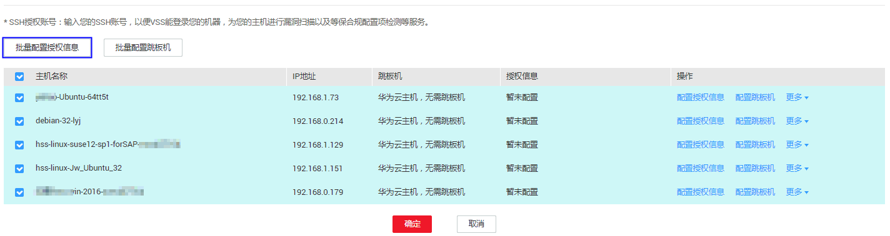
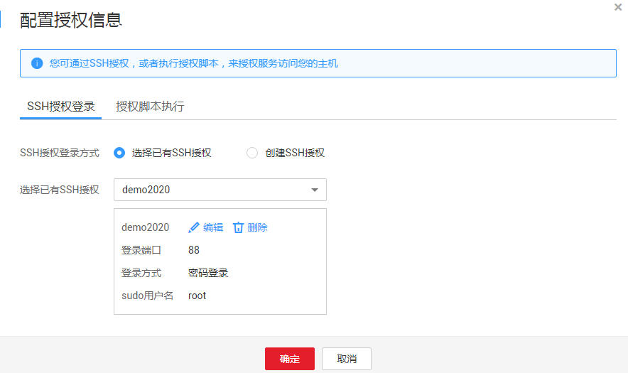
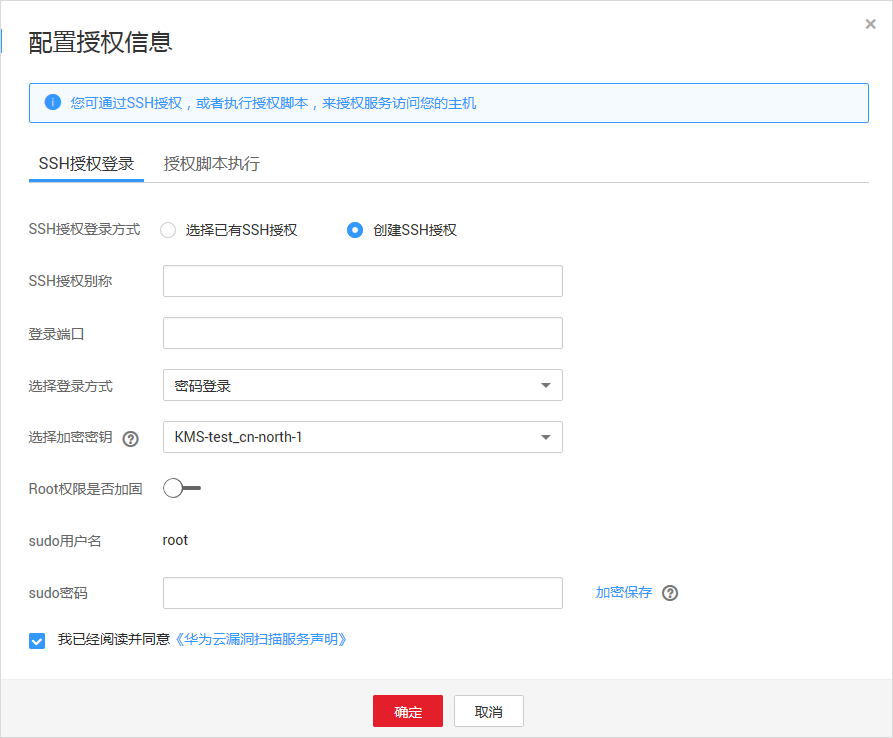

# 配置Linux主机授权

## 操作场景

该任务指导用户通过漏洞扫描服务对已添加的Linux主机进行扫描授权。

## 前提条件

-   已获取管理控制台的登录账号与密码。
-   已添加Linux主机。

## 操作步骤

1.  [登录管理控制台](https://console.huaweicloud.com/)。
2.  进入批量授权入口，如[图1](#fig1441123313521)所示。

    **图 1**  进入批量授权入口  
    

    > **说明：**   
    >用户也可以单台主机授权，在目标主机所在行的“操作“列，单击“编辑“。  

3.  在主机授权页面，批量选择需要授权的主机，单击“批量配置授权信息“，如[图2](#fig37091438195719)所示。

    > **说明：**   
    >-   用户也可以单台主机授权，在目标主机所在行的“操作“列，单击“配置授权信息“。  
    >-   如果需要修改主机名称，单击，在弹出的对话框中，进行修改。  

    **图 2**  批量授权  
    

4.  选择授权方式进行主机授权。
    -   方式一：SSH授权登录

        **图 3**  SSH授权登录  
        

        > **说明：**   
        >-   如果需要修改已有SSH授权，单击“编辑“，进行修改。  
        >-   如果需要删除已有SSH授权，单击“删除“，进行删除。  

        选择已有SSH授权，或者单击“创建SSH授权“创建SSH授权，如[图4](#fig19477214111918)所示，参数说明如[表1](#table1448281421911)所示。

        **图 4**  创建SSH授权  
        

        **表 1**  参数说明

        
        <table><thead align="left"><tr id="row6478214131913"><th class="cellrowborder" valign="top" width="38.07%" id="mcps1.2.3.1.1">
参数名称

        </th>
        <th class="cellrowborder" valign="top" width="61.92999999999999%" id="mcps1.2.3.1.2">
参数说明

        </th>
        </tr>
        </thead>
        <tbody><tr id="row14793148194"><td class="cellrowborder" valign="top" width="38.07%" headers="mcps1.2.3.1.1 ">
SSH授权别称

        </td>
        <td class="cellrowborder" valign="top" width="61.92999999999999%" headers="mcps1.2.3.1.2 ">
自定义SSH授权名称。

        </td>
        </tr>
        <tr id="row44799142191"><td class="cellrowborder" valign="top" width="38.07%" headers="mcps1.2.3.1.1 ">
登录端口

        </td>
        <td class="cellrowborder" valign="top" width="61.92999999999999%" headers="mcps1.2.3.1.2 ">
SSH授权登录的端口号。

        
请确保安全组已添加该端口，以便主机可通过该端口访问VSS。

        </td>
        </tr>
        <tr id="row144819141191"><td class="cellrowborder" valign="top" width="38.07%" headers="mcps1.2.3.1.1 ">
选择登录方式

        </td>
        <td class="cellrowborder" valign="top" width="61.92999999999999%" headers="mcps1.2.3.1.2 "><ul id="ul6480181481912"><li>“密码登录”</li><li>“密钥登录”</li></ul>
        
选择“密钥登录”时，需要“创建私钥”。

        </td>
        </tr>
        <tr id="row174811414131910"><td class="cellrowborder" valign="top" width="38.07%" headers="mcps1.2.3.1.1 ">
选择加密密钥

        </td>
        <td class="cellrowborder" valign="top" width="61.92999999999999%" headers="mcps1.2.3.1.2 ">
为了保护主机登录密码或密钥安全，请您必须使用加密密钥，以避免登录密码或密钥明文存储和泄露风险。

        
您可以选择已有的加密密钥，或者单击“创建密钥”，在数据加密服务的“密钥管理”界面创建新的密钥。

        
 须知： 
<ul id="ul37241450132619"><li>使用数据加密服务需要单独计费，详细的服务资费和费率标准，请参见<a href="https://www.huaweicloud.com/pricing.html?tab=detail#/dew" target="_blank" rel="noopener noreferrer">价格详情</a>。</li><li>VSS支持以下区域的密钥：<ul id="ul791718300011"><li>华北-北京一</li><li>华南-广州</li><li>华东-上海二</li></ul>
        
请您选择这些区域已有的加密密钥或者在这些区域创建密钥。有关创建密钥的详细操作，请参见<a href="https://support.huaweicloud.com/usermanual-dew/zh-cn_topic_0034324884.html" target="_blank" rel="noopener noreferrer">创建密钥</a>。

        </li></ul>
        

        </td>
        </tr>
        <tr id="row1548161491918"><td class="cellrowborder" valign="top" width="38.07%" headers="mcps1.2.3.1.1 ">
Root权限是否加固

        </td>
        <td class="cellrowborder" valign="top" width="61.92999999999999%" headers="mcps1.2.3.1.2 ">
打开该权限后，不可以用root账号直接登录，而只能通过普通用户登录，然后才能切换到root用户。

        </td>
        </tr>
        <tr id="row9481214121910"><td class="cellrowborder" valign="top" width="38.07%" headers="mcps1.2.3.1.1 ">
sudo用户名

        </td>
        <td class="cellrowborder" valign="top" width="61.92999999999999%" headers="mcps1.2.3.1.2 ">
默认为root。

        </td>
        </tr>
        <tr id="row148281481916"><td class="cellrowborder" valign="top" width="38.07%" headers="mcps1.2.3.1.1 ">
sudo密码

        </td>
        <td class="cellrowborder" valign="top" width="61.92999999999999%" headers="mcps1.2.3.1.2 ">
设置sudo用户对应的密码，单击“加密保存”，对密码进行加密保存。

        </td>
        </tr>
        </tbody>
        </table>

    -   方式二：授权脚本执行。

        > **说明：**   
        >-   如果您选择“授权脚本执行“进行主机授权，由于该方式无法将是否已授权的信息传回到VSS，所以虽然主机已完成授权，但“授权信息“状态仍然为“暂未授权“。  
        >-   用户也可以在“主机“页面，单击“扫描授权“，通过授权脚本执行完成主机授权。  

        **图 5**  授权脚本执行  
        

        1.  单击界面上的“复制“，复制开通授权的命令。
        2.  使用远程管理工具（例如：“Xshell“、“SecureCRT“、“PuTTY“），通过弹性IP地址登录到待开通授权的弹性云服务器。

            > **说明：**   
            >也可使用弹性云服务器的“远程登录“功能，登录服务器。  

        3.  执行复制的命令（这里用“SecureCRT“工具登录），结果如[图6](#fig13487814121911)所示，即执行成功。

            **图 6**  执行结果  
            

5.  单击“确定“，完成Linux主机授权。

## 相关操作

配置主机授权后，您可以取消主机授权，取消主机授权后，将不能完全扫描出主机的安全风险。有关取消主机授权的详细操作，请参见[取消主机授权](取消主机授权.md)。

