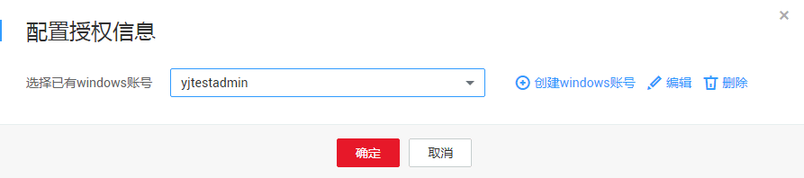
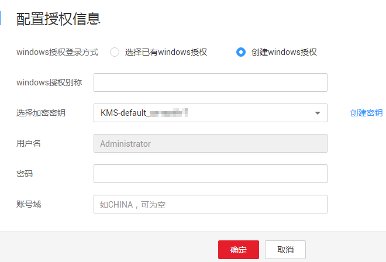

# 配置Windows主机授权

## 操作场景

该任务指导用户通过漏洞扫描服务对已添加的Windows主机进行扫描授权。

## 前提条件

-   已获取管理控制台的登录账号与密码。
-   登录用户只支持Administrator。
-   已添加Windows主机。

## 操作步骤

1.  [登录管理控制台](https://console.huaweicloud.com/)。
2.  进入批量授权入口，如[图1](#vss_01_0072_fig1441123313521)所示。

    **图 1**  进入批量授权入口  
    

    > **说明：**   
    >用户也可以单台主机授权，在目标主机所在行的“操作“列，单击“编辑“。  

3.  在主机授权页面，批量选择需要授权的主机，单击“批量配置授权信息“，如[图2](#fig37091438195719)所示。

    > **说明：**   
    >-   用户也可以单台主机授权，在目标主机所在行的“操作“列，单击“配置授权信息“。  
    >-   如果需要修改主机名称，单击，在弹出的对话框中，进行修改。  

    **图 2**  批量授权  
    

4.  在弹出的对话框中，选择已有windows授权，或者单击“创建windows授权“创建windows授权，如[图3](#fig1851741671217)所示。

    **图 3**  配置授权信息  
    

    > **说明：**   
    >-   如果需要修改已有windows授权，单击“编辑“，进行修改。  
    >-   如果需要删除已有windows授权，单击“删除“，进行删除。  

    如果没有windows授权，单击“创建windows授权“创建授权，如[图4](#fig98124191127)所示，参数说明如[表1](#table1947303131)。

    **图 4**  创建windows授权  
    

    **表 1**  参数说明

    
    <table><thead align="left"><tr id="row184230161317"><th class="cellrowborder" valign="top" width="40.21%" id="mcps1.2.3.1.1">
参数名称

    </th>
    <th class="cellrowborder" valign="top" width="59.79%" id="mcps1.2.3.1.2">
参数说明

    </th>
    </tr>
    </thead>
    <tbody><tr id="row5453018135"><td class="cellrowborder" valign="top" width="40.21%" headers="mcps1.2.3.1.1 ">
windows授权别称

    </td>
    <td class="cellrowborder" valign="top" width="59.79%" headers="mcps1.2.3.1.2 ">
自定义windows授权名称。

    </td>
    </tr>
    <tr id="row84203016138"><td class="cellrowborder" valign="top" width="40.21%" headers="mcps1.2.3.1.1 ">
选择加密密钥

    </td>
    <td class="cellrowborder" valign="top" width="59.79%" headers="mcps1.2.3.1.2 ">
为了保护主机登录密码或密钥安全，请您必须使用加密密钥，以避免登录密码或密钥明文存储和泄露风险。

    
您可以选择已有的加密密钥，或者单击“创建密钥”，在数据加密服务的“密钥管理”界面创建新的密钥。

    
 须知： 
<ul id="vss_01_0072_ul37241450132619"><li>使用数据加密服务需要单独计费，详细的服务资费和费率标准，请参见<a href="https://www.huaweicloud.com/pricing.html?tab=detail#/dew" target="_blank" rel="noopener noreferrer">价格详情</a>。</li><li>VSS支持以下区域的密钥：<ul id="vss_01_0072_ul791718300011"><li>华北-北京一</li><li>华南-广州</li><li>华东-上海二</li></ul>
    
请您选择这些区域已有的加密密钥或者在这些区域创建密钥。有关创建密钥的详细操作，请参见<a href="https://support.huaweicloud.com/usermanual-dew/zh-cn_topic_0034324884.html" target="_blank" rel="noopener noreferrer">创建密钥</a>。

    </li></ul>
    

    </td>
    </tr>
    <tr id="row241230111310"><td class="cellrowborder" valign="top" width="40.21%" headers="mcps1.2.3.1.1 ">
用户名

    </td>
    <td class="cellrowborder" valign="top" width="59.79%" headers="mcps1.2.3.1.2 ">
默认为Administrator。

    </td>
    </tr>
    <tr id="row981737121518"><td class="cellrowborder" valign="top" width="40.21%" headers="mcps1.2.3.1.1 ">
密码

    </td>
    <td class="cellrowborder" valign="top" width="59.79%" headers="mcps1.2.3.1.2 ">
windows系统登录密码。

    </td>
    </tr>
    <tr id="row10729144117152"><td class="cellrowborder" valign="top" width="40.21%" headers="mcps1.2.3.1.1 ">
账号域

    </td>
    <td class="cellrowborder" valign="top" width="59.79%" headers="mcps1.2.3.1.2 ">
查看该windows系统的账号域并填写到此处，该参数也可以为空，不填写。

    </td>
    </tr>
    </tbody>
    </table>

5.  单击“确定“，完成Windows主机授权。

## 相关操作

配置主机授权后，您可以取消主机授权，取消主机授权后，将不能完全扫描出主机的安全风险。有关取消主机授权的详细操作，请参见[取消主机授权](取消主机授权.md)。

